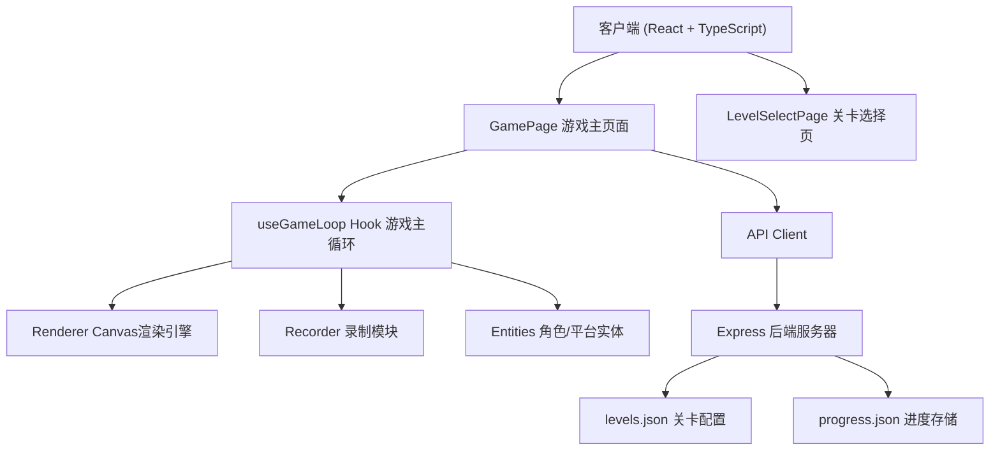

## 1. 架构设计



## 2. 技术描述

- 前端：React@18 + TypeScript@5 + Vite@5
- 后端：Express@4 + CORS
- 数据存储：JSON文件（levels.json、progress.json）
- 构建工具：Vite
- 渲染：HTML5 Canvas 2D API

## 3. 文件结构

```
auto104/
├── package.json
├── index.html
├── vite.config.js
├── tsconfig.json
├── server/
│   ├── index.ts
│   └── levels.json
└── src/
    ├── main.tsx
    ├── App.tsx
    ├── game/
    │   ├── renderer.ts
    │   ├── recorder.ts
    │   └── entities.ts
    ├── hooks/
    │   └── useGameLoop.ts
    └── pages/
        ├── GamePage.tsx
        └── LevelSelectPage.tsx
```

## 4. 路由定义

| 路由 | 页面 | 用途 |
|------|------|------|
| / | LevelSelectPage | 关卡选择页面 |
| /game/:id | GamePage | 游戏主页面 |

## 5. API 定义

### 5.1 获取关卡数据

```typescript
// GET /api/level/:id
interface LevelData {
  id: number;
  name: string;
  difficulty: number;
  platforms: { x: number; y: number; width: number; height: number; movable?: boolean }[];
  spikes: { x: number; y: number }[];
  switches: { x: number; y: number; targetPlatformIndex: number }[];
  start: { x: number; y: number };
  goal: { x: number; y: number };
  worldWidth: number;
  worldHeight: number;
}

// Response: LevelData | { error: string }
```

### 5.2 获取所有关卡列表

```typescript
// GET /api/levels
// Response: { id: number; name: string; difficulty: number }[]
```

### 5.3 获取玩家进度

```typescript
// GET /api/progress
interface ProgressData {
  unlockedLevels: number[];
  completedLevels: number[];
}

// Response: ProgressData
```

### 5.4 保存玩家进度

```typescript
// POST /api/progress
interface SaveProgressRequest {
  completedLevel: number;
}

// Response: { success: boolean; progress: ProgressData }
```

## 6. 核心类定义

### 6.1 Player 角色类

```typescript
class Player {
  x: number;
  y: number;
  vx: number;
  vy: number;
  width: number = 20;
  height: number = 20;
  onGround: boolean;
  scaleY: number = 1;
  landAnimationTime: number = 0;
  
  update(dt: number, keys: Set<string>): void;
  applyGravity(dt: number): void;
  checkCollision(platforms: Platform[]): void;
  startLandAnimation(): void;
}
```

### 6.2 Platform 平台类

```typescript
class Platform {
  x: number;
  y: number;
  width: number;
  height: number = 40;
  movable: boolean;
  originalX: number;
  moved: boolean;
  
  move(offset: number): void;
}
```

### 6.3 TimeClone 时间分身类

```typescript
class TimeClone {
  frames: FrameData[];
  currentFrame: number;
  x: number;
  y: number;
  opacity: number = 0.7;
  lifetime: number = 6;
  elapsed: number = 0;
  dissipating: boolean = false;
  particles: Particle[];
  
  update(dt: number): void;
  startDissipate(): void;
}
```

### 6.4 Recorder 录制模块

```typescript
class Recorder {
  buffer: FrameData[];
  maxDuration: number = 3;
  frameInterval: number = 1/60;
  
  recordFrame(player: Player): void;
  getLast3Seconds(): FrameData[];
  clear(): void;
}
```

### 6.5 Renderer 渲染引擎

```typescript
class Renderer {
  ctx: CanvasRenderingContext2D;
  width: number = 800;
  height: number = 600;
  stars: Star[];
  cameraX: number = 0;
  
  render(
    player: Player,
    platforms: Platform[],
    spikes: Spike[],
    switches: Switch[],
    clones: TimeClone[],
    goal: { x: number; y: number }
  ): void;
  
  drawBackground(): void;
  drawStars(dt: number): void;
  drawPlatforms(platforms: Platform[]): void;
  drawPlayer(player: Player): void;
  drawClone(clone: TimeClone): void;
  drawSpike(spike: Spike): void;
  drawSwitch(switch: Switch): void;
}
```

## 7. 性能优化

- 使用requestAnimationFrame驱动游戏循环
- 固定时间步长(dt)更新物理
- 星星粒子采用对象池复用
- 录制缓冲区使用环形数组避免频繁分配
- 离屏绘制静态元素（如背景渐变）
