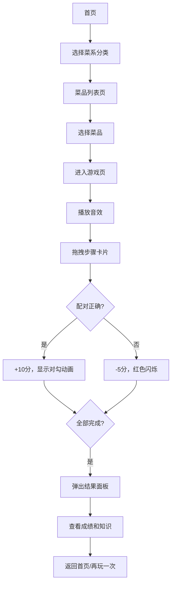

## 1. 产品概述
烹饪音效配对游戏是一款面向美食爱好者的互动教育游戏，通过聆听不同烹饪环节的音效并拖拽匹配对应的菜品步骤卡片，帮助用户学习烹饪知识并获得趣味体验。

## 2. 核心功能

### 2.1 用户角色
| 角色 | 注册方式 | 核心权限 |
|------|----------|----------|
| 普通用户 | 无需注册，本地存储记录 | 浏览分类、游戏游玩、查看历史记录 |

### 2.2 功能模块
1. **首页**: 六宫格菜品分类选择界面
2. **菜品列表页**: 展示分类下的所有菜品
3. **游戏页**: 音效播放与拖拽配对核心玩法
4. **结果面板**: 展示游戏成绩和趣味烹饪知识
5. **个人中心**: 历史游戏记录和统计数据

### 2.3 页面详情
| 页面名称 | 模块名称 | 功能描述 |
|----------|----------|----------|
| 首页 | 分类卡片 | 六宫格布局展示6大菜系分类，悬浮动效，点击进入菜品列表 |
| 菜品列表页 | 菜品网格 | 3列网格展示菜品缩略图和名称，点击进入游戏 |
| 游戏页 | 音效按钮 | 左侧4个音效播放按钮，点击播放5秒烹饪音效 |
| 游戏页 | 拖拽卡片 | 右侧4个步骤描述卡片，可拖拽到对应音效按钮下方 |
| 游戏页 | 计分系统 | 配对正确+10分，错误-5分，显示实时分数 |
| 游戏页 | 计时器 | 记录本轮游戏用时 |
| 结果面板 | 成绩展示 | 显示用时、正确率、总得分 |
| 结果面板 | 知识卡片 | 随机展示趣味烹饪知识 |
| 导航栏 | 统计展示 | 显示总场次、平均正确率、最高分 |
| 个人中心 | 历史记录 | 最近10次游戏记录表格 |

## 3. 核心流程
用户进入首页 → 选择菜系分类 → 选择具体菜品 → 进入配对游戏 → 播放音效拖拽匹配 → 完成4个配对 → 查看结果和知识 → 可查看历史记录

## 4. 用户界面设计

### 4.1 设计风格
- **主色调**: #f97316 (暖橙色)
- **辅色调**: #fef3c7 (浅黄色)
- **文字色**: #1e293b (深灰色)
- **卡片风格**: 柔和圆角(8-16px)，轻微阴影，悬浮过渡动画
- **字体**: 使用现代无衬线字体，标题加粗，正文适中
- **图标**: 使用emoji图标代表各菜系分类
- **动画**: 所有交互带0.2s ease过渡，配对成功有放大弹出动画

### 4.2 页面设计概述
| 页面名称 | 模块名称 | UI元素 |
|----------|----------|--------|
| 首页 | 分类卡片 | 200x280px卡片，#f8fafc背景，12px圆角，1.5px边框，悬浮时渐变#fff7ed，边框#fb923c，阴影加深，上移4px |
| 菜品列表页 | 菜品卡片 | 200x240px卡片，圆形60px缩略图，菜品名称 |
| 游戏页 | 音效按钮 | 150x50px按钮，#f1f5f9底色，播放时#f97316，8px圆角 |
| 游戏页 | 拖拽卡片 | 200x80px卡片，白色背景，8px圆角，1px边框，拖拽时放大1.05倍 |
| 结果面板 | 弹窗 | 400px宽，白色背景，16px圆角，半透明遮罩#00000050 |
| 结果面板 | 知识卡片 | #fef3c7背景，#374151文字，8px圆角，12px内边距 |
| 导航栏 | 顶部栏 | 60px固定高度，白色背景，底部阴影0 2px 4px rgba(0,0,0,0.08) |
| 个人中心 | 历史表格 | 表头#f1f5f9，行间隔#f8fafc/#fff |

### 4.3 响应式设计
- **桌面端**: 六宫格布局，3列菜品网格
- **平板端(<1024px)**: 4宫格，2列菜品网格
- **移动端(<768px)**: 2列或1列卡片，缩小尺寸，导航栏汉堡菜单折叠
- **触控优化**: 按钮最小44px触控区域，拖拽手势流畅

### 4.4 动画与交互
- 卡片悬浮: 0.2s ease过渡，背景色渐变，边框变色，阴影加深，上移4px
- 拖拽效果: 卡片放大1.05倍，半透明阴影
- 配对成功: 绿色对勾从按钮中心放大弹出，0.3s动画
- 配对错误: 按钮边框红色闪烁，0.5s
- 音效播放: 按钮背景色变化，播放状态指示
- 页面切换: 淡入淡出过渡效果
