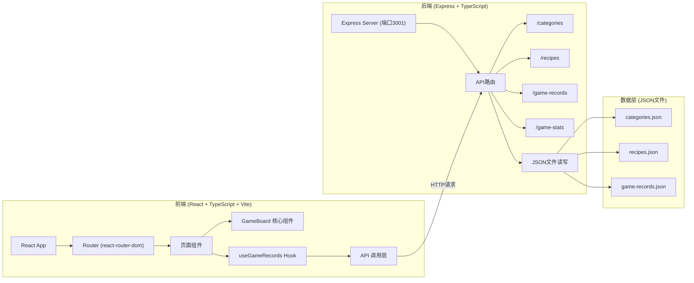
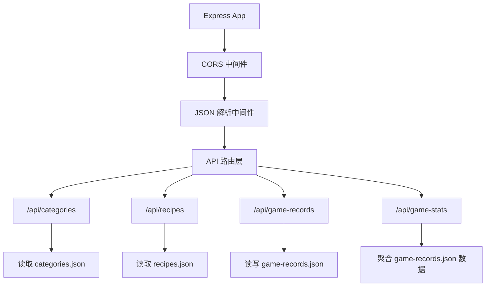
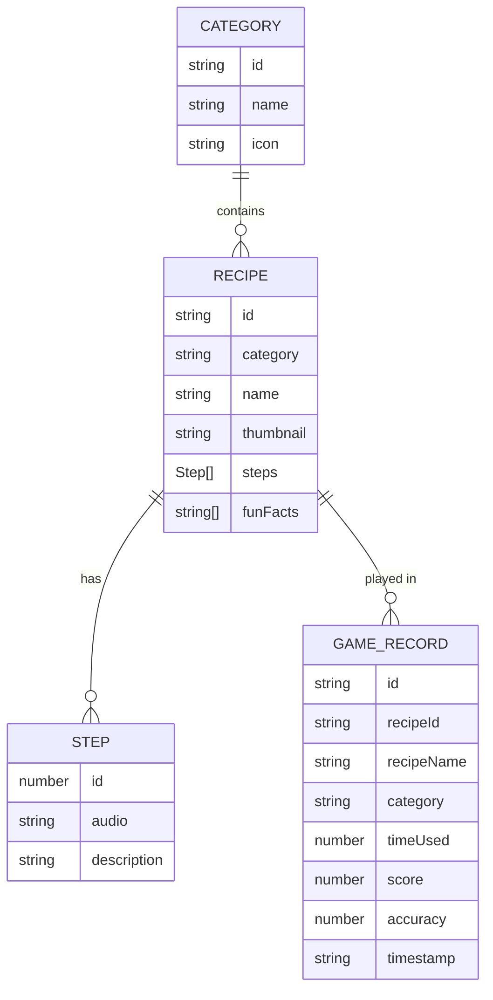

## 1. 架构设计



## 2. 技术描述

- **前端**: React 18 + TypeScript + Vite
- **状态管理**: React Hooks (useState, useEffect, useRef) + 自定义Hook
- **路由**: react-router-dom v6
- **样式**: 全局CSS (CSS变量)
- **后端**: Express 4 + TypeScript
- **数据存储**: JSON文件 (categories.json, recipes.json, game-records.json)
- **构建工具**: Vite
- **包管理器**: npm
- **端口**: 前端Vite开发服务器，后端Express运行在3001端口

## 3. 路由定义

| 路由 | 页面/组件 | 说明 |
|------|----------|------|
| `/` | 首页 | 六宫格分类选择界面 |
| `/game/:category` | 菜品列表页 | 显示分类下的所有菜品 |
| `/game/:category/recipe/:id` | 游戏页 | 配对游戏核心界面 |
| `/profile` | 个人中心 | 历史游戏记录和统计 |

## 4. API 定义

### 4.1 类型定义

```typescript
// 分类数据
interface Category {
  id: string;
  name: string;
  icon: string;
}

// 步骤数据
interface Step {
  id: number;
  audio: string;
  description: string;
}

// 菜品数据
interface Recipe {
  id: string;
  category: string;
  name: string;
  thumbnail: string;
  steps: Step[];
  funFacts: string[];
}

// 游戏记录
interface GameRecord {
  id: string;
  recipeId: string;
  recipeName: string;
  category: string;
  timeUsed: number;
  score: number;
  accuracy: number;
  timestamp: string;
}

// 游戏统计
interface GameStats {
  totalGames: number;
  averageAccuracy: number;
  highestScore: number;
}
```

### 4.2 API 接口

| 方法 | 路径 | 描述 | 请求 | 响应 |
|------|------|------|------|------|
| GET | `/api/categories` | 获取所有分类 | - | `Category[]` |
| GET | `/api/recipes?category=:category` | 获取分类下的菜品 | query: category | `Recipe[]` |
| GET | `/api/recipes/:id` | 获取单个菜品详情 | params: id | `Recipe` |
| GET | `/api/game-stats` | 获取游戏统计 | - | `GameStats` |
| GET | `/api/game-records` | 获取游戏记录列表 | - | `GameRecord[]` |
| POST | `/api/game-records` | 提交游戏记录 | body: `Omit<GameRecord, 'id' \| 'timestamp'>` | `GameRecord` |

## 5. 服务器架构



## 6. 数据模型

### 6.1 数据模型定义



### 6.2 文件结构

```
d:\VersionFastPro\tasks\auto105\
├── .trae\documents\
│   ├── PRD.md
│   └── technical-architecture.md
├── src\
│   ├── components\
│   │   └── GameBoard.tsx
│   ├── hooks\
│   │   └── useGameRecords.ts
│   ├── data\
│   │   ├── categories.json
│   │   └── recipes.json
│   ├── styles\
│   │   └── global.css
│   ├── App.tsx
│   └── main.tsx
├── data\
│   ├── categories.json
│   ├── recipes.json
│   └── game-records.json
├── server.ts
├── index.html
├── vite.config.js
├── tsconfig.json
└── package.json
```

## 7. 性能优化

- **音效预加载**: 进入游戏页时预加载所有音效文件，播放延迟≤100ms
- **拖拽性能**: 使用CSS transform进行拖拽，避免重排，帧率≥50fps
- **防抖/节流**: 拖拽事件使用requestAnimationFrame优化
- **响应式**: 使用CSS媒体查询实现自适应布局
- **资源优化**: 图片使用合适尺寸，音频使用压缩格式
