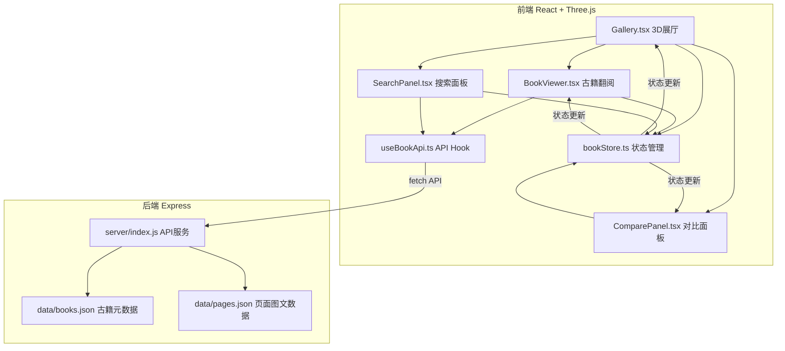
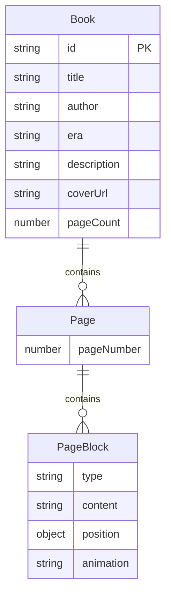

## 1. 架构设计



## 2. 技术说明

- 前端：React@18 + TypeScript + Three.js + @react-three/fiber + @react-three/drei
- 构建工具：Vite + @vitejs/plugin-react
- 状态管理：React Context（bookStore）
- 后端：Express@4 + CORS
- 数据存储：JSON文件（books.json, pages.json）
- 初始化工具：vite-init（react-ts模板）
- 图片资源：程序化生成（Canvas API）

## 3. 路由定义

| 路由 | 用途 |
|------|------|
| / | 3D展厅主页面，包含书架、古籍选取、翻阅、对比所有功能 |

## 4. API定义

### 4.1 GET /api/books

返回所有古籍元数据数组

```typescript
interface Book {
  id: string;
  title: string;
  author: string;
  era: string;
  description: string;
  coverUrl: string;
  pageCount: number;
}
```

响应：`Book[]`

### 4.2 GET /api/books/:id/pages/:page

返回指定古籍指定页的图文块数组

```typescript
interface PageBlock {
  type: 'text' | 'image';
  content: string;
  position: { x: number; y: number; width: number; height: number };
  animation: 'fade' | 'slide' | 'zoom';
}
```

响应：`PageBlock[]`

### 4.3 GET /api/books/search?q=keyword

搜索古籍

响应：`Book[]`

## 5. 服务器架构

```mermaid
graph LR
    "Express Router" --> "BookController"
    "BookController" --> "JSON File Reader"
    "JSON File Reader" --> "data/books.json"
    "JSON File Reader" --> "data/pages.json"
```

## 6. 数据模型

### 6.1 数据模型定义



### 6.2 数据文件

- `data/books.json`：5本古籍元数据，id为UUID
- `data/pages.json`：以古籍id为key，值为页面数组，每页6-10个图文块
- `public/images/`：5张封面图 + 10张页面插图（Canvas程序化生成）

## 7. 文件结构与调用关系

```
├── package.json
├── vite.config.js          → 配置Vite构建
├── tsconfig.json           → TypeScript严格模式
├── index.html              → 入口HTML
├── src/
│   ├── types.ts            → 所有类型定义（被所有模块引用）
│   ├── store/
│   │   └── bookStore.ts    → Context状态管理
│   ├── components/
│   │   ├── Gallery.tsx     → 3D展厅（→ bookStore, useBookApi）
│   │   ├── BookViewer.tsx  → 古籍翻阅（→ bookStore, useBookApi）
│   │   ├── ComparePanel.tsx→ 对比面板（→ bookStore）
│   │   └── SearchPanel.tsx → 搜索面板（→ bookStore, useBookApi）
│   ├── hooks/
│   │   └── useBookApi.ts   → API调用封装（→ fetch → server API）
│   ├── App.tsx             → 应用入口
│   └── main.tsx            → React挂载
├── server/
│   └── index.js            → Express API服务（→ data/*.json）
├── data/
│   ├── books.json          → 古籍元数据
│   └── pages.json          → 页面图文数据
└── public/
    └── images/             → 程序化生成的图片
```

数据流向：
1. 用户交互 → bookStore方法 → API调用(useBookApi) → Express API → JSON文件
2. API响应 → bookStore更新Context → 组件重渲染
3. 组件渲染 → Three.js场景更新 → Canvas绘制
