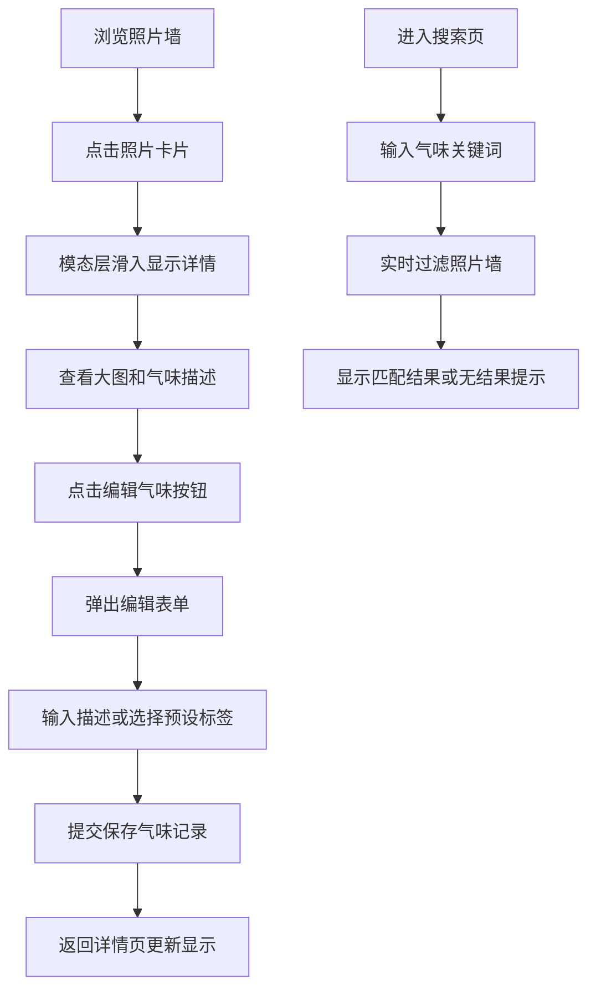

## 1. 产品概述
气味记忆相册是一个通过气味唤醒回忆的照片管理应用，用户可以为每张照片添加气味描述，通过气味关键词搜索重温美好记忆。
- 核心价值：将嗅觉记忆与视觉影像结合，创造独特的回忆体验
- 目标用户：希望以创新方式保存和重温生活记忆的人群

## 2. 核心功能

### 2.1 功能模块
1. **首页照片墙**：瀑布流展示所有照片卡片，每张卡片显示气味标签
2. **照片详情页**：大图展示、气味描述、气味波动动画、编辑气味功能
3. **搜索页**：按气味关键词实时过滤照片，无结果时友好提示

### 2.2 页面详情
| 页面名称 | 模块名称 | 功能描述 |
|-----------|-------------|---------------------|
| 首页照片墙 | 瀑布流卡片 | 300px固定宽度卡片，圆角12px，悬浮上移动画，显示气味标签 |
| 首页照片墙 | 模态层 | 点击卡片从底部滑入半屏模态层，展示照片详情 |
| 照片详情页 | 大图展示 | 左侧显示照片大图 |
| 照片详情页 | 气味描述 | 右侧显示气味描述文本 |
| 照片详情页 | 气味波动动画 | Canvas绘制波形动画，颜色渐变，频率随鼠标移动变化 |
| 照片详情页 | 编辑气味表单 | 弹出表单，支持文本输入和预设标签选择，实时字数统计 |
| 搜索页 | 搜索框 | 固定顶部，聚焦样式变化，实时搜索过滤 |
| 搜索页 | 过滤结果 | 实时过滤照片墙，空缺位置淡入动画，无结果友好提示 |

## 3. 核心流程
用户浏览照片墙 → 点击照片查看详情 → 编辑或添加气味描述 → 保存气味记录 → 通过搜索框按气味关键词查找相关照片

## 4. 用户界面设计

### 4.1 设计风格
- **主色调**：#fef9ef（暖米色背景）
- **辅助色**：#fde68a（浅黄标签色）、#92400e（深棕文字色）、#f59e0b（强调橙色）、#d97706（深橙渐变）
- **字体**：衬线体（Georgia, 'Times New Roman', serif）增强年代感
- **卡片风格**：较大圆角（12-16px），轻柔阴影，背景#fef9ef，边框1px solid #f0e6d3
- **背景纹理**：CSS亚麻纹理图案
- **动效**：所有交互平滑过渡（0.2-0.4秒），悬浮上移6px，阴影过渡

### 4.2 页面设计概述
| 页面名称 | 模块名称 | UI元素 |
|-----------|-------------|-------------|
| 首页照片墙 | 瀑布流卡片 | 300px宽度卡片、12px圆角、#fef9ef背景、悬浮上移6px、阴影过渡0.3s、气味标签（#fde68a背景、#92400e文字、12px字号） |
| 首页照片墙 | 模态层 | 背景#1a1a2e透明度0.6、从底部滑入0.4秒动画、左右分栏布局 |
| 照片详情页 | 气味波动动画 | Canvas绘制、波形从#f59e0b渐变为#d97706、频率随鼠标移动变化 |
| 照片详情页 | 编辑表单 | 背景#fffaf0、16px圆角、阴影0 20px 40px rgba(0,0,0,0.2)、输入框60字限制、实时字数显示、预设标签（#fef3c7底色、选中#f59e0b） |
| 搜索页 | 搜索框 | 固定顶部、背景#fffaf0、400px宽度、20px圆角、2px solid #f59e0b边框、聚焦变#d97706、阴影0 2px 8px rgba(245,158,11,0.2) |
| 搜索页 | 无结果提示 | 中央大问号图标、文字"没有找到这个气味，试试其他词吧"、颜色#a16207 |

### 4.3 响应式设计
- **桌面端**：瀑布流多列布局，卡片宽300px
- **平板（≤768px）**：照片墙改为两列
- **手机（≤375px）**：单列布局，卡片宽度占满屏幕
- **触控优化**：增大可点击区域，优化手势操作

## 5. 性能要求
- 照片墙滚动帧率：稳定55fps以上
- 搜索过滤渲染：2秒内完成
- 动画流畅度：所有过渡效果60fps
