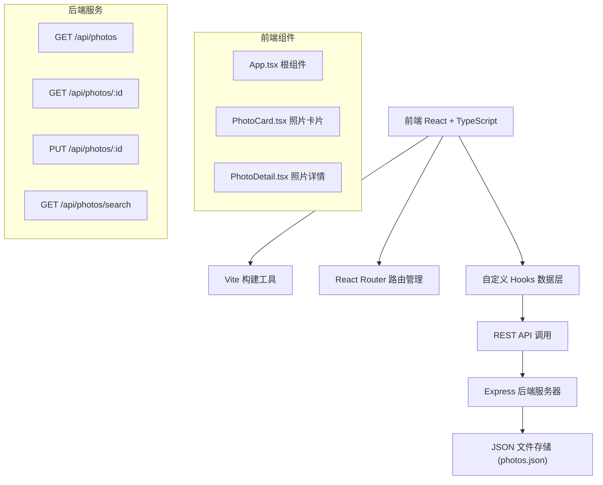
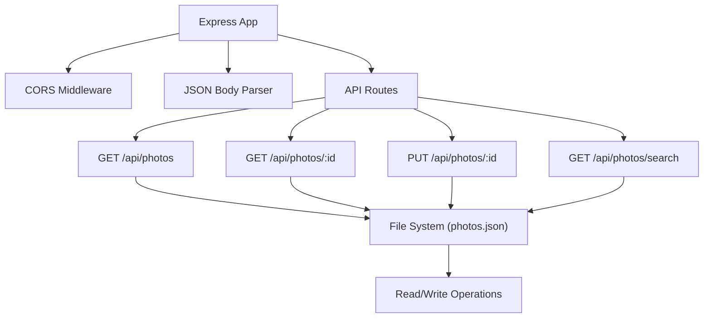
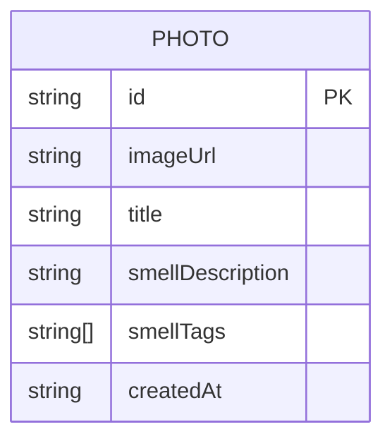

## 1. 架构设计



## 2. 技术栈说明
- **前端**：React 18 + TypeScript + Vite
- **路由**：React Router DOM 6
- **后端**：Express 4
- **数据存储**：JSON 文件（server/data/photos.json）
- **跨域**：CORS 中间件
- **ID生成**：UUID

## 3. 路由定义

| 路由路径 | 页面组件 | 功能说明 |
|-------|---------|---------|
| / | PhotoWall（首页） | 瀑布流照片墙展示 |
| /photo/:id | PhotoDetailPage | 照片详情页（模态层形式） |
| /search | SearchPage | 气味关键词搜索页 |

## 4. API 定义

### 4.1 TypeScript 类型定义

```typescript
interface Photo {
  id: string;
  imageUrl: string;
  title: string;
  smellDescription: string;
  smellTags: string[];
  createdAt: string;
}

interface UpdateSmellRequest {
  smellDescription: string;
  smellTags: string[];
}
```

### 4.2 API 接口

| 方法 | 路径 | 请求参数 | 响应格式 | 说明 |
|------|------|----------|----------|------|
| GET | /api/photos | 无 | Photo[] | 获取所有照片列表 |
| GET | /api/photos/:id | id: string | Photo | 获取单张照片详情 |
| PUT | /api/photos/:id | id: string, body: UpdateSmellRequest | Photo | 更新照片的气味数据 |
| GET | /api/photos/search | q: string | Photo[] | 按气味关键词搜索照片 |

## 5. 服务器架构



## 6. 数据模型

### 6.1 数据模型定义



### 6.2 初始数据结构（photos.json）

```json
{
  "photos": [
    {
      "id": "uuid-1",
      "imageUrl": "https://images.unsplash.com/photo-1506905925346-21bda4d32df4?w=600",
      "title": "雨后山林",
      "smellDescription": "雨后泥土的清新气息混合着松针的香气",
      "smellTags": ["草香", "木香"],
      "createdAt": "2024-01-15T10:30:00Z"
    }
  ]
}
```

## 7. 项目文件结构

```
d:\VersionFastPro\tasks\auto108\
├── package.json
├── index.html
├── vite.config.js
├── tsconfig.json
├── src/
│   ├── App.tsx
│   ├── main.tsx
│   ├── components/
│   │   ├── PhotoCard.tsx
│   │   └── PhotoDetail.tsx
│   ├── pages/
│   │   ├── HomePage.tsx
│   │   └── SearchPage.tsx
│   ├── hooks/
│   │   └── usePhotoData.ts
│   ├── types/
│   │   └── index.ts
│   └── styles/
│       └── global.css
└── server/
    ├── index.ts
    └── data/
        └── photos.json
```

## 8. 性能优化策略

1. **图片懒加载**：使用 Intersection Observer 实现图片懒加载
2. **虚拟滚动**：照片墙使用虚拟滚动优化大量图片渲染
3. **防抖搜索**：搜索框输入添加 300ms 防抖
4. **CSS 动画优化**：使用 transform 和 opacity 属性实现 GPU 加速动画
5. **内存管理**：Canvas 动画组件卸载时及时清理资源
6. **请求缓存**：照片列表数据缓存，避免重复请求
