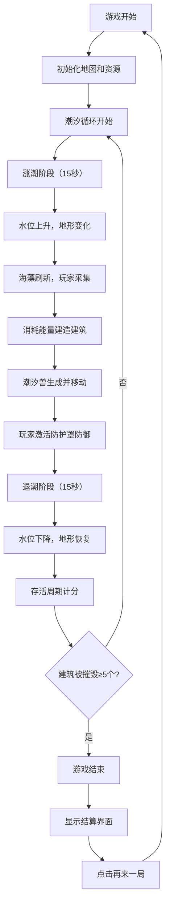

## 1. 产品概述

潮汐之岛是一款基于浏览器的资源管理策略游戏，玩家在一个受潮汐变化动态影响的小岛上采集资源、建造防御设施并抵御周期性涨潮带来的威胁。游戏融合了资源采集、建筑规划和即时防御等核心玩法，通过动态潮汐机制创造紧张刺激的游戏体验。

- 核心玩法：资源采集 → 建筑建造 → 潮汐防御 → 周期循环
- 目标用户：休闲策略游戏爱好者
- 产品价值：提供具有挑战性和策略深度的浏览器游戏体验

## 2. 核心功能

### 2.1 用户角色

| 角色 | 注册方式 | 核心权限 |
|------|----------|----------|
| 玩家 | 无需注册，直接游玩 | 完整游戏体验，包括资源采集、建筑建造、潮汐防御 |

### 2.2 功能模块

1. **游戏主界面**：Canvas游戏画布、顶部信息栏、右侧建造菜单
2. **潮汐系统**：30秒周期涨落潮、水位变化、圆形进度条显示
3. **资源采集系统**：发光海藻生成、点击采集、扩散动画效果
4. **建筑建造系统**：防波堤、瞭望塔、种植园三种建筑，各有独特功能
5. **潮汐防御系统**：潮汐兽生成与移动、建筑防护罩激活、碰撞检测
6. **计分系统**：海藻采集计分、建筑建造计分、存活周期计分
7. **游戏结束系统**：结算界面、统计数据展示、重新开始功能

### 2.3 页面详情

| 页面名称 | 模块名称 | 功能描述 |
|----------|----------|----------|
| 游戏主界面 | 顶部信息栏 | 显示海藻能量、潮汐进度条与状态、当前得分 |
| 游戏主界面 | Canvas游戏画布 | 8x8网格地图、地形渲染、资源显示、建筑绘制、潮汐兽渲染 |
| 游戏主界面 | 右侧建造菜单 | 三种建筑选择、能量消耗显示、选中状态反馈 |
| 游戏主界面 | 游戏结束遮罩 | 半透明黑色遮罩、结算面板、统计数据、重新开始按钮 |

## 3. 核心流程

## 4. 用户界面设计

### 4.1 设计风格

- **主色调**：深海蓝色系（#0A1628 背景，#162240 顶栏，#1A2A4A 侧边栏）
- **强调色**：海藻绿（#00FF88）、金色（#FFD700）、潮汐蓝（#00BFFF → #000080 渐变）
- **按钮样式**：圆形背景，悬浮放大1.05倍，0.2s过渡，点击缩小0.95倍反馈
- **字体**：现代无衬线字体，标题粗体，数值使用等宽数字
- **布局风格**：三栏式布局（顶栏 + 中央画布 + 右侧菜单），游戏画布居中
- **视觉效果**：发光阴影、渐变填充、平滑过渡动画、闪烁预警效果

### 4.2 页面设计概述

| 页面名称 | 模块名称 | UI元素 |
|----------|----------|--------|
| 游戏主界面 | 顶部信息栏 | 海藻能量图标（绿色圆形）+ 数值、圆形潮汐进度条（渐变填充）+ 状态文本、金色得分 |
| 游戏主界面 | Canvas画布 | 8x8网格线（半透明#1E3A5F）、三种地形颜色、发光海藻、建筑简笔画、潮汐兽 |
| 游戏主界面 | 右侧建造菜单 | 48x48px建筑图标、半透明圆形背景（#2A3A5A）、选中状态（#4A6A8A）、能量消耗提示 |
| 游戏主界面 | 游戏结束界面 | 半透明黑色遮罩（0.7透明度）、白色结算面板（从下方滑入）、统计数据、再来一局按钮 |

### 4.3 响应式设计

- 桌面端优先设计，固定画布尺寸800x600px
- 整体布局采用flex居中，确保在不同分辨率下正常显示
- 按钮和交互元素尺寸足够大，支持触摸操作

### 4.4 动画效果

- 潮汐进度条：每秒平滑更新，渐变色填充
- 海藻刷新：半径从0到40px扩散动画，透明度0.8到0，持续0.5秒
- 建筑选中：背景色过渡，缩放效果
- 潮汐预警：瞭望塔覆盖区域闪烁提示
- 建筑损坏：红色闪烁3秒后消失
- 防护罩激活：半圆形光罩，持续2秒
- 游戏结束：遮罩淡入（0→0.7，0.5秒），面板从下方滑入
- 按钮交互：悬浮放大1.05倍（0.2s过渡），点击缩小0.95倍
