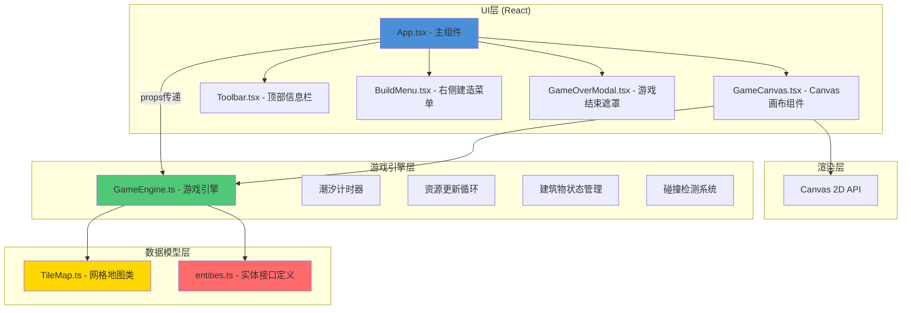
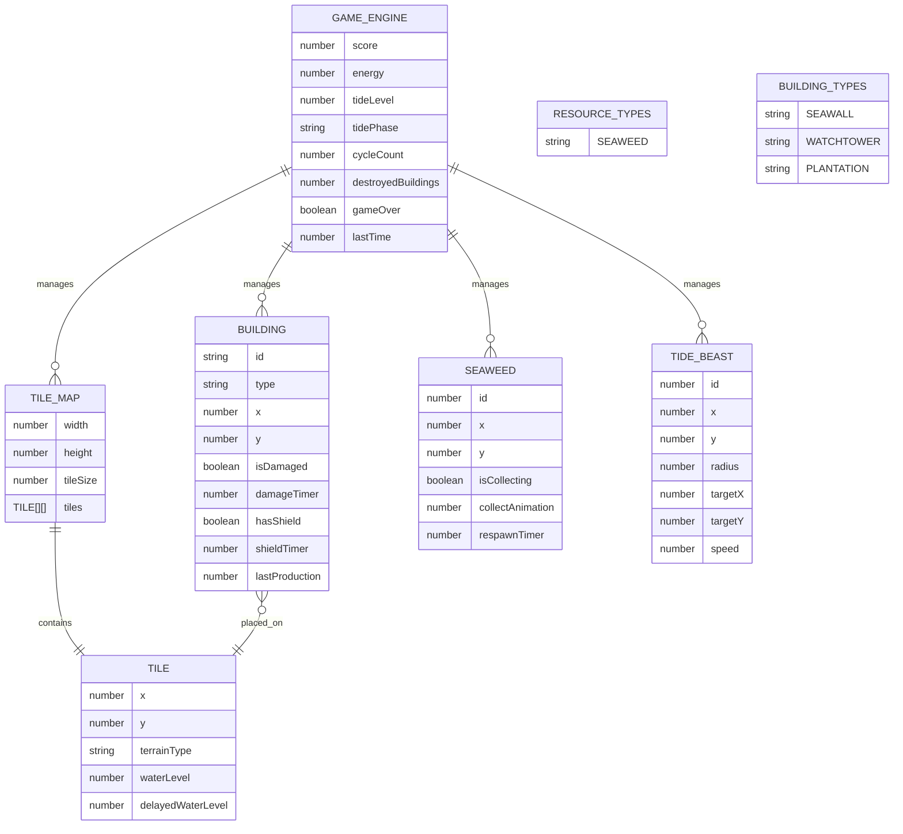

## 1. 架构设计



## 2. 技术描述

- **前端框架**：React@18 + ReactDOM@18
- **开发语言**：TypeScript@5（严格模式，target ES2020）
- **构建工具**：Vite@5 + @vitejs/plugin-react@4
- **渲染技术**：HTML5 Canvas 2D API
- **动画系统**：requestAnimationFrame 60fps游戏循环
- **样式方案**：内联CSS + CSS变量，不引入额外UI框架

### 项目初始化
- 使用 `npm create vite@latest` 初始化项目
- 手动配置 TypeScript 严格模式
- 开发服务器端口：3000

### 文件结构
```
auto109/
├── package.json
├── vite.config.js
├── tsconfig.json
├── index.html
└── src/
    ├── main.tsx
    ├── game/
    │   ├── GameEngine.ts
    │   ├── TileMap.ts
    │   └── entities.ts
    └── ui/
        ├── App.tsx
        └── Toolbar.tsx
```

## 3. 路由定义

| 路由 | 用途 |
|------|------|
| / | 游戏主界面（单页应用，无额外路由） |

## 4. 数据模型

### 4.1 数据模型定义



### 4.2 TypeScript 类型定义

```typescript
// src/game/entities.ts
export type TerrainType = 'land' | 'shallow' | 'deep';

export type BuildingType = 'seawall' | 'watchtower' | 'plantation';

export type TidePhase = 'rising' | 'falling';

export interface Tile {
  x: number;
  y: number;
  terrain: TerrainType;
  waterLevel: number;
  delayedWaterLevel: number;
}

export interface Building {
  id: string;
  type: BuildingType;
  x: number;
  y: number;
  isDamaged: boolean;
  damageTimer: number;
  hasShield: boolean;
  shieldTimer: number;
  lastProduction: number;
}

export interface Seaweed {
  id: number;
  x: number;
  y: number;
  collectAnimation: number;
  respawnTimer: number;
}

export interface TideBeast {
  id: number;
  x: number;
  y: number;
  radius: number;
  targetX: number;
  targetY: number;
  speed: number;
  deathAnimation: number;
}

export interface GameState {
  score: number;
  energy: number;
  tideLevel: number;
  tidePhase: TidePhase;
  tideTimer: number;
  cycleCount: number;
  destroyedBuildings: number;
  gameOver: boolean;
  selectedBuilding: BuildingType | null;
}

export interface BuildingConfig {
  cost: number;
  name: string;
  description: string;
}

export const BUILDING_CONFIGS: Record<BuildingType, BuildingConfig> = {
  seawall: { cost: 10, name: '防波堤', description: '阻挡相邻3格水位上升' },
  watchtower: { cost: 15, name: '瞭望塔', description: '提前5秒预警潮汐' },
  plantation: { cost: 20, name: '种植园', description: '每5秒产出2点食物' },
};
```

## 5. 核心模块设计

### 5.1 GameEngine 类

```typescript
// src/game/GameEngine.ts
class GameEngine {
  // 属性
  private tileMap: TileMap;
  private buildings: Building[];
  private seaweeds: Seaweed[];
  private tideBeasts: TideBeast[];
  private state: GameState;
  private lastTime: number;
  private animationFrameId: number;
  
  // 方法
  constructor(canvasWidth: number, canvasHeight: number);
  public start(): void;
  public stop(): void;
  public update(deltaTime: number): void;
  public render(ctx: CanvasRenderingContext2D): void;
  public handleClick(x: number, y: number): void;
  public selectBuilding(type: BuildingType | null): void;
  public getState(): GameState;
  public restart(): void;
  
  // 私有方法
  private updateTide(deltaTime: number): void;
  private updateSeaweeds(deltaTime: number): void;
  private updateBuildings(deltaTime: number): void;
  private updateTideBeasts(deltaTime: number): void;
  private spawnTideBeast(): void;
  private checkCollisions(): void;
  private collectSeaweed(x: number, y: number): void;
  private placeBuilding(x: number, y: number): void;
  private activateShield(building: Building): void;
}
```

### 5.2 TileMap 类

```typescript
// src/game/TileMap.ts
class TileMap {
  // 属性
  public readonly width: number = 8;
  public readonly height: number = 8;
  public readonly tileSize: number = 60;
  private tiles: Tile[][];
  private offsetX: number;
  private offsetY: number;
  
  // 方法
  constructor(canvasWidth: number, canvasHeight: number);
  public generateMap(): void;
  public getTile(x: number, y: number): Tile | null;
  public getTileAtPixel(pixelX: number, pixelY: number): Tile | null;
  public updateWaterLevels(tideLevel: number, delayedTiles: Set<string>): void;
  public render(ctx: CanvasRenderingContext2D): void;
  public getAdjacentTiles(x: number, y: number, range: number): Tile[];
  public getShallowTiles(): Tile[];
  public getLandTiles(): Tile[];
  public getDeepTiles(): Tile[];
  
  // 私有方法
  private generateTerrain(): void;
  private terrainToColor(terrain: TerrainType, waterLevel: number): string;
}
```

### 5.3 性能优化策略

1. **Canvas渲染优化**：
   - 使用 `requestAnimationFrame` 实现60fps游戏循环
   - 仅在必要时重绘，使用脏矩形优化
   - 离屏Canvas预渲染静态元素（如网格线）

2. **对象池化**：
   - 潮汐兽对象池，避免频繁创建销毁
   - 海藻对象复用

3. **碰撞检测优化**：
   - 空间分区（8x8网格）减少碰撞检测次数
   - 潮汐兽数量限制在12个以内

4. **内存管理**：
   - 及时清理死亡动画结束的潮汐兽
   - 移除已损坏消失的建筑引用
