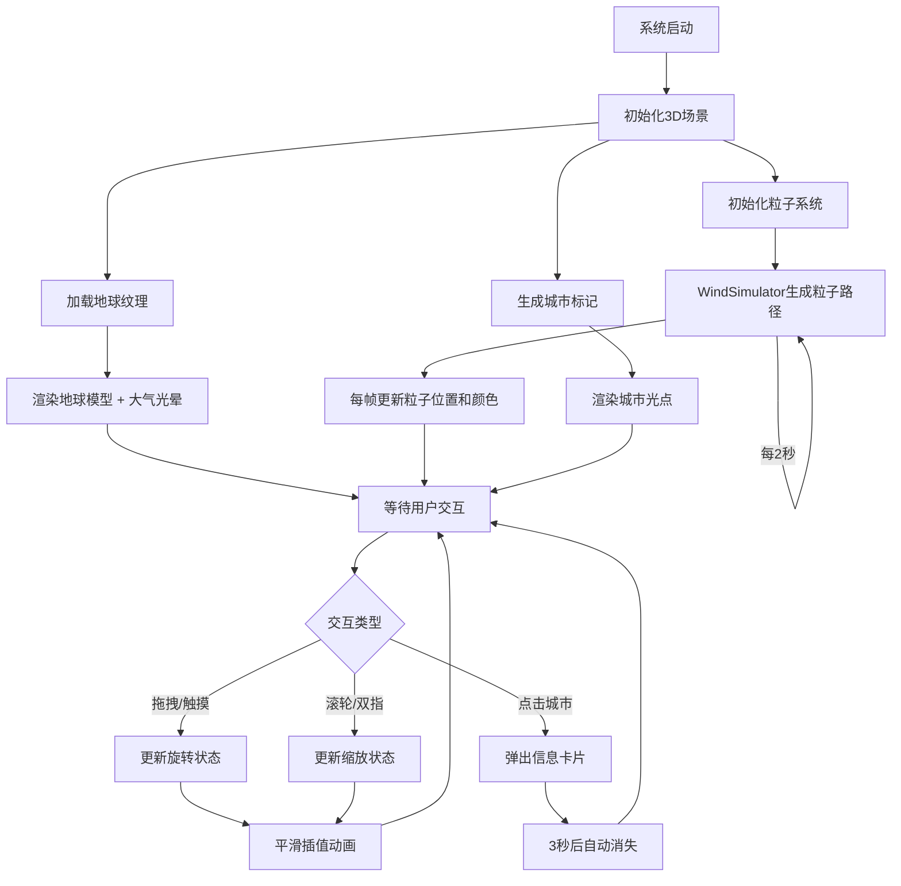
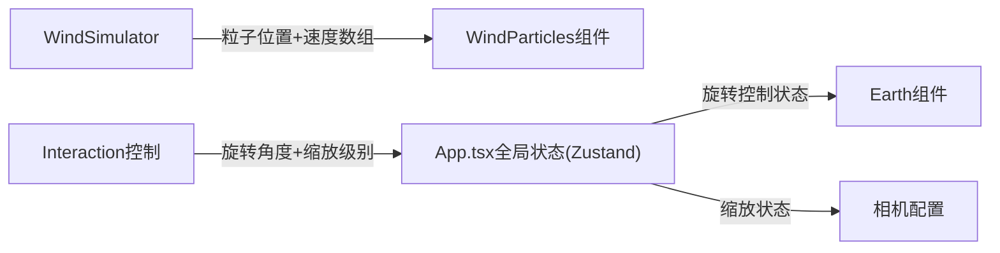

## 1. 产品概述

3D全球风场可视化地球交互系统，面向科技馆参观者，通过Three.js渲染的3D地球实时展示全球主要城市风速与风向数据，配合流动粒子系统模拟大气环流，支持手势交互操作，让参观者直观理解全球大气环流模式。

- 目标用户：科技馆参观者（全年龄段，含触屏交互场景）
- 核心价值：将抽象的气象数据转化为直观、可交互的3D可视化体验

## 2. 核心功能

### 2.1 功能模块

1. **3D地球场景**：带国家轮廓和海洋底色的高分辨率地球模型，含大气光晕效果
2. **风场粒子系统**：2000个流动粒子模拟全球风场，颜色随风速渐变
3. **交互控制**：鼠标拖拽旋转、滚轮缩放、触摸手势支持
4. **城市标记**：20个主要城市光点标记，点击弹出信息卡片
5. **控制面板**：风速显示条 + 重置视角按钮
6. **信息层**：底部滚动时间戳显示

### 2.2 页面详情

| 页面/模块 | 子模块 | 功能描述 |
|-----------|--------|----------|
| 3D地球场景 | 地球模型 | 2048x1024纹理渲染球体，半径3单位，带国家轮廓和海洋底色 |
| 3D地球场景 | 大气光晕 | Shader实现半透明外层光晕效果 |
| 风场粒子系统 | 粒子渲染 | 2000个长条形粒子(0.08×0.02单位)，表面海拔0.1单位流动 |
| 风场粒子系统 | 颜色映射 | 风速5m/s以下蓝色(#1e88e5)→20m/s以上红色(#e53935)渐变 |
| 风场粒子系统 | 路径更新 | WindSimulator每2秒重新生成流线路径(随机种子变化) |
| 交互控制 | 旋转控制 | 鼠标左键拖拽，水平无限制，垂直±30度限制 |
| 交互控制 | 缩放控制 | 滚轮缩放，范围2-8单位，0.2秒ease-out平滑插值 |
| 交互控制 | 触摸支持 | 单指旋转，双指缩放 |
| 城市标记 | 光点标记 | 20个主要城市位置，半径0.05单位，颜色#ffeb3b |
| 城市标记 | 信息卡片 | 点击弹出城市名+风速，宽140px高60px，3秒自动消失 |
| 控制面板 | 风速显示条 | 全局平均风速5-40动态变化 |
| 控制面板 | 重置按钮 | 点击0.5秒动画回到初始位置 |
| 信息层 | 时间戳 | 底部中央滚动文字，12px，每5秒更新 |

## 3. 核心流程

## 4. 用户界面设计

### 4.1 设计风格

- 主色调：深蓝黑(#0a0a1a) + 科技蓝(#1e88e5) + 金色点缀(#ffeb3b)
- 风速色阶：蓝(#1e88e5) → 红(#e53935)
- 毛玻璃风格：backdrop-filter: blur(8px)，半透明深色背景
- 字体：科技感无衬线字体，中文使用系统默认
- 布局：全屏3D场景 + 浮层UI控件

### 4.2 页面设计概览

| 模块 | UI元素 | 样式特征 |
|------|--------|----------|
| 背景 | 全屏3D Canvas | 纯黑背景#0a0a1a |
| 地球 | 3D球体 | 高分辨率纹理，大气光晕Shader |
| 粒子 | 长条形流动粒子 | 蓝红色渐变，半透明 |
| 控制面板 | 固定左上角浮层 | 宽200px，rgba(10,10,26,0.85)背景，圆角12px，内边距12px，毛玻璃效果 |
| 风速条 | 渐变进度条 | 蓝→红渐变，数字5-40 |
| 重置按钮 | 文字按钮 | 半透明→悬停不透明，0.15s过渡 |
| 城市光点 | 球体标记 | 半径0.05，颜色#ffeb3b，发光效果 |
| 信息卡片 | 弹出卡片 | 宽140px高60px，rgba(0,0,0,0.7)，圆角8px，白色14px文字，底部上滑动画0.3s |
| 时间戳 | 底部中央文字 | 12px，rgba(255,255,255,0.4) |

### 4.3 响应式设计

- 宽屏(>1200px)：全尺寸控件，正常字体和间距
- 小屏(<768px)：自动缩小字体和控件间距，触控区域适当增大

### 4.4 3D场景指导

- 环境：深空黑色背景，无HDRI，依赖自发光和点光源
- 光照：一个方向光(模拟太阳) + 环境光(低强度) + 地球自发光
- 相机：透视相机，初始距离5单位，FOV 45度
- 焦点：地球居中，粒子系统环绕
- 交互：OrbitControls基础 + 自定义旋转限制
- 后处理：大气光晕(自定义Shader)，无Bloom
- 性能预算：粒子≤3000，目标帧率≥30FPS
