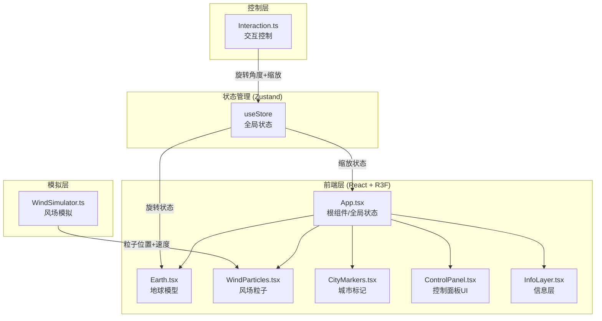

## 1. 架构设计



## 2. 技术说明

- 前端框架：React 18 + TypeScript
- 3D渲染：Three.js + @react-three/fiber + @react-three/drei
- 状态管理：Zustand
- 构建工具：Vite
- 初始化工具：vite-init (react-ts模板)
- 无后端服务，所有数据为前端模拟生成

## 3. 路由定义

| 路由 | 用途 |
|------|------|
| / | 单页应用，3D地球风场可视化主场景 |

## 4. 文件结构与数据流

```
project/
├── package.json              # 依赖与脚本
├── vite.config.js            # Vite构建配置
├── tsconfig.json             # TypeScript严格模式
├── index.html                # 入口HTML
└── src/
    ├── App.tsx               # 根组件：初始化R3F Canvas、相机、全局状态
    │   ├── ← useStore (Zustand状态)
    │   ├── → Earth (旋转状态)
    │   ├── → WindParticles (粒子数据)
    │   └── → CityMarkers (城市数据)
    ├── main.tsx              # React入口
    ├── components/
    │   ├── Earth.tsx         # 地球模型：加载纹理+大气光晕Shader
    │   │   ├── ← useStore.rotation
    │   │   └── → 更新球体旋转矩阵
    │   ├── WindParticles.tsx # 风场粒子系统：渲染+动画
    │   │   ├── ← WindSimulator.generateParticles()
    │   │   └── → 每帧更新粒子位置
    │   ├── CityMarkers.tsx   # 城市标记+信息卡片
    │   │   ├── ← useStore.selectedCity
    │   │   └── → 点击事件→更新Store
    │   ├── ControlPanel.tsx  # 控制面板：风速条+重置按钮
    │   │   ├── ← useStore.avgWindSpeed
    │   │   └── → 重置事件→更新Store
    │   └── InfoLayer.tsx     # 底部信息层：时间戳
    │       └── ← useStore.simTime
    ├── sim/
    │   └── WindSimulator.ts  # 风场模拟：粒子路径+速度生成
    │       └── → 输出粒子位置数组+速度数组
    ├── controls/
    │   └── Interaction.ts    # 交互控制：拖拽/缩放/触摸
    │       └── → 输出交互状态→useStore
    └── store/
        └── useStore.ts       # Zustand全局状态
            ├── rotationX/Y
            ├── zoomLevel
            ├── avgWindSpeed
            ├── selectedCity
            └── simTime
```

### 数据流方向

1. **交互 → 状态**：Interaction.ts捕获用户操作 → 更新Zustand Store
2. **状态 → 渲染**：Store变化 → Earth/WindParticles组件重新渲染
3. **模拟 → 粒子**：WindSimulator定时生成数据 → WindParticles消费
4. **事件 → UI**：城市点击 → Store.selectedCity更新 → CityMarkers显示卡片

## 5. 关键技术方案

### 5.1 地球大气光晕Shader

使用自定义ShaderMaterial实现半透明外层光晕：
- 顶点着色器：计算法线与视线方向夹角
- 片元着色器：基于菲涅尔效果生成边缘发光

### 5.2 风场粒子系统

使用InstancedMesh + BufferGeometry实现高性能粒子渲染：
- 每帧通过useFrame更新实例矩阵
- 颜色通过instanceColor属性设置
- WindSimulator每2秒重新生成流线种子点

### 5.3 平滑交互插值

使用lerp函数实现0.2秒ease-out过渡：
- 旋转：当前值 → 目标值，每帧插值
- 缩放：同上
- 重置：0.5秒动画回到初始值

### 5.4 触摸手势

- 单指拖拽映射为旋转操作
- 双指距离变化映射为缩放操作
- 使用PointerEvent统一处理鼠标和触摸
