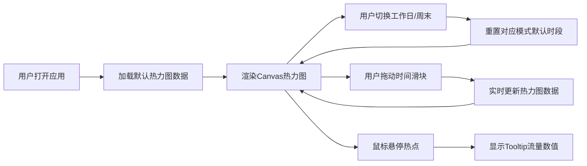

## 1. 产品概述

城市交通流量热力图可视化应用，为城市交通管理和规划人员提供直观的车流密度分析工具。
- 主要用途：通过不同时间维度观察城市路口车流密度变化，辅助交通决策
- 目标用户：城市交通管理人员、城市规划师、数据分析师

## 2. 核心功能

### 2.1 功能模块

1. **热力图展示模块**：Canvas渲染800x500交通热力图，30x20个路口热点，高斯模糊平滑过渡，蓝到红颜色渐变
2. **时间选择模块**：工作日/周末切换按钮，0-23小时时间滑块，实时更新热力图
3. **交互反馈模块**：鼠标悬停显示路口精确车流量tooltip，图例指示条，0.3秒过渡动画

### 2.2 页面详情

| 页面名称 | 模块名称 | 功能描述 |
|---------|---------|---------|
| 主页面 | 热力图展示 | Canvas渲染路口车流密度，高斯模糊热点，颜色渐变映射 |
| 主页面 | 时间选择器 | 日期类型切换（工作日/周末），小时滑块实时更新 |
| 主页面 | 图例指示 | 蓝红渐变图例条，标注低流量/高流量 |
| 主页面 | Tooltip | 鼠标悬停显示精确车流量数值 |

## 3. 核心流程

用户打开应用 → 查看默认时段（工作日早高峰）热力图 → 切换工作日/周末模式 → 拖动时间滑块观察不同时段车流变化 → 鼠标悬停查看具体路口流量数值

## 4. 用户界面设计

### 4.1 设计风格
- 主色调：深色背景#111827，蓝色#3b82f6，红色#ef4444
- 按钮样式：圆角，选中态蓝色背景白字，未选中深灰背景浅灰字
- 字体：系统无衬线字体（-apple-system, BlinkMacSystemFont, 'Segoe UI'）
- 布局：热力图居中展示，时间选择器底部对齐，整体居中
- 交互元素：最小44px触控区域

### 4.2 页面设计概述

| 页面名称 | 模块名称 | UI元素 |
|---------|---------|--------|
| 主页面 | 热力图容器 | 800px高度，自适应宽度，Canvas渲染，0.3秒淡入淡出动画 |
| 主页面 | 图例条 | 左上角渐变条，10px灰色标注文字 |
| 主页面 | 日期切换按钮组 | 双按钮，44px高度，选中高亮，过渡动画 |
| 主页面 | 时间滑块 | 0-23范围，#374151轨道，#3b82f6已选区域，44px触控区域 |
| 主页面 | Tooltip | #1f2937背景，0.95透明度，8px圆角，12px白色文字 |

### 4.3 响应式

桌面端优先，热力图宽度自适应窗口，高度固定800px，移动端触控优化，交互元素最小44px。
