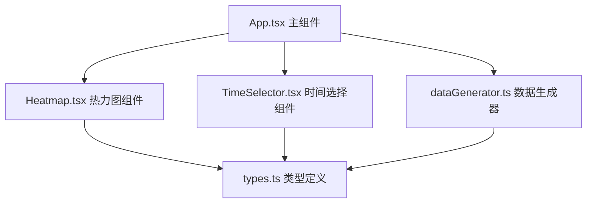

## 1. 架构设计



## 2. 技术描述

- 前端框架：React 18 + TypeScript
- 构建工具：Vite
- 渲染技术：Canvas 2D API
- 数据来源：前端Mock数据生成
- 开发服务器端口：3000

## 3. 文件结构

```
├── package.json
├── vite.config.js
├── tsconfig.json
├── index.html
└── src/
    ├── types.ts          # 交通数据类型定义
    ├── dataGenerator.ts  # 模拟交通数据生成
    ├── Heatmap.tsx       # Canvas热力图组件
    ├── TimeSelector.tsx  # 时间选择器组件
    └── App.tsx           # 主应用组件
```

## 4. 数据模型

### 4.1 类型定义

```typescript
interface IntersectionData {
  x: number;           // 路口X坐标
  y: number;           // 路口Y坐标
  traffic: number;     // 车流量 (辆/小时)
  timeLabel: string;   // 时间标签
}

type DayType = 'weekday' | 'weekend';

interface TrafficData {
  dayType: DayType;
  hour: number;
  intersections: IntersectionData[];
}
```

### 4.2 数据生成规则

- 路口数量：30x20个随机分布热点
- 车流量范围：0-500辆/小时
- 高峰时段：
  - 工作日：早8-9点、晚6-7点
  - 周末：下午2-4点
- 随机波动：±15%

## 5. 性能优化策略

- Canvas 2D直接绘制，避免DOM重绘
- 使用高斯模糊预计算热点
- requestAnimationFrame控制渲染帧率（目标≥30FPS）
- 数据更新延迟≤50ms
- 0.3秒CSS过渡动画实现平滑切换
