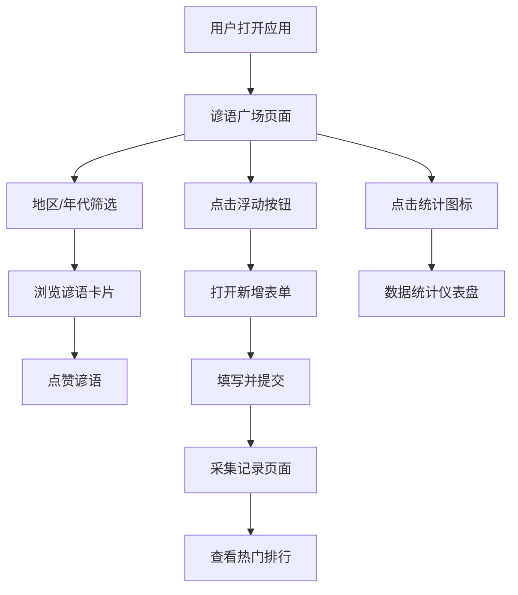

## 1. 产品概述

民间谚语数字博物馆是一个面向民间文学保护组织的数字化平台，旨在将散落在乡间的谚语和歇后语以时间轴方式呈现，让公众可以贡献自己的采集记录，共同保护和传承中华优秀传统文化。

- 主要目的：建立谚语数字化档案库，实现民间文学的保护与传承
- 目标用户：民间文学爱好者、文化研究者、普通公众
- 市场价值：填补民间文学数字化保护平台的空白，促进文化传承

## 2. 核心功能

### 2.1 用户角色

| 角色 | 注册方式 | 核心权限 |
|------|----------|----------|
| 普通用户 | 无需注册 | 浏览谚语、筛选浏览、点赞谚语、提交采集记录、查看排行榜 |

### 2.2 功能模块

1. **谚语广场页面**：双级联筛选器（地区+年代）、响应式卡片网格、点赞功能、虚拟滚动
2. **采集记录页面**：新增谚语表单、用户提交列表、热门谚语排行
3. **数据统计仪表盘**：谚语总数、地区分布饼图、今日新增数
4. **Header导航**：页面切换、统计面板

### 2.3 页面详情

| 页面名称 | 模块名称 | 功能描述 |
|-----------|----------|----------|
| 谚语广场 | 双级联筛选器 | 地区（6大地区）和年代（古代/近代/现代）筛选，0.3秒淡入动画 |
| 谚语广场 | 卡片网格 | 响应式布局，240x300px卡片，悬浮上移6px，阴影过渡 |
| 谚语广场 | 点赞按钮 | 大拇指图标，颜色从#9ca3af渐变至#f59e0b，乐观更新UI |
| 采集记录 | 新增表单 | 全屏模态表单，字段校验，100/200字符限制 |
| 采集记录 | 热门排行 | Top10点赞排行，30秒自动刷新，数字跳动动画 |
| 采集记录 | 用户列表 | 当前用户已提交的谚语卡片列表 |
| Header | 统计面板 | 谚语总数、地区分布饼图、今日新增，60秒自动更新 |

## 3. 核心流程

用户打开应用 → 进入谚语广场 → 通过地区和年代筛选浏览谚语卡片 → 点击点赞按钮（乐观更新+异步请求）→ 点击浮动按钮打开新增表单 → 填写表单并提交 → 查看采集记录页面 → 查看热门排行榜 → 点击统计图标查看数据仪表盘

## 4. 用户界面设计

### 4.1 设计风格

- **主色调**：暖色调怀旧风格，主背景#faf5eb
- **卡片背景**：#fef9ef，边框#f0e6d3，做旧纹理#d4b896
- **强调色**：#f59e0b（金色），#1e293b（深色导航）
- **按钮风格**：圆角，0.2秒过渡动画
- **字体**：Georgia衬线体，营造古典文化氛围
- **布局风格**：左右两栏（桌面）/上下单列（移动端<768px）
- **卡片风格**：圆角16px，边框1px，悬浮上移6px，阴影过渡0.3s

### 4.2 页面设计概述

| 页面名称 | 模块名称 | UI元素 |
|-----------|----------|----------|
| 谚语广场 | 筛选区域 | 双下拉框，暖色调边框，做旧风格 |
| 谚语广场 | 卡片网格 | 240x300px，#fef9ef背景，淡入动画0.3s |
| 谚语广场 | 点赞按钮 | 大拇指图标，颜色随点赞数渐变 |
| 采集记录 | 浮动按钮 | 圆形48px，#f59e0b背景，悬浮旋转45度 |
| 采集记录 | 模态表单 | 全屏覆盖，平滑收起动画 |
| 采集记录 | 热门排行 | 金色排名数字，跳动动画0.2s |
| Header | 导航栏 | #1e293b深色背景，固定定位 |
| Header | 统计面板 | 下拉面板，CSS圆环图 |

### 4.3 响应式设计

- 桌面端（>768px）：左右两栏布局，左栏3/4（卡片网格），右栏1/4（排行/筛选区）
- 移动端（≤768px）：上下单列布局，卡片自适应宽度
- 触控优化：按钮最小尺寸48px，触摸反馈

### 4.4 动画与交互

- 卡片淡入：0.3秒淡入动画
- 卡片悬浮：上移6px，阴影增加，0.3s过渡
- 点赞按钮：颜色渐变，数字跳动
- 浮动按钮：悬浮旋转45度，0.3s过渡
- 模态表单：平滑展开/收起
- 排行数字：刷新时跳动动画0.2s
- 所有交互：0.2秒平滑过渡

### 4.5 性能优化

- 虚拟滚动：仅渲染可视区域卡片，100+卡片保持60FPS
- API响应：≤500ms响应时间
- 乐观更新：点赞操作先更新UI再异步请求
