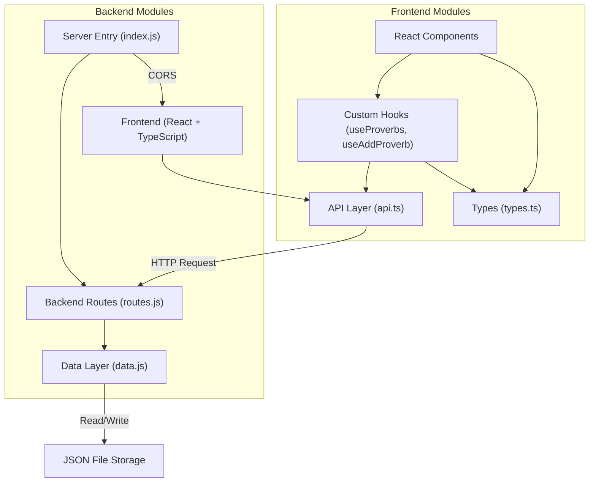
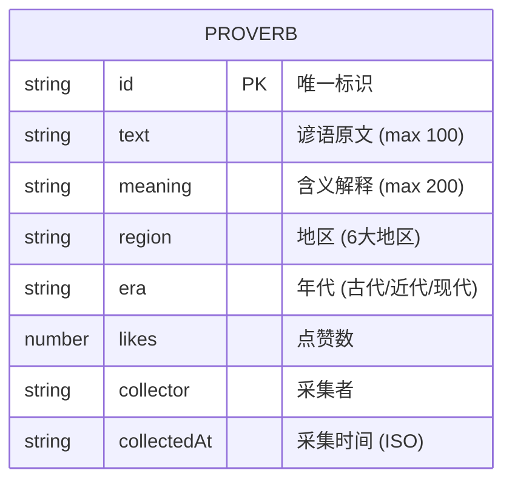

## 1. 架构设计



## 2. 技术描述

### 2.1 前端技术栈
- **框架**: React 18 + TypeScript
- **构建工具**: Vite
- **路由**: react-router-dom
- **状态管理**: React Hooks (useState, useEffect, useCallback, useMemo)
- **自定义Hooks**: useProverbs, useAddProverb
- **样式**: 原生CSS (按需求不使用Tailwind)

### 2.2 后端技术栈
- **框架**: Express 4
- **跨域**: cors
- **ID生成**: uuid
- **数据存储**: JSON文件 (无需数据库)
- **语言**: JavaScript (按用户需求)

### 2.3 项目初始化
- **模板**: react-express-ts (Vite + React + TypeScript + Express)
- **包管理器**: npm
- **开发端口**: 前端3000，后端3001

## 3. 目录结构

```
.
├── package.json              # 项目依赖与脚本
├── vite.config.js            # Vite构建配置
├── tsconfig.json             # TypeScript配置
├── index.html                # 入口HTML
├── server/                   # 后端代码
│   ├── data.js               # 数据层 - JSON读写
│   ├── routes.js             # 路由层 - API定义
│   └── index.js              # 服务入口
├── src/                      # 前端代码
│   ├── types.ts              # TypeScript类型定义
│   ├── api.ts                # API层 - 自定义Hooks
│   ├── App.tsx               # 主应用组件
│   ├── components/
│   │   ├── Header.tsx        # 顶部导航组件
│   │   ├── ProverbCard.tsx   # 谚语卡片组件
│   │   ├── FilterBar.tsx     # 筛选器组件
│   │   ├── RankingList.tsx   # 排行榜组件
│   │   ├── StatsPanel.tsx    # 统计面板组件
│   │   ├── AddProverbModal.tsx # 新增表单模态框
│   │   └── VirtualList.tsx   # 虚拟滚动组件
│   └── pages/
│       ├── ProverbSquare.tsx # 谚语广场页面
│       └── Contribution.tsx  # 采集记录页面
```

### 3.1 调用关系与数据流

1. **数据流方向**:
   - 前端组件 → src/api.ts (自定义Hooks) → HTTP请求 → server/routes.js → server/data.js → JSON文件

2. **模块依赖**:
   - [App.tsx](file:///d:/VersionFastPro/tasks/auto113/src/App.tsx) 依赖 [Header.tsx](file:///d:/VersionFastPro/tasks/auto113/src/components/Header.tsx)、[ProverbSquare.tsx](file:///d:/VersionFastPro/tasks/auto113/src/pages/ProverbSquare.tsx)、[Contribution.tsx](file:///d:/VersionFastPro/tasks/auto113/src/pages/Contribution.tsx)
   - [ProverbSquare.tsx](file:///d:/VersionFastPro/tasks/auto113/src/pages/ProverbSquare.tsx) 依赖 [useProverbs](file:///d:/VersionFastPro/tasks/auto113/src/api.ts)、[FilterBar.tsx](file:///d:/VersionFastPro/tasks/auto113/src/components/FilterBar.tsx)、[ProverbCard.tsx](file:///d:/VersionFastPro/tasks/auto113/src/components/ProverbCard.tsx)、[VirtualList.tsx](file:///d:/VersionFastPro/tasks/auto113/src/components/VirtualList.tsx)
   - [Contribution.tsx](file:///d:/VersionFastPro/tasks/auto113/src/pages/Contribution.tsx) 依赖 [useAddProverb](file:///d:/VersionFastPro/tasks/auto113/src/api.ts)、[RankingList.tsx](file:///d:/VersionFastPro/tasks/auto113/src/components/RankingList.tsx)、[AddProverbModal.tsx](file:///d:/VersionFastPro/tasks/auto113/src/components/AddProverbModal.tsx)
   - [api.ts](file:///d:/VersionFastPro/tasks/auto113/src/api.ts) 依赖 [types.ts](file:///d:/VersionFastPro/tasks/auto113/src/types.ts)

## 4. 路由定义

### 4.1 前端路由 (react-router-dom)

| 路由路径 | 页面组件 | 说明 |
|----------|----------|------|
| / | ProverbSquare | 谚语广场首页 |
| /square | ProverbSquare | 谚语广场 |
| /contribution | Contribution | 采集记录 |

### 4.2 后端API路由

| 方法 | 路径 | 说明 |
|------|------|------|
| GET | /api/proverbs | 获取谚语列表，支持region和era查询参数 |
| POST | /api/proverbs | 新增谚语采集记录 |
| PUT | /api/proverbs/:id/like | 点赞谚语 |
| GET | /api/proverbs/top | 获取Top10热门谚语 |
| GET | /api/stats | 获取统计数据 |

## 5. API定义

### 5.1 TypeScript类型定义

```typescript
interface Proverb {
  id: string;
  text: string;
  meaning: string;
  region: Region;
  era: Era;
  likes: number;
  collector: string;
  collectedAt: string;
}

type Region = '华北' | '华东' | '华南' | '西南' | '西北' | '东北';
type Era = '古代' | '近代' | '现代';
```

### 5.2 请求/响应格式

#### GET /api/proverbs
- **Query参数**: region?: string, era?: string
- **响应**: `{ data: Proverb[] }`

#### POST /api/proverbs
- **请求体**: 
  ```json
  {
    "text": "谚语原文",
    "meaning": "含义解释",
    "region": "地区",
    "era": "年代",
    "collector": "采集者"
  }
  ```
- **响应**: `{ data: Proverb }`

#### PUT /api/proverbs/:id/like
- **响应**: `{ data: { id: string, likes: number } }`

#### GET /api/proverbs/top
- **响应**: `{ data: Proverb[] }` (按likes降序，前10条)

#### GET /api/stats
- **响应**: 
  ```json
  {
    "total": 50,
    "byRegion": { "华北": 10, "华东": 8, ... },
    "todayNew": 3
  }
  ```

## 6. 数据模型

### 6.1 谚语数据结构



### 6.2 初始数据
- **数据量**: 50条谚语数据，覆盖6大地区和3个年代
- **存储格式**: JSON数组，文件路径: `server/data/proverbs.json`
- **示例数据**:
  ```json
  [
    {
      "id": "uuid-1",
      "text": "一寸光阴一寸金，寸金难买寸光阴",
      "meaning": "时间非常宝贵，无法用金钱衡量",
      "region": "华北",
      "era": "古代",
      "likes": 42,
      "collector": "系统初始化",
      "collectedAt": "2024-01-01T00:00:00.000Z"
    }
  ]
  ```

## 7. 核心技术实现要点

### 7.1 虚拟滚动实现
- 使用IntersectionObserver或基于scrollTop计算可视区域
- 仅渲染当前可视区域内的卡片
- 设置固定容器高度和卡片预估高度
- 实现占位符保持滚动位置

### 7.2 乐观更新策略
- 点赞操作：立即更新本地状态，异步发送请求
- 请求失败：回滚本地状态并提示用户

### 7.3 动画实现
- CSS transitions: 卡片悬浮、按钮点击、模态框展开
- CSS keyframes: 淡入、数字跳动、旋转
- 所有动画持续时间: 0.2s-0.3s

### 7.4 性能优化
- API缓存：短时间内重复请求使用缓存
- 防抖：筛选器输入使用防抖
- 节流：滚动事件使用节流
- 组件懒加载：按需加载非关键组件

### 7.5 表单验证
- 前端验证：所有字段非空、长度限制
- 实时验证：输入时即时反馈
- 错误提示：红色边框+错误文字
