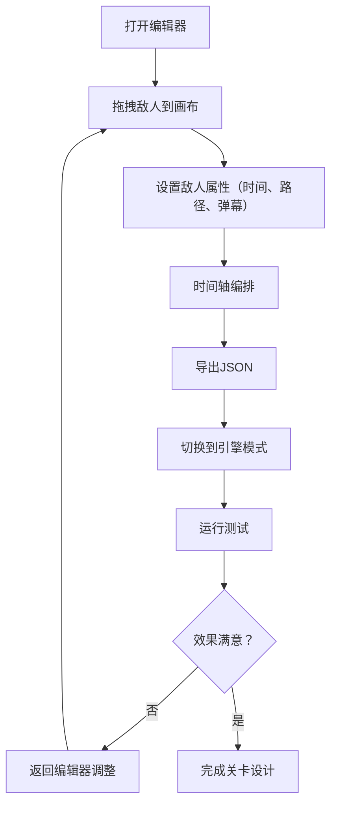

## 1. 产品概述

经典2D横版卷轴射击游戏（STG）的完整关卡编辑器与可执行引擎，解决独立游戏开发者在原型设计阶段难以快速制作并测试弹幕模式、敌人编队和关卡节奏的问题。

- 主要用途：快速设计和测试STG游戏的关卡原型，包括敌人配置、弹幕模式、移动路径
- 目标用户：独立游戏开发者、STG游戏爱好者
- 产品价值：大幅缩短STG关卡的原型迭代周期，通过可视化编辑降低开发门槛

## 2. 核心功能

### 2.1 用户角色
| 角色 | 注册方式 | 核心权限 |
|------|----------|----------|
| 游戏开发者 | 无需注册 | 完整的关卡编辑、导出、测试权限 |

### 2.2 功能模块
1. **关卡编辑器模块**：左侧敌人模板库、中央编辑画布、下方时间轴、撤销/重做系统、JSON导出
2. **游戏引擎模块**：玩家控制、敌人AI、弹幕系统、碰撞检测、HUD显示、暂停/重开、胜利画面
3. **数据交互模块**：编辑器与引擎间的数据传递、状态反馈

### 2.3 页面详情
| 页面名称 | 模块名称 | 功能描述 |
|-----------|-----------|-------------|
| 编辑器页面 | 左侧模板库 | 展示三种敌人模板（普通敌机、精英敌机、Boss），支持拖拽到画布 |
| 编辑器页面 | 中央画布 | 800x600px编辑区域，支持放置敌人、绘制贝塞尔曲线路径、选择敌人编辑属性 |
| 编辑器页面 | 下方时间轴 | 120px高时间轴面板，显示敌人出现时间，支持点击跳转、设置弹幕模板 |
| 编辑器页面 | 工具栏 | 撤销/重做按钮、导出JSON按钮、运行测试按钮 |
| 引擎运行页面 | 游戏画布 | 全屏Canvas，渲染游戏世界、玩家、敌人、弹幕、粒子效果 |
| 引擎运行页面 | HUD系统 | 显示生命值（3个红心）、分数（白色24px）、波次（紫色18px） |
| 引擎运行页面 | 暂停界面 | 半透明遮罩，显示"暂停"文字 |
| 引擎运行页面 | 胜利画面 | 全屏深蓝色背景，"Victory!"文字，金色粒子雨效果 |

## 3. 核心流程

用户从模板库拖拽敌人到画布，设置出现时间和移动路径，配置弹幕模式，通过时间轴编排敌人出场顺序，导出JSON关卡数据，切换到引擎模式测试游戏，根据测试结果返回编辑器调整参数。

## 4. 用户界面设计

### 4.1 设计风格
- 主色调：深灰#2d2d2d（编辑器面板）、深蓝#0a1929（画布/游戏背景）
- 强调色：浅蓝#64b5f6（普通敌机）、橙红#e65100（精英敌机）、深紫#7b1fa2（Boss）、绿色#00e676（路径）
- 按钮风格：圆角8px，悬停有轻微放大效果
- 字体：使用现代无衬线字体，标题加粗，正文清晰易读
- 布局：左侧面板300px固定宽度，中央画布flex-grow自适应，下方时间轴120px固定高度
- 动画：所有状态切换0.3秒ease-in-out过渡，拖拽0.2秒平滑回退动画

### 4.2 页面设计概述
| 页面名称 | 模块名称 | UI元素 |
|-----------|-----------|----------|
| 编辑器页面 | 左侧模板库 | 深灰背景#2d2d2d，圆角8px，内边距14px，敌人预览卡片，拖拽效果 |
| 编辑器页面 | 中央画布 | 深蓝背景#0a1929，10x10浅色网格线rgba(255,255,255,0.05)，1px实线#444443边框 |
| 编辑器页面 | 时间轴面板 | 深灰背景#1e1e1e，浅蓝色#4fc3f7时间指示线，每0.5秒刻度 |
| 引擎运行页面 | 游戏界面 | 纯黑背景全屏，无外部UI，HUD悬浮显示 |
| 引擎运行页面 | 暂停界面 | 半透明遮罩#000000aa，白色"暂停"字体36px居中 |
| 引擎运行页面 | 胜利画面 | 全屏#1a237e背景，中央白色大字"Victory!"，金色粒子雨效果 |

### 4.3 响应式
- 桌面端优先设计，编辑器区域固定尺寸保证编辑精度
- 引擎运行时全屏自适应
- 不考虑移动端适配

### 4.4 性能要求
- 编辑器和引擎帧率稳定60FPS
- 拖拽和撤销操作响应延迟低于100ms
- 引擎同时处理200颗以上子弹时帧率不低于30FPS
- 碰撞检测使用空间哈希优化
