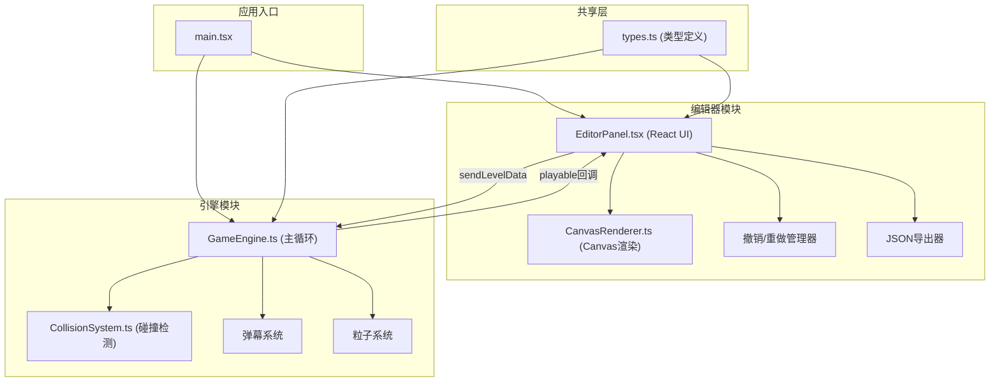

## 1. 架构设计

本项目采用纯前端架构，分为编辑器模块和引擎模块，通过TypeScript接口进行数据交互。



## 2. 技术描述

- **前端框架**：React 18 + TypeScript 5
- **构建工具**：Vite 5
- **渲染技术**：HTML5 Canvas 2D
- **状态管理**：React Hooks (useState, useRef, useCallback) 管理编辑器状态，引擎内部使用类实例状态
- **项目初始化**：使用 vite-init 创建 react-ts 模板

## 3. 文件结构

| 文件路径 | 职责 |
|---------|------|
| `/package.json` | 项目依赖配置，包含react、react-dom、typescript、vite等 |
| `/index.html` | 入口HTML，全屏无滚动 |
| `/vite.config.js` | Vite构建配置，base设为'/' |
| `/tsconfig.json` | TypeScript配置，严格模式，target ES2020 |
| `/src/main.tsx` | 应用入口，管理editor/play模式切换 |
| `/src/types.ts` | 共享类型定义：敌人配置、弹幕模板、关卡数据结构 |
| `/src/editor/EditorPanel.tsx` | 编辑器React组件：模板库、画布、时间轴、撤销/重做、导出 |
| `/src/editor/CanvasRenderer.ts` | 编辑器画布渲染器：网格、敌人实体、移动路径绘制 |
| `/src/engine/GameEngine.ts` | 引擎主循环：关卡加载、玩家控制、敌人AI、弹幕系统、渲染调度 |
| `/src/engine/CollisionSystem.ts` | 碰撞检测：空间哈希优化，检测各类碰撞事件 |

## 4. 核心数据结构

### 4.1 关卡数据 (LevelData)
```typescript
interface LevelData {
  id: string;
  name: string;
  duration: number;
  enemies: EnemyInstance[];
}
```

### 4.2 敌人实例 (EnemyInstance)
```typescript
interface EnemyInstance {
  id: string;
  type: 'normal' | 'elite' | 'boss';
  spawnTime: number;
  initialPosition: { x: number; y: number };
  path: BezierPath;
  bulletPattern: BulletPattern;
  health: number;
}
```

### 4.3 贝塞尔路径 (BezierPath)
```typescript
interface BezierPath {
  controlPoints: [
    { x: number; y: number },
    { x: number; y: number },
    { x: number; y: number }
  ];
  duration: number;
}
```

### 4.4 弹幕模板 (BulletPattern)
```typescript
interface BulletPattern {
  type: 'aimed' | 'fan' | 'spiral';
  fireRate: number;
  bulletSpeed: number;
  bulletColor: string;
  bulletSize: number;
  angle?: number;
  count?: number;
}
```

## 5. 模块接口定义

### 5.1 编辑器 → 引擎 数据传递
```typescript
// 编辑器模块导出函数
function sendLevelData(levelData: LevelData): void;

// 引擎模块回调
type PlayableCallback = (status: 'ready' | 'running' | 'paused' | 'victory' | 'defeat') => void;
function setPlayableCallback(callback: PlayableCallback): void;
```

### 5.2 引擎状态
```typescript
interface GameState {
  mode: 'editor' | 'play';
  isPaused: boolean;
  score: number;
  lives: number;
  wave: number;
  currentTime: number;
}
```

## 6. 性能优化策略

### 6.1 碰撞检测优化
- 使用空间哈希（Spatial Hash）将游戏空间划分为网格
- 每个对象只与同一网格及相邻网格内的对象进行碰撞检测
- 时间复杂度从O(n²)降低到O(n)

### 6.2 渲染优化
- 使用离屏Canvas预渲染静态元素（网格）
- 弹幕对象池（Object Pooling）避免频繁GC
- requestAnimationFrame驱动主循环，固定时间步长更新

### 6.3 编辑器性能
- 拖拽操作使用requestAnimationFrame节流
- 撤销/重做使用浅拷贝 + 快照，避免深拷贝性能损耗
- Canvas渲染使用脏矩形（Dirty Rectangle）优化

## 7. 按键映射

| 按键 | 功能 | 适用模块 |
|-----|------|---------|
| W/A/S/D | 玩家移动 | 引擎 |
| 空格 | 射击 | 引擎 |
| P | 暂停/继续 | 引擎 |
| R | 重新开始 | 引擎 |
| Ctrl+Z | 撤销 | 编辑器 |
| Ctrl+Shift+Z | 重做 | 编辑器 |
| ESC | 返回编辑器 | 引擎 |
