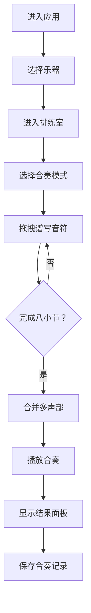

## 1. 产品概述

虚拟排练室是一个在线协作音乐应用，让音乐爱好者和初学者在没有实体乐器的情况下体验合奏乐趣。用户可选择虚拟乐器，在五线谱上拖拽谱写旋律，通过三种合奏模式与虚拟指挥协作完成八小节的多声部音乐作品。

- 核心目标：降低音乐合奏门槛，提供沉浸式的即兴协作体验
- 目标用户：音乐爱好者、初学者、教育场景下的学生
- 产品价值：随时随地体验多乐器合奏，学习音乐节拍与和声概念

## 2. 核心功能

### 2.1 用户角色
| 角色 | 注册方式 | 核心权限 |
|------|----------|----------|
| 普通用户 | 无需注册，本地会话 | 选择乐器、谱写旋律、体验合奏模式、查看合奏结果 |

### 2.2 功能模块
1. **乐器选择界面**：五种乐器卡片选择，独特视觉风格和音色
2. **排练室主界面**：五线谱编辑区、模式切换器、小节计数器、播放进度条
3. **合奏引擎**：音符缓冲区、多声部合并逻辑、三种模式时间对齐规则
4. **结果展示面板**：合奏总时长、各乐器活跃度半圆环图、演奏记录存储

### 2.3 页面详情
| 页面名称 | 模块名称 | 功能描述 |
|----------|----------|----------|
| 乐器选择页 | 乐器卡片网格 | 五种乐器卡片，悬停放大效果，选中状态高亮 |
| 排练室页面 | 五线谱编辑区 | 点击创建音符，拖拽调整位置，删除操作带惯性效果 |
| 排练室页面 | 模式切换器 | 对齐/跟随/自由三种模式，平滑下拉动画切换 |
| 排练室页面 | 小节计数器 | 显示当前小节进度，完成时播放提示音 |
| 排练室页面 | 播放进度条 | 合奏播放时显示进度，颜色匹配当前模式 |
| 合奏完成面板 | 统计展示 | 半圆环图显示各乐器活跃度，总时长统计 |

## 3. 核心流程

用户进入应用 → 选择虚拟乐器 → 进入排练室 → 选择合奏模式 → 在五线谱上拖拽谱写音符 → 完成八小节创作 → 自动合并多声部播放 → 查看合奏结果统计 → 保存记录

## 4. 用户界面设计

### 4.1 设计风格
- 主色调：暗色调音乐工作室风格，背景渐变 `#1a1a2e` 到 `#16213e`
- 乐器配色：钢琴 `#ffcdd2`、小提琴 `#c8e6c9`、大提琴 `#bbdefb`、长笛 `#fff9c4`、打击乐 `#d1c4e9`
- 模式主题色：对齐 `#66bb6a`、跟随 `#42a5f5`、自由 `#ef5350`
- 按钮卡片：圆角设计 12px-24px，过渡动画 0.2-0.4s ease-out
- 字体：显示字体使用 Playfair Display，正文字体使用 Inter，突出音乐艺术感

### 4.2 页面设计概述
| 页面名称 | 模块名称 | UI 元素 |
|----------|----------|----------|
| 乐器选择页 | 乐器卡片 | 120x120px圆角卡片，悬停放大1.08倍，选中3px深色边框 |
| 排练室页面 | 五线谱区 | 85%宽60%高，半透明背景圆角24px，椭圆音符拖拽 |
| 排练室页面 | 模式按钮 | 平滑下拉动画，高度0→36px，背景色渐变 |
| 排练室页面 | 进度条 | 6px高度圆角3px，模式主题色渐变 |
| 结果面板 | 半圆环图 | 48px直径，线宽6px，乐器配色，分隔间距4px |

### 4.3 响应式设计
- 桌面优先设计，窄屏宽度 < 768px 时自动适配
- 五线谱区域改为竖排显示，音符按节拍垂直滚动
- 乐器卡片改为两行三列布局
- 触摸操作优化，拖拽区域扩大

### 4.4 动效与交互
- 所有过渡动画 0.2-0.4s ease-out
- 音符拖拽时放大1.2倍，带虚线路径指示
- 模式切换下拉动画，背景色渐变
- 小节完成时 880Hz 正弦波提示音（0.15秒）
- 音符拖拽和删除惯性滑动效果
