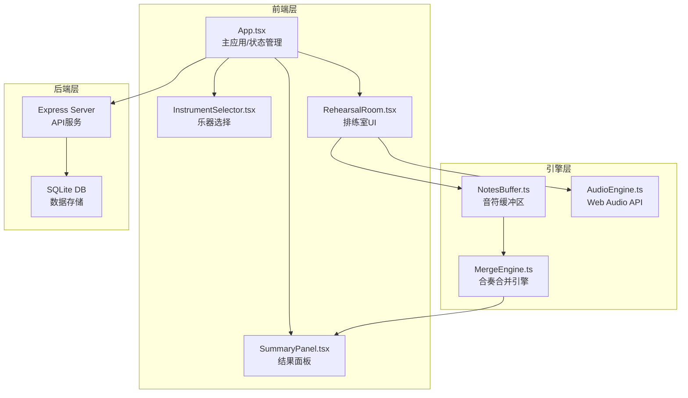
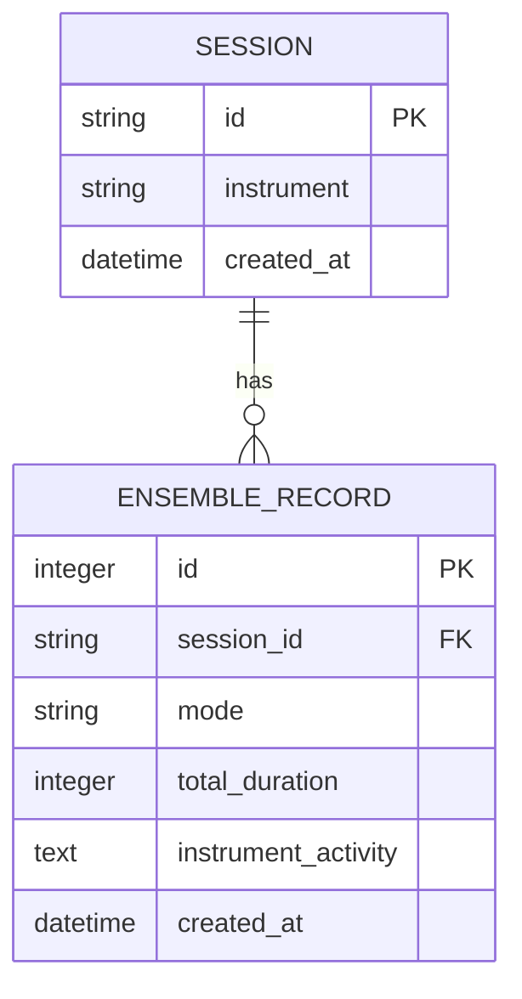
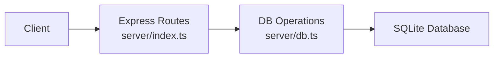

## 1. 架构设计



## 2. 技术描述

- **前端框架**：React 18 + TypeScript + Hooks
- **构建工具**：Vite 5.x，端口 3000
- **状态管理**：React Hooks (useState, useEffect, useReducer) + 本地事件总线
- **音频引擎**：Web Audio API 合成音色
- **样式方案**：CSS Modules + CSS Variables
- **后端**：Express 4.x + TypeScript，端口 5000
- **数据库**：SQLite 单文件存储
- **代理配置**：Vite 代理 `/api` 到 `localhost:5000`
- **路径别名**：`@/` 指向 `src/`

## 3. 目录结构

```
├── src/
│   ├── App.tsx                 # 主应用组件
│   ├── components/
│   │   ├── InstrumentSelector.tsx  # 乐器选择组件
│   │   ├── RehearsalRoom.tsx       # 排练室组件
│   │   └── SummaryPanel.tsx        # 结果面板组件
│   ├── engine/
│   │   ├── NotesBuffer.ts          # 音符缓冲区
│   │   ├── MergeEngine.ts          # 合并引擎（纯函数）
│   │   └── AudioEngine.ts          # 音频引擎
│   ├── types/
│   │   └── index.ts                # 类型定义
│   └── main.tsx                    # 入口文件
├── server/
│   ├── index.ts                    # Express服务
│   └── db.ts                       # SQLite封装
├── index.html
├── vite.config.ts
├── tsconfig.json
└── package.json
```

## 4. 核心类型定义

```typescript
// 乐器类型
type InstrumentType = 'piano' | 'violin' | 'cello' | 'flute' | 'percussion';

// 乐器配置
interface Instrument {
  id: InstrumentType;
  name: string;
  color: string;
  avatar: string;
}

// 音符数据
interface Note {
  id: string;
  instrument: InstrumentType;
  pitch: number;      // 音高 0-11
  beat: number;       // 节拍位置 0-3
  duration: number;   // 持续时长
  x: number;          // UI位置
  y: number;          // UI位置
}

// 合奏模式
type EnsembleMode = 'align' | 'follow' | 'free';

// 小节数据
interface Measure {
  measureNumber: number;
  notes: Note[];
  completed: boolean;
}

// 合奏结果
interface EnsembleResult {
  sessionId: string;
  totalDuration: number;
  measures: Measure[];
  instrumentActivity: Record<InstrumentType, number>;
  mode: EnsembleMode;
  createdAt: number;
}

// 用户会话
interface UserSession {
  id: string;
  instrument: InstrumentType;
  currentMeasure: number;
  totalMeasures: number;
}
```

## 5. 路由定义

| 路由 | 用途 |
|------|------|
| `/` | 乐器选择页面 |
| `/rehearsal` | 排练室页面 |

## 6. API 定义

### 6.1 创建会话
```typescript
// POST /api/session
interface CreateSessionRequest {
  instrument: InstrumentType;
}

interface CreateSessionResponse {
  sessionId: string;
}
```

### 6.2 保存合奏记录
```typescript
// POST /api/ensemble
interface SaveEnsembleRequest {
  sessionId: string;
  result: EnsembleResult;
}

interface SaveEnsembleResponse {
  success: boolean;
  id: number;
}
```

### 6.3 查询合奏记录
```typescript
// GET /api/ensemble/:sessionId
interface GetEnsembleResponse {
  records: EnsembleResult[];
}
```

## 7. 数据模型

### 7.1 ER 图


### 7.2 DDL 语句
```sql
CREATE TABLE IF NOT EXISTS sessions (
  id TEXT PRIMARY KEY,
  instrument TEXT NOT NULL,
  created_at DATETIME DEFAULT CURRENT_TIMESTAMP
);

CREATE TABLE IF NOT EXISTS ensemble_records (
  id INTEGER PRIMARY KEY AUTOINCREMENT,
  session_id TEXT NOT NULL,
  mode TEXT NOT NULL,
  total_duration INTEGER NOT NULL,
  instrument_activity TEXT NOT NULL,
  created_at DATETIME DEFAULT CURRENT_TIMESTAMP,
  FOREIGN KEY (session_id) REFERENCES sessions(id)
);

CREATE INDEX IF NOT EXISTS idx_session_id ON ensemble_records(session_id);
```

## 8. 性能要求

- 音符拖拽帧率 ≥ 55fps
- 模式切换响应延迟 ≤ 100ms
- 音频播放延迟 < 50ms
- 内存占用 < 200MB

## 9. 服务端架构


