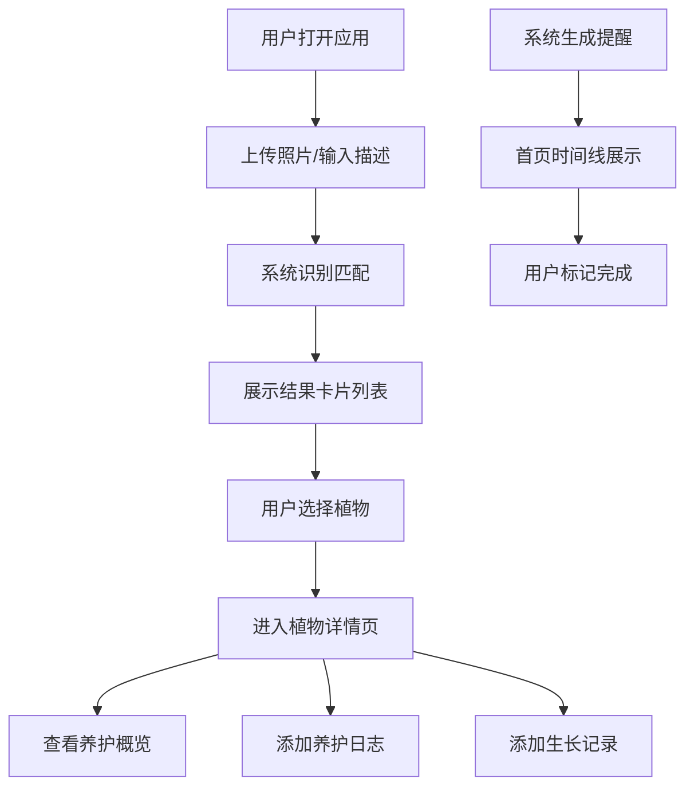

## 1. 产品概述

园艺助手应用是一款帮助园艺爱好者和新手通过AI识别植物、获取个性化养护指南和管理植物生长记录的在线工具。解决用户在养护过程中缺乏准确识别工具和个性化护理方案的痛点。

- 主要用途：植物识别、养护指南生成、养护日志管理、生长记录追踪
- 目标用户：园艺爱好者、新手园丁、室内植物养护者
- 市场价值：降低园艺入门门槛，提供智能化、个性化的植物养护体验

## 2. 核心功能

### 2.1 用户角色

| 角色 | 注册方式 | 核心权限 |
|------|----------|----------|
| 普通用户 | 无需注册，本地存储 | 上传图片/输入描述识别植物、查看养护指南、管理养护日志、记录生长历程 |

### 2.2 功能模块

1. **首页**：植物识别上传面板、识别结果卡片列表、养护提醒时间线
2. **植物详情页**：植物高清图、快捷养护概览卡片、月历式养护日志、生长记录列表
3. **我的植物库**：已添加植物网格展示、植物搜索、快速进入详情

### 2.3 页面详情

| 页面名称 | 模块名称 | 功能描述 |
|---------|----------|----------|
| 首页 | 上传面板 | 支持拖拽/点击上传植物照片，支持手动输入植物特征描述 |
| 首页 | 识别结果列表 | 卡片形式展示前3个匹配结果，显示植物名称、置信度百分比，支持悬停动效 |
| 首页 | 养护提醒时间线 | 按时间展示未来一周养护提醒，支持一键标记完成 |
| 植物详情页 | 养护概览卡片 | 展示光照、浇水频率、适宜温度、土壤类型，图标+文字展示 |
| 植物详情页 | 月历养护日志 | 点击日期添加养护事件（浇水、施肥、修剪、换盆），彩色标签展示，支持编辑删除 |
| 植物详情页 | 生长记录列表 | 按时间倒序展示生长记录，支持上传照片和备注，支持图片预览放大 |
| 我的植物库 | 植物网格 | 三列网格展示所有已添加植物卡片，支持响应式布局 |

## 3. 核心流程

用户上传植物照片或输入描述 → 系统返回匹配结果列表 → 用户选择正确结果 → 进入植物详情页 → 查看养护指南 → 添加养护日志和生长记录 → 系统生成养护提醒 → 用户在首页查看并执行提醒

## 4. 用户界面设计

### 4.1 设计风格

- **主色调**：#6d4c41（深棕色）
- **辅助色**：#a5d6a7（浅绿色）
- **背景色**：#faf5f0（米白色）
- **卡片背景**：#ffffff
- **按钮样式**：圆角设计，点击有涟漪水波效果（rgba(255,255,255,0.3)）
- **字体**：系统无衬线字体（-apple-system, BlinkMacSystemFont, "Segoe UI", Roboto, sans-serif）
- **布局风格**：卡片式布局，顶部固定导航栏，主内容区居中最大宽1200px
- **图标风格**：简约线性图标，与自然主题契合

### 4.2 页面设计概述

| 页面名称 | 模块名称 | UI元素 |
|---------|----------|--------|
| 首页 | 上传面板 | 拖拽区域、文件选择按钮、文本输入框、识别按钮、温暖渐变背景 |
| 首页 | 结果卡片 | 200x280px卡片，圆角16px，顶部120px图片，植物名20px字重700，置信度14px色#888，悬停上移6px阴影加深 |
| 首页 | 时间线 | 2px实线#e0e0e0，左侧图标圆点，右侧文字描述，已完成项灰色带删除线 |
| 植物详情页 | 高清图 | 400x400px圆角20px，object-fit cover |
| 植物详情页 | 养护概览 | 60x60px圆角12px浅色背景块，图标+文字 |
| 植物详情页 | 月历 | 网格布局，日期可点击，事件彩色标签（浇水#4fc3f7、施肥#81c784、修剪#ffb74d、换盆#ba68c8） |
| 植物详情页 | 生长记录 | 横排卡片，左侧80x80px缩略图圆角8px，中间日期备注，右侧删除按钮 |
| 我的植物库 | 植物网格 | 三列网格gap 24px，响应式768px两列，480px单列 |

### 4.3 响应式

- **设计原则**：桌面优先，移动适配
- **断点设置**：768px（平板两列）、480px（手机单列）
- **触摸优化**：按钮最小44x44px触摸区域，卡片点击反馈明显
- **动画效果**：页面切换淡入（opacity 0→1持续0.3s ease），卡片悬停过渡0.3s ease

### 4.4 性能要求

- 主页面加载时间 ≤ 2秒（首次无缓存）
- 图片懒加载，单张图片 ≤ 200KB
- 图片压缩处理使用sharp库
