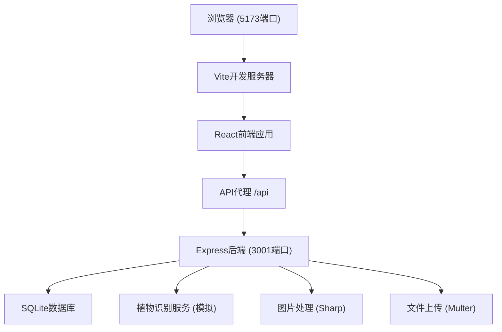
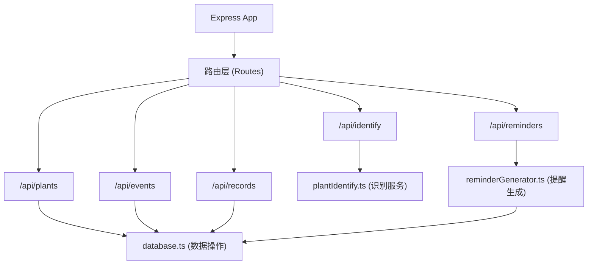
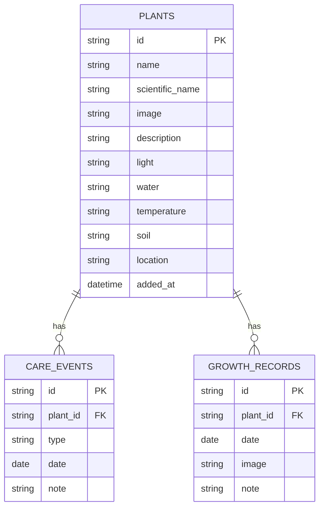

## 1. 架构设计



## 2. 技术描述

- **前端框架**：React@18 + TypeScript + Vite@5
- **状态管理**：React hooks (useState, useEffect, useContext)
- **路由管理**：React Router v6
- **样式方案**：CSS Modules + CSS Variables
- **后端框架**：Express@4
- **数据库**：SQLite3
- **图片处理**：Sharp（压缩、裁剪）
- **文件上传**：Multer
- **ID生成**：uuid
- **跨域处理**：cors

## 3. 路由定义

| 前端路由 | 页面组件 | 用途 |
|---------|----------|------|
| / | Home | 首页：植物识别上传、结果展示、养护提醒时间线 |
| /plant/:id | PlantDetail | 植物详情页：养护概览、养护日志、生长记录 |
| /garden | MyGarden | 我的植物库：所有植物网格展示 |

| 后端API路由 | 方法 | 用途 |
|------------|------|------|
| /api/identify | POST | 植物识别（图片上传或文本描述） |
| /api/plants | GET | 获取所有植物列表 |
| /api/plants | POST | 添加新植物 |
| /api/plants/:id | GET | 获取单株植物详情 |
| /api/plants/:id | PUT | 更新植物信息 |
| /api/plants/:id | DELETE | 删除植物 |
| /api/plants/:id/events | GET | 获取植物养护事件 |
| /api/plants/:id/events | POST | 添加养护事件 |
| /api/events/:id | PUT | 更新养护事件 |
| /api/events/:id | DELETE | 删除养护事件 |
| /api/plants/:id/records | GET | 获取植物生长记录 |
| /api/plants/:id/records | POST | 添加生长记录 |
| /api/records/:id | DELETE | 删除生长记录 |
| /api/reminders | GET | 获取养护提醒列表 |
| /api/reminders/:id/complete | POST | 标记提醒完成 |
| /api/upload | POST | 图片上传接口 |

## 4. API 类型定义

```typescript
// 植物类型
interface Plant {
  id: string;
  name: string;
  scientificName: string;
  image: string;
  description: string;
  light: string;
  water: string;
  temperature: string;
  soil: string;
  location: string;
  addedAt: string;
}

// 养护事件类型
interface CareEvent {
  id: string;
  plantId: string;
  type: 'water' | 'fertilize' | 'prune' | 'repot';
  date: string;
  note?: string;
}

// 生长记录类型
interface GrowthRecord {
  id: string;
  plantId: string;
  date: string;
  image: string;
  note: string;
}

// 养护提醒类型
interface Reminder {
  id: string;
  plantId: string;
  plantName: string;
  type: 'water' | 'fertilize' | 'prune' | 'repot';
  date: string;
  description: string;
  completed: boolean;
}

// 识别结果类型
interface IdentifyResult {
  id: string;
  name: string;
  confidence: number;
  image: string;
  light: string;
  water: string;
  temperature: string;
  soil: string;
}

// 识别请求
interface IdentifyRequest {
  image?: File;
  description?: string;
}
```

## 5. 服务器架构



## 6. 数据模型

### 6.1 实体关系图



### 6.2 DDL 语句

```sql
-- 植物表
CREATE TABLE IF NOT EXISTS plants (
  id TEXT PRIMARY KEY,
  name TEXT NOT NULL,
  scientific_name TEXT,
  image TEXT,
  description TEXT,
  light TEXT,
  water TEXT,
  temperature TEXT,
  soil TEXT,
  location TEXT,
  added_at DATETIME DEFAULT CURRENT_TIMESTAMP
);

-- 养护事件表
CREATE TABLE IF NOT EXISTS care_events (
  id TEXT PRIMARY KEY,
  plant_id TEXT NOT NULL,
  type TEXT NOT NULL CHECK(type IN ('water', 'fertilize', 'prune', 'repot')),
  date TEXT NOT NULL,
  note TEXT,
  FOREIGN KEY (plant_id) REFERENCES plants(id) ON DELETE CASCADE
);

-- 生长记录表
CREATE TABLE IF NOT EXISTS growth_records (
  id TEXT PRIMARY KEY,
  plant_id TEXT NOT NULL,
  date TEXT NOT NULL,
  image TEXT,
  note TEXT,
  FOREIGN KEY (plant_id) REFERENCES plants(id) ON DELETE CASCADE
);

-- 索引
CREATE INDEX IF NOT EXISTS idx_events_plant_id ON care_events(plant_id);
CREATE INDEX IF NOT EXISTS idx_events_date ON care_events(date);
CREATE INDEX IF NOT EXISTS idx_records_plant_id ON growth_records(plant_id);
CREATE INDEX IF NOT EXISTS idx_records_date ON growth_records(date);
```

## 7. 项目文件结构

```
project-root/
├── package.json
├── vite.config.js
├── tsconfig.json
├── index.html
├── src/
│   ├── App.tsx              # 路由配置
│   ├── main.tsx             # 应用入口
│   ├── styles/
│   │   └── global.css       # 全局样式变量
│   ├── components/          # 公共组件
│   │   ├── Navbar.tsx
│   │   ├── PlantCard.tsx
│   │   ├── CareCalendar.tsx
│   │   ├── Timeline.tsx
│   │   └── ImageModal.tsx
│   ├── pages/
│   │   ├── Home.tsx
│   │   ├── PlantDetail.tsx
│   │   └── MyGarden.tsx
│   ├── types/
│   │   └── index.ts         # TypeScript类型定义
│   └── utils/
│       └── api.ts           # API请求封装
├── server/
│   ├── index.ts             # Express入口
│   ├── database.ts          # SQLite初始化
│   ├── plantIdentify.ts     # 植物识别逻辑
│   ├── plantDatabase.ts     # 内置50种植物数据
│   └── routes/
│       ├── identify.ts
│       ├── plants.ts
│       ├── events.ts
│       ├── records.ts
│       └── reminders.ts
└── uploads/                 # 上传图片存储目录
```
