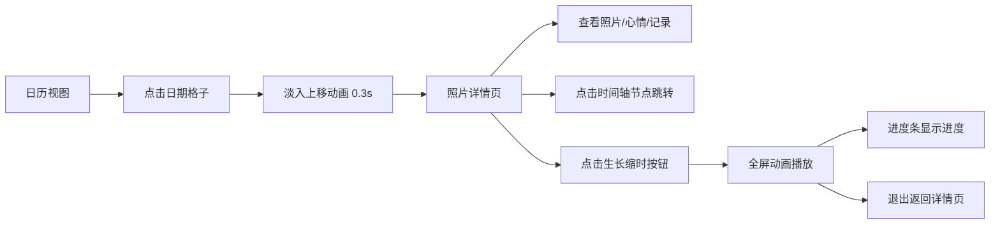

## 1. 产品概述

植物生长日记是一款帮助用户记录和展示植物生长过程的Web应用，用户可以每天上传照片并记录植物状态，系统自动生成时间轴展示生长历程。

- 主要用途：记录植物生长过程，通过可视化时间轴和缩时动画回顾植物成长
- 目标用户：园艺爱好者、植物种植者、喜欢记录生活的用户
- 产品价值：将植物生长过程数字化，通过时间轴和动画呈现生命成长的美好

## 2. 核心功能

### 2.1 用户角色
| 角色 | 注册方式 | 核心权限 |
|------|----------|----------|
| 普通用户 | 无需注册（本地演示） | 浏览日历、查看照片详情、播放缩时动画 |

### 2.2 功能模块
1. **日历视图首页**：7列网格日历、日期格子、心情标记圆点、切换动画
2. **照片详情页**：照片展示、心情标签、文字记录、横向时间轴导航
3. **缩时动画播放器**：全屏播放、淡入淡出切换、进度条、缩放旋转效果

### 2.3 页面详情
| 页面名称 | 模块名称 | 功能描述 |
|----------|----------|----------|
| 日历视图页 | 日期格子 | 120x120px格子，#faf5ef背景，圆角8px，边框#e4d5c0，当天日期有#86efac淡绿色圆环标记 |
| 日历视图页 | 心情标记 | 有照片的日期左下角显示小圆点，颜色：开心#22c55e、平静#3b82f6、忧伤#a855f7、生气#ef4444 |
| 日历视图页 | 切换动画 | 点击日期淡入上移0.3s过渡动画 |
| 照片详情页 | 照片展示 | 最大宽800px居中，圆角16px，3px柔光边框#e4d5c0 |
| 照片详情页 | 心情标签 | 圆角6px，背景对应心情颜色，白色文字，内边距4px 12px |
| 照片详情页 | 文字记录 | 最大200字，字体颜色#4a3a2a |
| 照片详情页 | 横向时间轴 | 日期节点直径10px，有照片的为心情色，无照片的为#ccc，连线#d4c9b7，点击跳转 |
| 缩时动画页 | 动画播放 | 全屏深色背景#1f2937，每张照片停留1.5s，切换0.5s，带轻微放大旋转效果 |
| 缩时动画页 | 进度条 | 底部显示当前播放进度 |

## 3. 核心流程

用户打开应用进入日历视图 → 浏览日期格子查看哪些天有记录 → 点击有记录的日期（淡入上移动画）→ 进入详情页查看照片、心情标签和文字记录 → 通过横向时间轴快速跳转其他日期 → 点击左上角"生长缩时"按钮 → 进入全屏动画播放模式 → 观看植物生长缩时动画 → 退出返回详情页

## 4. 用户界面设计

### 4.1 设计风格
- 主色调：#faf5ef（温暖米白）
- 辅助色：#e4d5c0（浅棕边框）
- 强调色：根据心情动态变化（绿/蓝/紫/红）
- 按钮样式：圆角设计，悬浮时轻微放大和阴影变化
- 字体：系统无衬线字体，保持简洁舒适
- 布局风格：卡片式布局，柔和阴影，大量留白
- 图标风格：简洁的几何形状圆点

### 4.2 页面设计概述
| 页面名称 | 模块名称 | UI元素 |
|----------|----------|----------|
| 日历视图页 | 日期格子 | 7列网格、圆角边框、淡绿圆环标记当天、心情圆点标记、淡入上移动画 |
| 照片详情页 | 内容区 | 居中照片卡片、心情标签、文字记录、横向时间轴导航 |
| 缩时动画页 | 播放器 | 深色渐变背景、全屏照片、淡入淡出切换、轻微缩放旋转、底部进度条 |

### 4.3 响应式
- 桌面端：照片最大宽800px，日历格子120x120px
- 平板端：照片宽90%
- 手机端：照片宽100%，日历格子缩小为90x90px
- 触摸优化：按钮点击区域足够大，滑动操作流畅

### 4.4 性能要求
- 日历视图滚动保持60fps
- 缩时动画使用requestAnimationFrame实现60fps动画
- 图片懒加载，避免卡顿
