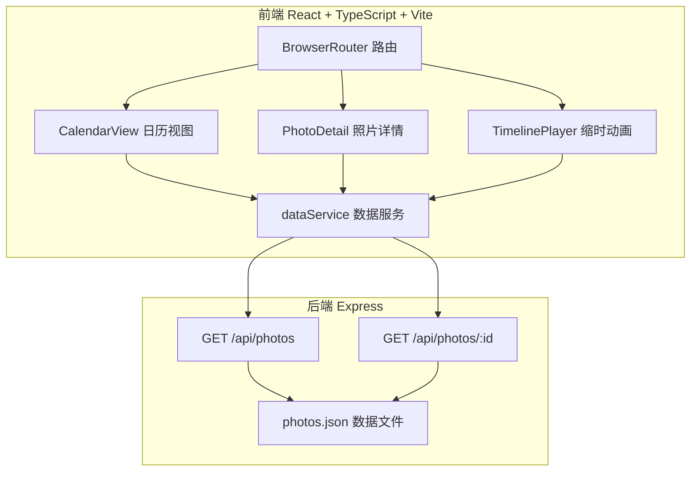
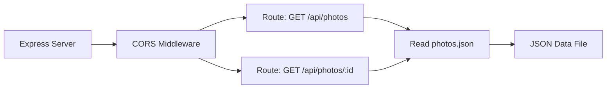
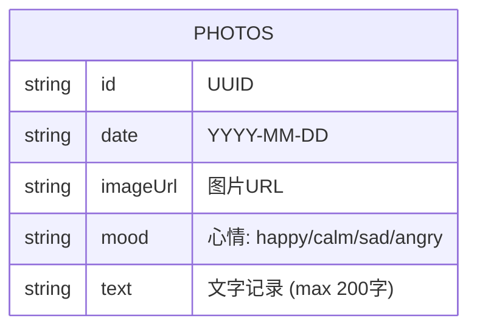

## 1. 架构设计



## 2. 技术描述

- 前端：React@18 + React Router@6 + TypeScript + Vite@5
- 构建工具：Vite
- 后端：Express@4 + CORS 中间件
- 数据存储：JSON 文件（server/data/photos.json）
- 动画实现：CSS transitions + requestAnimationFrame
- 状态管理：React Hooks (useState, useEffect)
- 依赖：uuid 用于生成唯一ID

## 3. 路由定义

| 路由 | 页面 | 用途 |
|------|------|------|
| `/` | 日历视图 | 首页，显示日历网格和心情标记 |
| `/photo/:id` | 照片详情 | 显示单张照片、心情标签、文字记录和时间轴 |
| `/timeline` | 缩时动画 | 全屏播放植物生长缩时动画 |

## 4. API 定义

### 类型定义
```typescript
interface Photo {
  id: string;
  date: string; // YYYY-MM-DD
  imageUrl: string;
  mood: 'happy' | 'calm' | 'sad' | 'angry';
  text: string;
}
```

### GET /api/photos
- 响应：`Photo[]` 返回所有照片列表，按日期排序
- 错误：500 服务器错误

### GET /api/photos/:id
- 参数：`id` 照片ID
- 响应：`Photo` 返回单张照片详情
- 错误：404 照片不存在，500 服务器错误

## 5. 服务器架构图



## 6. 数据模型

### 6.1 数据模型定义



### 6.2 初始数据

photos.json 初始包含3条数据：
- id: 使用 uuid 生成
- date: 连续3天的日期
- imageUrl: 使用植物图片URL
- mood: 不同心情
- text: 植物状态描述

## 7. 文件结构

```
auto2/
├── package.json
├── vite.config.js
├── tsconfig.json
├── index.html
├── src/
│   ├── main.tsx
│   ├── App.tsx
│   ├── components/
│   │   ├── CalendarView.tsx
│   │   ├── PhotoDetail.tsx
│   │   └── TimelinePlayer.tsx
│   └── services/
│       └── dataService.ts
└── server/
    ├── index.js
    └── data/
        └── photos.json
```

## 8. 性能优化

- 日历视图：使用 CSS Grid 布局，避免重排重绘
- 图片：使用 loading="lazy" 懒加载
- 动画：使用 requestAnimationFrame 实现 60fps 缩时动画
- 组件：使用 React.memo 避免不必要的重渲染
- 滚动：使用 CSS will-change 优化滚动性能
