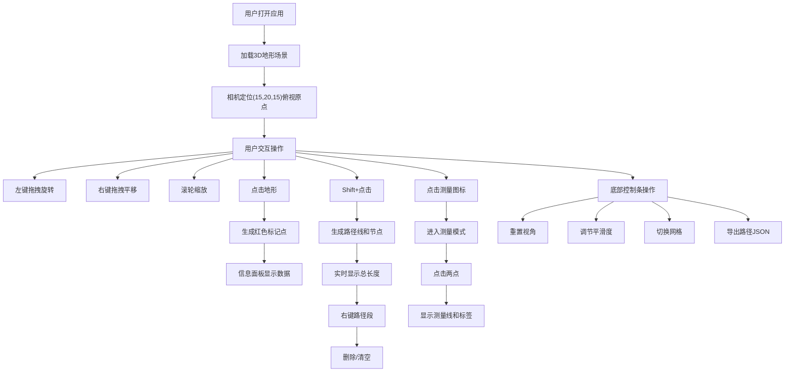

## 1. 产品概述

3D数字沙盘应用是一款基于WebGL的交互式地形可视化工具，主要解决户外探险者和地理爱好者在规划路线时无法直观预览地形起伏、计算海拔差和坡度的问题。

- 主要用途：在浏览器中展示真实感地形高程数据，支持用户交互测量与标注
- 目标用户：户外探险者、地理爱好者、徒步旅行者、越野跑者
- 核心价值：提供沉浸式3D地形预览，支持精确的海拔、距离、坡度测量，辅助路线规划决策

## 2. 核心功能

### 2.1 功能模块

1. **3D地形展示模块**：Perlin噪声生成的64x64地形网格，按高度渐变着色，支持视角控制
2. **标记点系统**：点击地形生成高精度标记点，显示坐标、海拔、距离和坡度信息
3. **路径规划模块**：Shift+点击连续选点，生成路径线，实时计算总长度，支持删除和导出
4. **测量工具模块**：两点间直线距离测量，显示浮动标签
5. **控制面板模块**：重置视角、地形平滑度调节、网格线显示切换、路径导出

### 2.2 页面详情

| 页面名称 | 模块名称 | 功能描述 |
|-----------|-------------|---------------------|
| 主页面 | 3D场景渲染 | 64x64地形网格，Perlin噪声驱动，高度渐变着色 |
| 主页面 | 相机控制 | 左键旋转(360°水平, 15°-75°垂直)，右键平移，滚轮缩放(5-50单位)，0.4秒平滑过渡 |
| 主页面 | 标记点系统 | 红色小球标记，细线连接地面，显示UTM坐标、海拔、距离、坡度 |
| 主页面 | 路径规划 | Shift连续选点，亮绿色路径线，白色节点，支持右键删除和JSON导出 |
| 主页面 | 测量工具 | 左上角标尺按钮，两点间黄色虚线测量，浮动距离标签 |
| 主页面 | 信息面板 | 右上角240px宽深灰半透明面板，毛玻璃效果，显示测量数据 |
| 主页面 | 控制条 | 底部48px高控制条，重置视角、平滑度滑块、网格开关、导出按钮 |

## 3. 核心流程

### 3.1 主要用户流程

1. 用户打开应用 → 页面加载3D地形场景 → 相机自动定位到(15,20,15)俯视原点
2. 用户鼠标操作：左键拖拽旋转视角，右键拖拽平移，滚轮缩放
3. 用户点击地形 → 生成红色标记点 → 信息面板显示坐标、海拔、与上一点的距离和坡度
4. 用户按住Shift连续点击 → 生成路径线和白色节点 → 实时显示路径总长度
5. 用户右键点击路径段 → 弹出菜单 → 选择删除该段或清空所有路径
6. 用户点击左上角测量图标 → 进入测量模式 → 点击两点 → 显示黄色虚线和浮动距离标签
7. 用户调整底部控制条 → 重置视角/调节平滑度/切换网格/导出路径JSON

## 4. 用户界面设计

### 4.1 设计风格

- **整体风格**：暗色科技感风格，数据可视化导向
- **主背景色**：#121212 深黑色
- **字体**：Google Fonts JetBrains Mono，增强数据感和科技感
- **毛玻璃效果**：信息面板和控制条使用backdrop-filter: blur(12px)
- **过渡动画**：所有交互元素0.3秒hover过渡，相机操作0.4秒cubic-bezier(0.25, 0.1, 0.25, 1)平滑过渡

### 4.2 颜色系统

| 用途 | 颜色值 | 说明 |
|------|--------|------|
| 主背景 | #121212 | 深黑色 |
| 面板背景 | rgba(30,30,30,0.85) | 深灰半透明 |
| 控制条背景 | rgba(20,20,20,0.8) | 更深灰半透明 |
| 按钮背景 | #546e7a | 蓝灰色 |
| 按钮悬停 | #78909c | 浅蓝灰色 |
| 标记点 | #ff1744 | 红色 |
| 路径线 | #00e676 | 亮绿色 |
| 测量线 | #ffeb3b | 黄色虚线 |
| 滑块轨道 | #00bcd4 | 青色 |
| 开关开启 | #00e676 | 绿色 |
| 开关关闭 | #616161 | 灰色 |

### 4.3 地形配色方案

| 高度范围 | 颜色值 | 说明 |
|----------|--------|------|
| < 0 | #2e7d32 | 深绿色 |
| 0 - 2 | #66bb6a | 浅绿色 |
| 2 - 4 | #c5a059 | 土黄色 |
| > 4 | #9e9e9e | 灰色 |

### 4.4 页面设计概述

| 页面名称 | 模块名称 | UI Elements |
|-----------|-------------|-------------|
| 主页面 | 3D场景 | 全屏WebGL渲染，64x64地形网格，半透明网格线#444，线宽0.5px |
| 主页面 | 信息面板 | 右上角240px宽，圆角12px，内边距16px，毛玻璃效果 |
| 主页面 | 控制条 | 底部100%宽，48px高，内边距16px，毛玻璃效果 |
| 主页面 | 按钮 | 圆角8px，背景#546e7a，悬停变浅#78909c，0.3秒过渡 |
| 主页面 | 滑块 | 轨道宽100px，圆点直径12px，颜色#00bcd4，范围1-5，步长1 |
| 主页面 | 浮动标签 | 白色半透明背景rgba(255,255,255,0.9)，圆角6px，内边距4px 8px，深灰字体#222 |

### 4.5 3D场景指导

- **环境**：暗色背景，无HDRI，使用方向光模拟日光
- **光照**：一个主方向光(强度1.0) + 环境光(强度0.4)
- **相机**：初始位置(15, 20, 15)，看向原点，透视相机，视场角60°
- **旋转限制**：水平360°，垂直15°到75°（极角限制）
- **缩放范围**：距离5到50单位
- **平滑过渡**：所有相机操作带0.4秒cubic-bezier(0.25, 0.1, 0.25, 1)插值

### 4.6 性能要求

- 鼠标拖拽操作时帧率稳定在55fps以上
- 地形网格更新（调整平滑度）响应时间不超过100ms
- 使用BufferGeometry和InstanceMesh优化渲染性能

## 5. 技术约束

- **技术栈**：TypeScript + Three.js + Vite
- **无框架**：纯Three.js实现，不使用React或Vue
- **UI实现**：纯DOM操作，不与Three.js冲突
- **坐标系**：地形坐标转换为UTM格式显示
- **导出格式**：JSON格式，包含点坐标和海拔列表
