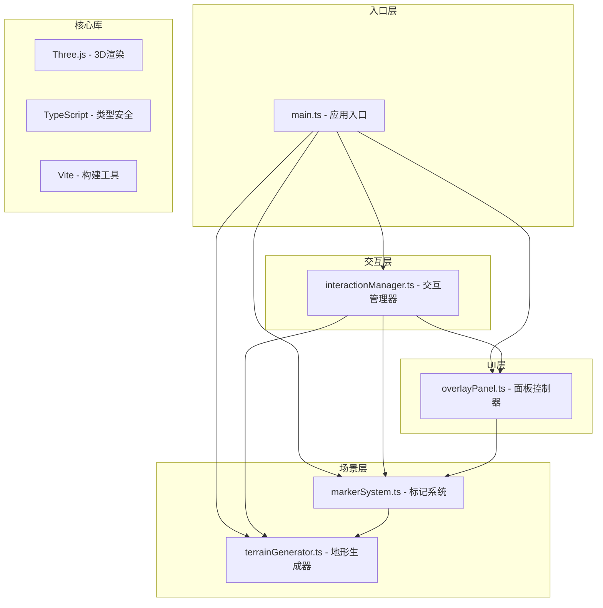

## 1. 架构设计



## 2. 技术描述

- **前端框架**：无框架，原生TypeScript + Three.js
- **构建工具**：Vite 5.x
- **3D引擎**：Three.js r160+
- **类型系统**：TypeScript 5.x (strict: true, target: ES2020)
- **包管理**：npm
- **开发服务器**：Vite Dev Server

### 2.1 依赖清单

| 包名 | 版本 | 用途 |
|------|------|------|
| three | ^0.160.0 | 3D渲染引擎 |
| @types/three | ^0.160.0 | Three.js类型定义 |
| typescript | ^5.3.0 | TypeScript编译器 |
| vite | ^5.0.0 | 构建工具和开发服务器 |
| @types/node | ^20.10.0 | Node.js类型定义 |

## 3. 模块职责划分

### 3.1 文件结构

```
├── package.json
├── vite.config.js
├── tsconfig.json
├── index.html
└── src/
    ├── main.ts                          # 应用入口
    ├── interaction/
    │   └── interactionManager.ts        # 交互管理器
    ├── scene/
    │   └── terrainGenerator.ts          # 地形生成器
    └── ui/
        ├── overlayPanel.ts              # UI面板控制器
        └── markerSystem.ts              # 标记系统
```

### 3.2 模块说明

#### main.ts - 应用入口
- 初始化Three.js场景、相机、渲染器
- 创建各个模块实例
- 注册全局事件监听
- 启动动画循环
- 处理窗口大小变化

#### interactionManager.ts - 交互管理器
- 处理鼠标点击、拖拽、滚轮事件
- 处理键盘事件（Shift键状态）
- 管理测量模式状态
- 将用户操作转换为对terrain和marker模块的调用
- 实现相机平滑过渡动画

#### terrainGenerator.ts - 地形生成器
- Perlin噪声算法实现
- 生成64x64地形网格
- 按高度计算顶点颜色
- 提供海拔采样方法（双线性插值）
- 支持更新平滑度参数
- 提供坐标转UTM格式方法

#### markerSystem.ts - 标记系统
- 管理标记点（红色小球+细线）
- 管理路径线和节点（亮绿色线+白色小球）
- 管理测量线（黄色虚线+浮动标签）
- 支持右键菜单删除路径段
- 计算路径总长度
- 导出路径数据为JSON

#### overlayPanel.ts - UI面板控制器
- 纯DOM操作创建信息面板
- 创建底部控制条
- 绑定按钮事件
- 读取并显示地形数据
- 处理滑块值变化
- 切换网格线显示
- 触发JSON导出

## 4. 核心数据结构

### 4.1 类型定义

```typescript
// 地形点数据
interface TerrainPoint {
    x: number;
    z: number;
    elevation: number;
    utmX: number;
    utmY: number;
}

// 标记点数据
interface Marker {
    id: string;
    position: TerrainPoint;
    mesh: THREE.Mesh;
    line: THREE.Line;
}

// 路径节点
interface PathNode {
    id: string;
    position: TerrainPoint;
    mesh: THREE.Mesh;
}

// 路径段
interface PathSegment {
    id: string;
    startNodeId: string;
    endNodeId: string;
    line: THREE.Line;
    length: number;
}

// 路径数据
interface PathData {
    nodes: PathNode[];
    segments: PathSegment[];
    totalLength: number;
}

// 测量数据
interface Measurement {
    id: string;
    startPoint: TerrainPoint;
    endPoint: TerrainPoint;
    line: THREE.Line;
    label: HTMLElement;
    distance: number;
}

// 地形配置
interface TerrainConfig {
    size: number;        // 64
    resolution: number;  // 64
    noiseFrequency: number;  // 0.02
    noiseAmplitude: number;  // 5
    smoothness: number;  // 1-5, default 3
}

// 相机状态
interface CameraState {
    position: THREE.Vector3;
    target: THREE.Vector3;
    theta: number;  // 水平角
    phi: number;    // 垂直角
    distance: number;
}
```

## 5. 核心算法

### 5.1 Perlin噪声算法

使用改进的Perlin噪声算法生成自然的地形起伏：
- 噪声频率：0.02
- 振幅：5单位
- 支持多八度叠加（通过smoothness参数控制）
- 双线性插值获取任意点海拔

### 5.2 相机控制算法

球坐标系相机控制：
- theta：水平旋转角（0-360度）
- phi：垂直极角（15-75度，限制避免翻转）
- distance：相机到目标点距离（5-50单位）
- 使用四元数实现平滑旋转插值
- 右键拖拽平移使用屏幕空间到世界空间转换

### 5.3 UTM坐标转换

简化的UTM转换算法：
- 假设地形位于北半球某一UTM带
- 将局部坐标(x, z)线性映射到UTM坐标
- 原点(0,0)对应UTM(500000, 4000000)
- 1单位 = 1米

### 5.4 地形拾取算法

使用Three.js Raycaster进行地形拾取：
- 将屏幕坐标转换为NDC坐标
- 发射射线与地形网格求交
- 使用双线性插值获取精确交点海拔

## 6. 性能优化策略

### 6.1 渲染优化

- 使用BufferGeometry存储地形数据，减少draw call
- 网格线使用LineSegments，共享顶点数据
- 标记点使用MeshBasicMaterial，避免复杂光照计算
- 路径线使用LineBasicMaterial

### 6.2 交互优化

- 鼠标拖拽时使用requestAnimationFrame批量更新
- 平滑过渡使用插值算法，避免每帧重建几何体
- 地形海拔查询使用缓存，重复查询直接返回
- DOM操作使用DocumentFragment批量更新

### 6.3 内存管理

- 标记点和路径删除时及时dispose几何体和材质
- 事件监听器在组件销毁时移除
- 避免闭包引用导致的内存泄漏

## 7. 配置文件

### 7.1 package.json

```json
{
    "name": "3d-terrain-sandbox",
    "version": "1.0.0",
    "type": "module",
    "scripts": {
        "dev": "vite",
        "build": "tsc && vite build",
        "preview": "vite preview"
    },
    "dependencies": {
        "three": "^0.160.0"
    },
    "devDependencies": {
        "@types/three": "^0.160.0",
        "@types/node": "^20.10.0",
        "typescript": "^5.3.0",
        "vite": "^5.0.0"
    }
}
```

### 7.2 vite.config.js

```javascript
import { defineConfig } from 'vite';

export default defineConfig({
    server: {
        port: 5173,
        open: true
    },
    build: {
        target: 'es2020',
        sourcemap: true
    }
});
```

### 7.3 tsconfig.json

```json
{
    "compilerOptions": {
        "target": "ES2020",
        "useDefineForClassFields": true,
        "module": "ESNext",
        "lib": ["ES2020", "DOM", "DOM.Iterable"],
        "skipLibCheck": true,
        "moduleResolution": "bundler",
        "allowImportingTsExtensions": false,
        "resolveJsonModule": true,
        "isolatedModules": true,
        "noEmit": true,
        "strict": true,
        "noUnusedLocals": true,
        "noUnusedParameters": true,
        "noFallthroughCasesInSwitch": true
    },
    "include": ["src"]
}
```

### 7.4 index.html

```html
<!DOCTYPE html>
<html lang="zh-CN">
<head>
    <meta charset="UTF-8">
    <meta name="viewport" content="width=device-width, initial-scale=1.0">
    <title>3D数字沙盘</title>
    <link rel="preconnect" href="https://fonts.googleapis.com">
    <link rel="preconnect" href="https://fonts.gstatic.com" crossorigin>
    <link href="https://fonts.googleapis.com/css2?family=JetBrains+Mono:wght@400;500;700&display=swap" rel="stylesheet">
    <style>
        * { margin: 0; padding: 0; box-sizing: border-box; }
        body { 
            font-family: 'JetBrains Mono', monospace;
            background: #121212;
            overflow: hidden;
        }
        #app { width: 100vw; height: 100vh; }
    </style>
</head>
<body>
    <div id="app"></div>
    <script type="module" src="/src/main.ts"></script>
</body>
</html>
```
