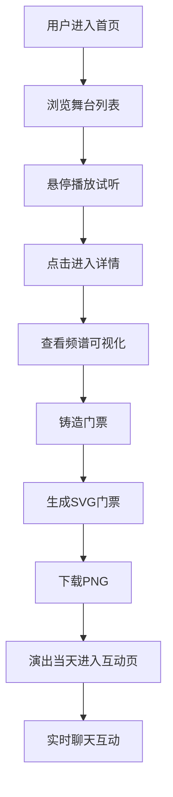
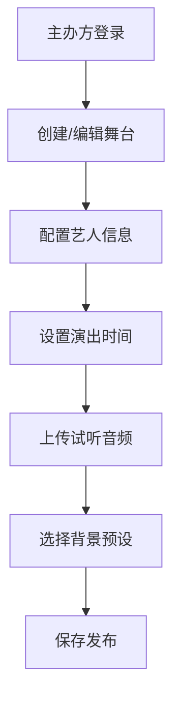

## 1. 产品概述
虚拟音乐节门票铸造与互动舞台体验平台，让用户在线浏览艺人舞台、铸造数字门票、实时观看演出并与其他观众互动。

- 主要目的：打造沉浸式线上音乐节体验，打破地域限制，让全球用户都能参与音乐现场氛围
- 解决的问题：传统线下音乐节受地域、时间限制，线上体验缺乏互动感和参与感
- 目标用户：音乐爱好者、音乐节参与者、数字收藏品爱好者
- 产品价值：创造独特的数字门票收藏价值 + 实时互动的线上演出体验

## 2. 核心功能

### 2.1 用户角色

| 角色 | 注册方式 | 核心权限 |
|------|-----------|-----------|
| 主办方 | 后台账号 | 创建管理舞台、艺人信息、演出时间配置 |
| 普通用户 | 无需注册（昵称登录 | 浏览舞台、铸造门票、观看演出、实时聊天 |

### 2.2 功能模块

1. **舞台列表页：时间线流式加载舞台卡片、悬停试听、在线人数显示
2. **舞台详情页：全屏频谱可视化、门票铸造、SVG门票生成与PNG下载
3. **演出互动页：动态粒子背景舞台、实时聊天区域、WebSocket实时互动
4. **后台管理页**：舞台卡片管理、艺人信息编辑

### 2.3 页面详情

| 页面名称 | 模块名称 | 功能描述 |
|---------|---------|-----------|
| 舞台列表页 | 卡片网格 | 按演出时间线排列，流式加载 |
| 舞台列表页 | 舞台卡片 | 280x360px卡片，悬停播放试听，流光渐变边框动画 |
| 舞台列表页 | 在线状态 | WebSocket连接状态显示，在线人数统计 |
| 舞台详情页 | 频谱可视化 | Web Audio API 实时频谱柱状图，#e040fb到#00e5ff渐变 |
| 舞台详情页 | 门票铸造 | 调用API生成唯一SHA256哈希和随机图案SVG门票 |
| 舞台详情页 | 门票下载 | SVG转PNG下载，500x280尺寸 |
| 演出互动页 | 粒子背景 | 150个粒子星云效果，颜色随舞台预设变化 |
| 演出互动页 | 实时聊天 | 40px消息气泡，左侧头像昵称，右侧时间 |
| 后台管理页 | 舞台卡片编辑 | 创建/编辑舞台信息，卡片预览 |

## 3. 核心流程

### 核心用户流程：
用户进入首页 → 浏览舞台列表 → 悬停试听音乐 → 点击进入舞台详情 → 查看频谱可视化 → 点击铸造门票 → 生成唯一SVG门票 → 下载PNG → 演出当天进入互动舞台 → 观看演出 → 实时聊天互动

### 后台管理流程：
主办方登录后台 → 创建/编辑舞台信息 → 配置艺人头像、演出时间、试听音频、背景色预设 → 保存发布

## 4. 用户界面设计

### 4.1 设计风格

- 主色调：深紫到深蓝渐变背景（#1a0033 到 #0d0221）
- 强调色：#e040fb 到 #00e5ff 渐变
- 按钮样式：圆角12px，悬停阴影扩散8px
- 字体：现代无衬线字体，标题加粗，正文清晰可读
- 布局风格：卡片式布局，毛玻璃效果（backdrop-filter: blur(12px)
- 动效：流光渐变边框动画（2秒循环），悬停试听自动播放

### 4.2 页面设计概述

| 页面名称 | 模块名称 | UI元素 |
|---------|---------|--------|
| 舞台列表页 | 卡片网格 | 280x360px圆角16px卡片，半透明毛玻璃信息区，动态背景色 |
| 舞台列表页 | 舞台卡片 | 悬停流光边框动画，音量30%自动播放试听 |
| 舞台详情页 | 频谱可视化 | 柱状图宽4px间距2px，#e040fb到#00e5ff渐变 |
| 舞台详情页 | 门票铸造按钮 | 渐变背景，圆角12px，悬停阴影 |
| 演出互动页 | 粒子背景 | 150个粒子3-6px，星云流动效果，30FPS稳定帧率 |
| 演出互动页 | 聊天区域 | 40px消息气泡，圆角8px，半透明白色背景 |
| 后台管理页 | 舞台卡片 | 同前端卡片样式，可编辑 |

### 4.3 响应式设计

- 桌面端优先设计，移动端自适应
- 卡片网格在移动端单列展示
- 触摸优化：增大点击区域，避免悬停效果改为点击触发
- 聊天区域在移动端底部固定，键盘弹出时自适应高度调整

### 4.4 性能要求

- 粒子动画稳定30FPS
- 聊天消息延迟不超过200ms
- 频谱可视化流畅60FPS
- 门票SVG生成即时响应
