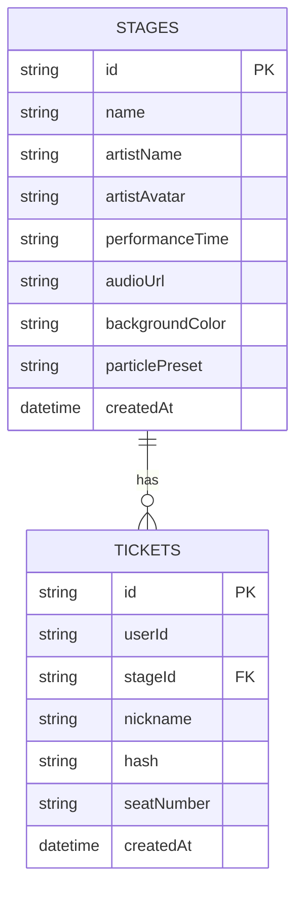

## 1. 架构设计

```mermaid
graph TD
    subgraph "前端 (React + TypeScript"
        A["BrowserRouter 路由管理
        B["StageListPage 舞台列表页
        C["StageDetailPage 舞台详情页
        D["StageCard 卡片组件
        E["TicketSVG 门票组件
        F["ParticleBackground 粒子背景
        G["ChatArea 聊天区域
        H["SpectrumVisualizer 频谱可视化
    end

    subgraph "后端 (Express + TypeScript"
        I["RESTful API 接口
        J["WebSocket 实时通信
        K["数据库操作层
    end

    subgraph "数据层 (SQLite)"
        L["stages 舞台表
        M["tickets 门票表
    end

    subgraph "外部服务"
        N["Web Audio API
        O["Canvas API
    end

    B --> A
    C --> A
    D --> B
    D --> C
    E --> C
    F --> C
    G --> C
    H --> C
    A --> I
    A --> J
    I --> K
    J --> K
    K --> L
    K --> M
    H --> N
    F --> O
```

## 2. 技术描述

- **前端**：React@18 + TypeScript + Vite
- **初始化工具**：Vite
- **后端**：Express@4 + TypeScript + ts-node
- **数据库**：SQLite3
- **WebSocket**：ws 库
- **状态管理**：React Context
- **HTTP客户端**：原生 fetch API
- **音频处理**：Web Audio API
- **图形渲染**：Canvas API

### 核心依赖：
- react, react-dom
- express, sql.js, cors, uuid, ws
- typescript, vite, @vitejs/plugin-react
- @types/react, @types/react-dom, @types/express, @types/sql.js, @types/cors, @types/uuid, @types/ws
- concurrently

### 数据库依赖替换说明：
原需求指定使用 `sqlite3` 库，但由于 `sqlite3` 在 Windows 环境下需要完整编译工具链（Python + C++ Build Tools），且 `better-sqlite3` 在 Node 24 环境下也存在预编译二进制下载超时和本地编译失败的问题，实际实现中替换为 `sql.js`。

**替换原因：**
1. **纯 WebAssembly 实现**：`sql.js` 基于 Emscripten 编译 SQLite 为 WebAssembly，完全不需要任何本地编译工具链
2. **零配置开箱即用**：无需安装 Visual Studio、Python 或任何 C++ 构建工具，npm install 即可使用
3. **跨平台一致性**：WASM 在所有平台行为完全一致，不存在平台特定的编译问题
4. **持久化支持**：支持将数据库导出为二进制 Buffer 保存到本地文件，启动时重新加载
5. **TypeScript 支持**：官方维护的 `@types/sql.js` 类型定义完善

**性能和兼容性说明：**
- **性能差异**：WASM 版比原生版慢约 20-30%，对于小型项目（舞台/门票数据量极少）完全无感知
- **SQL 兼容性**：完全兼容标准 SQLite 语法，底层就是编译后的 SQLite 引擎
- **数据格式**：可导出为标准 SQLite 数据库文件，使用任何 SQLite 客户端均可打开读取
- **迁移说明**：如需要换回 `sqlite3` 或 `better-sqlite3`，只需修改 `src/server/db.ts` 中具体的 API 调用方式，表结构和 SQL 语句无需改动

## 3. 路由定义

| 路由 | 用途 |
|------|------|
| `/` | 舞台列表页 |
| `/stage/:id` | 舞台详情页 / 演出互动页 |
| `/admin` | 后台管理页 |

## 4. API 定义

### RESTful API:

```typescript
// 舞台数据类型
interface Stage {
  id: string;
  name: string;
  artistName: string;
  artistAvatar: string;
  performanceTime: string;
  audioUrl: string;
  backgroundColor: string;
  particlePreset: string;
  createdAt: string;
}

// 门票数据类型
interface Ticket {
  id: string;
  id: string;
  userId: string;
  stageId: string;
  nickname: string;
  hash: string;
  seatNumber: string;
  createdAt: string;
}

// 聊天消息类型
interface ChatMessage {
  id: string;
  userId: string;
  nickname: string;
  avatar: string;
  content: string;
  timestamp: string;
  stageId: string;
}

// GET /api/stages
// 返回: Stage[]

// GET /api/stages/:id
// 返回: Stage

// POST /api/tickets
// 请求: { userId: string; stageId: string; nickname: string }
// 返回: Ticket
```

## 5. 服务端架构图

```mermaid
graph TD
    A["Express App"] --> B["API Controller
    A --> C["WebSocket Manager
    B --> D["Database Layer"]
    C --> D["Database Layer"]
    D --> E["SQLite Database"]
    
    subgraph "API Controller"
    B1["GET /api/stages
    B2["GET /api/stages/:id
    B3["POST /api/tickets
    end
    
    subgraph "WebSocket Manager"
    C1["连接管理"]
    C2["房间管理"]
    C3["消息广播"]
    end
    
    subgraph "Database Layer"
    D1["stages CRUD
    D2["tickets CRUD"]
    end
```

## 6. 数据模型

### 6.1 数据模型定义



### 6.2 数据定义语言

```sql
-- stages 表
CREATE TABLE IF NOT EXISTS stages (
  id TEXT PRIMARY KEY,
  name TEXT NOT NULL,
  artistName TEXT NOT NULL,
  artistAvatar TEXT,
  performanceTime TEXT NOT NULL,
  audioUrl TEXT,
  backgroundColor TEXT,
  particlePreset TEXT,
  createdAt DATETIME DEFAULT CURRENT_TIMESTAMP
);

-- tickets 表
CREATE TABLE IF NOT EXISTS tickets (
  id TEXT PRIMARY KEY,
  userId TEXT NOT NULL,
  stageId TEXT NOT NULL,
  nickname TEXT NOT NULL,
  hash TEXT NOT NULL,
  seatNumber TEXT NOT NULL,
  createdAt DATETIME DEFAULT CURRENT_TIMESTAMP,
  FOREIGN KEY (stageId) REFERENCES stages(id)
);

-- 初始数据
INSERT INTO stages (id, name, artistName, artistAvatar, performanceTime, audioUrl, backgroundColor, particlePreset) VALUES
('1', 'Electric Dreams', 'Neon Pulse', 'https://api.dicebear.com/7.x/avataaars/svg?seed=neon', '2026-06-20T20:00:00', 'https://www.soundhelix.com/examples/mp3/SoundHelix-Song-1.mp3', '#6a1b9a', 'nebula'),
('2', 'Synthwave Nights', 'RetroWave', 'https://api.dicebear.com/7.x/avataaars/svg?seed=retro', '2026-06-20T21:30:00', 'https://www.soundhelix.com/examples/mp3/SoundHelix-Song-2.mp3', '#006064', 'cosmic'),
('3', 'Bass Drop Arena', 'Subsonic', 'https://api.dicebear.com/7.x/avataaars/svg?seed=bass', '2026-06-20T23:00:00', 'https://www.soundhelix.com/examples/mp3/SoundHelix-Song-3.mp3', '#4a148c', 'galaxy'),
('4', 'Ambient Space', 'Echo Chamber', 'https://api.dicebear.com/7.x/avataaars/svg?seed=echo', '2026-06-21T20:00:00', 'https://www.soundhelix.com/examples/mp3/SoundHelix-Song-4.mp3', '#1a237e', 'stars');
```
