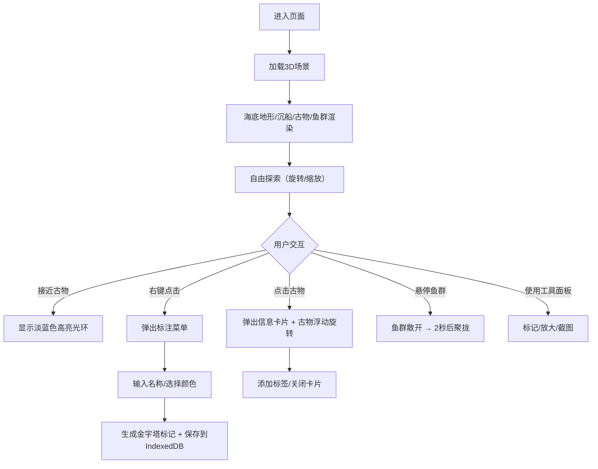

## 1. 产品概述

海底沉船考古是一款沉浸式3D交互式可视化应用，用户扮演水下考古学家，在虚拟沉船遗址中自由探索、发现、标注并分析散落的古物，系统自动积累知识图谱并生成考古报告。

- 核心价值：通过沉浸式3D交互体验，让用户身临其境地感受水下考古的乐趣与挑战
- 目标用户：历史爱好者、考古爱好者、教育场景用户

## 2. 核心功能

### 2.1 用户角色
| 角色 | 注册方式 | 核心权限 |
|------|----------|----------|
| 考古学家 | 无需注册，直接使用 | 自由探索、古物发现、标注分析、截图保存 |

### 2.2 功能模块
1. **3D场景模块**：程序生成海底地形、沉船残骸、古物散布、鱼群游动
2. **交互控制模块**：视角旋转缩放、古物选择放大、右键标注菜单
3. **UI界面模块**：左侧工具面板、古物信息卡片、右上角性能指示器
4. **数据存储模块**：Zustand状态管理、IndexedDB标注持久化

### 2.3 页面详情
| 页面名称 | 模块名称 | 功能描述 |
|---------|---------|----------|
| 主场景 | 海底地形 | 程序生成细分曲面，浅海沙色到深海墨蓝渐变 |
| 主场景 | 沉船残骸 | 15米木制低多边形帆船，倾斜半埋，海藻覆盖 |
| 主场景 | 古物系统 | 陶罐、金币、锚，接近高亮光环，点击弹出信息卡 |
| 主场景 | 鱼群系统 | 12条银灰小鱼，正弦曲线游动，悬停散开聚拢 |
| 左侧面板 | 虚拟手柄 | 十字准星控制视角和选中 |
| 左侧面板 | 工具按钮 | 笔记笔标记、放大镜缩放、相机截图 |
| 信息卡片 | 古物详情 | 名称、材质、年代、描述、关闭、添加标签 |
| 右键菜单 | 标注系统 | 输入名称、选择颜色、生成金字塔标记 |
| 指示器 | 性能监控 | 帧率显示（低于30变红）、已发现古物数量 |

## 3. 核心流程

用户进入页面后，首先看到海底沉船遗址3D场景，可以通过鼠标拖拽旋转视角、滚轮缩放。当相机靠近古物时，古物会出现淡蓝色高亮光环。点击古物会弹出信息卡片，显示古物详细信息，同时古物开始上下浮动并面向相机。用户可以通过左侧工具面板进行标记、放大、截图操作。右键点击场景任意位置可以添加自定义标注点，标注数据保存到IndexedDB。鱼群在场景中缓慢游动，鼠标悬停时鱼群会散开然后重新聚拢。右上角指示器实时显示帧率和已发现古物数量。

## 4. 用户界面设计

### 4.1 设计风格
- **主色调**：深海蓝 #0d47a1、墨蓝 #0a2a4a、青色 #00bcd4
- **辅助色**：沙色 #c2b280、金色 #ffd700、绿色 #388e3c
- **强调色**：红色 #ff5252（关闭按钮）、黄色 #ffeb3b（标记）
- **UI风格**：半透明毛玻璃效果（backdrop-filter: blur(8px)），深海蓝/青色/白色为主
- **动效**：所有过渡动画统一0.3秒 ease-out 曲线

### 4.2 页面设计概述
| 页面名称 | 模块名称 | UI元素 |
|---------|---------|--------|
| 主场景 | 海底环境 | 垂直渐变背景（深蓝到黑）、程序生成地形、三点照明 |
| 主场景 | 沉船古物 | 低多边形风格、海藻半透明材质、金属光泽金币 |
| 左侧面板 | 工具面板 | 220px宽、圆角12px、毛玻璃背景、虚拟手柄、三个图标按钮 |
| 中央弹窗 | 信息卡片 | 320px宽、圆角16px、深蓝背景、关闭按钮、添加标签按钮 |
| 右键菜单 | 标注菜单 | 半透明圆角面板、名称输入、六色选择、确认按钮 |
| 右上角 | 指示器 | 200x60px、圆角8px、帧率（绿色/红色）、古物数量 |

### 4.3 响应式
- 桌面端优先，全屏沉浸式体验
- 不支持移动端，专注于桌面端3D交互体验

### 4.4 3D场景指南
- **环境氛围**：深海水下效果，从浅到深的色彩渐变，神秘探索感
- **光照设置**：三点照明（主方向光 #4fc3f7 强度1.2、环境光 #1565c0 强度0.3、背光点光 #00bcd4 强度0.6）
- **相机设置**：透视相机，可自由旋转缩放，支持平滑过渡动画（0.8秒）
- **核心元素**：沉船残骸为视觉焦点，周围散布古物，鱼群增添生气
- **交互动画**：古物接近高亮、点击浮动旋转、鱼群散开聚拢、信息卡片弹出
- **性能优化**：低多边形模型、实例化渲染、帧率监控
