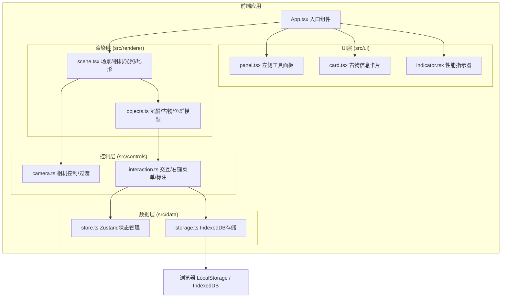

## 1. 架构设计



## 2. 技术描述

- **前端框架**：React 18 + TypeScript
- **3D引擎**：Three.js + @react-three/fiber + @react-three/drei
- **状态管理**：Zustand
- **构建工具**：Vite
- **数据存储**：IndexedDB（标注点）、LocalStorage（截图）

## 3. 目录结构

```
src/
├── App.tsx                 # 应用入口
├── renderer/
│   ├── scene.tsx          # 场景、相机、光照、海底地形
│   └── objects.ts         # 沉船、古物、鱼群模型生成与更新
├── controls/
│   ├── camera.ts          # 视角旋转缩放、自动过渡
│   └── interaction.ts     # 鼠标交互、右键菜单、标注系统
├── ui/
│   ├── panel.tsx          # 左侧工具面板
│   ├── card.tsx           # 古物信息卡片
│   └── indicator.tsx      # 右上角性能指标
└── data/
    ├── store.ts           # Zustand状态管理
    └── storage.ts         # IndexedDB操作封装
```

## 4. 数据模型

### 4.1 古物数据
```typescript
interface Artifact {
  id: string;
  type: 'pot' | 'coin' | 'anchor';
  name: string;
  material: string;
  era: string;
  description: string;
  position: [number, number, number];
  rotation: [number, number, number];
  scale: number;
  discovered: boolean;
  tags: string[];
}
```

### 4.2 标注点数据
```typescript
interface Annotation {
  id: string;
  name: string;
  color: string;
  position: [number, number, number];
  createdAt: number;
}
```

### 4.3 Zustand Store
```typescript
interface AppState {
  selectedArtifact: Artifact | null;
  discoveredArtifacts: string[];
  annotations: Annotation[];
  isMarkerMode: boolean;
  showInfoCard: boolean;
  fps: number;
  setSelectedArtifact: (artifact: Artifact | null) => void;
  addDiscoveredArtifact: (id: string) => void;
  addAnnotation: (annotation: Annotation) => void;
  setMarkerMode: (active: boolean) => void;
  setShowInfoCard: (show: boolean) => void;
  setFps: (fps: number) => void;
}
```

## 5. 核心模块说明

### 5.1 渲染模块 (renderer)
- **scene.tsx**：Canvas容器、场景配置、相机设置、三点光照、程序生成海底地形（细分曲面+顶点颜色渐变）
- **objects.ts**：沉船模型（低多边形木制帆船+海藻材质）、古物（陶罐/金币/锚+高亮光环）、鱼群（12条+正弦路径+散开聚拢动画）

### 5.2 控制模块 (controls)
- **camera.ts**：OrbitControls封装、相机平滑过渡到目标位置（0.8秒）
- **interaction.ts**：射线检测、古物点击/悬停、右键菜单、标注点创建、接近检测（高亮光环触发）

### 5.3 UI模块 (ui)
- **panel.tsx**：左侧半透明工具面板、虚拟手柄、笔记笔/放大镜/相机按钮
- **card.tsx**：古物信息弹出卡片、关闭按钮、添加标签功能
- **indicator.tsx**：右上角性能面板、帧率显示（低于30变红）、已发现古物计数

### 5.4 数据模块 (data)
- **store.ts**：Zustand全局状态，管理选中古物、发现列表、标注点、UI状态
- **storage.ts**：IndexedDB封装，标注点CRUD操作，页面刷新后数据保留
