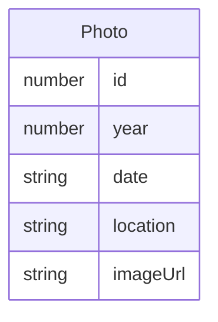

## 1. 架构设计

```mermaid
graph TB
    subgraph "前端层"
        "App.tsx[主组件 App]" --> "Timeline.tsx[时间轴组件]"
        "App.tsx" --> "PhotoCard.tsx[照片卡片组件]"
        "Timeline.tsx" --> "App.tsx[年份切换回调]"
        "PhotoCard.tsx" --> "App.tsx[模态窗触发回调]"
    end
    subgraph "数据层"
        "MockData[模拟照片数据]" --> "App.tsx"
    end
```

**数据流向：**
1. App.tsx 持有全局状态（当前选中年份、模态窗状态、照片列表）
2. 模拟数据作为常量数组定义在 App.tsx 中
3. App.tsx 将筛选后的照片列表传递给 Timeline 和照片卡片区
4. Timeline 触发年份切换 → App 更新状态 → 照片区重新渲染
5. PhotoCard 触发点击 → App 打开模态窗 → 模态窗内导航切换照片

## 2. 技术说明

- 前端：React@18 + TypeScript + Vite
- 初始化工具：vite-init（react-ts 模板）
- 状态管理：React useState/useCallback（轻量应用无需 Zustand）
- 样式方案：CSS Modules + 内联样式（无需 Tailwind，保持极简）
- 后端：无
- 数据库：无，使用模拟数据

## 3. 路由定义

| 路由 | 用途 |
|------|------|
| / | 单页应用，展示时间轴画廊 |

## 4. API 定义

无后端 API，所有数据为前端模拟。

## 5. 服务器架构图

不适用，纯前端项目。

## 6. 数据模型

### 6.1 数据模型定义



### 6.2 数据定义

```typescript
interface Photo {
  id: number;
  year: number;
  date: string;
  location: string;
  imageUrl: string;
}
```

预置20条模拟数据，年份覆盖2019-2024，图片URL格式为 `https://picsum.photos/seed/{id}/600/400`。

## 7. 文件结构与职责

```
├── package.json          # 依赖声明与启动脚本
├── vite.config.js        # Vite 构建配置
├── tsconfig.json         # TypeScript 严格模式配置
├── index.html            # 入口页面
└── src/
    ├── main.tsx          # React 入口，挂载 App
    ├── App.tsx           # 主组件，管理全局状态，提供模拟数据
    ├── App.css           # 全局样式与导航栏样式
    ├── Timeline.tsx      # 水平时间轴组件
    ├── Timeline.css      # 时间轴样式
    ├── PhotoCard.tsx     # 照片卡片组件（含懒加载）
    ├── PhotoCard.css     # 卡片样式
    ├── Modal.tsx         # 照片查看模态窗组件
    ├── Modal.css         # 模态窗样式
    └── vite-env.d.ts     # Vite 类型声明
```

**调用关系：**
- `main.tsx` → `App.tsx`
- `App.tsx` → `Timeline.tsx`（传入年份列表、当前年份、切换回调）
- `App.tsx` → `PhotoCard.tsx`（传入照片对象、点击回调）
- `App.tsx` → `Modal.tsx`（传入照片列表、当前索引、关闭回调、导航回调）
- `PhotoCard.tsx` 内部使用 IntersectionObserver 实现懒加载
