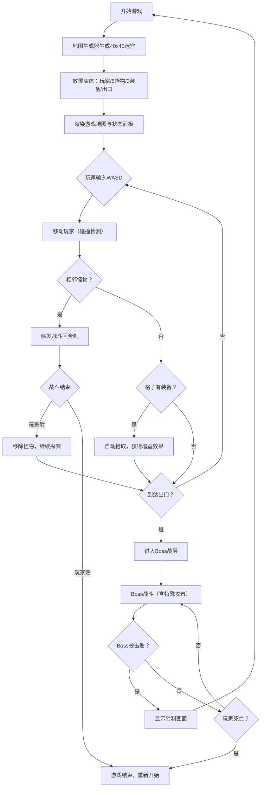

## 1. 产品概述

暗影回廊是一款roguelike风格的地牢探索网页游戏，玩家在随机生成的迷宫中探索、战斗、收集装备，最终击败Boss通关。游戏采用TypeScript + React技术栈，纯TS处理游戏逻辑，React负责UI渲染，通过自定义hooks管理状态。

- 核心玩法：随机迷宫探索 + 回合制战斗 + 装备收集
- 目标用户：休闲游戏爱好者，roguelike游戏粉丝
- 产品价值：提供沉浸式的暗黑哥特风格地牢探索体验，每次游戏都有全新地图和挑战

## 2. 核心功能

### 2.1 用户角色
无需注册登录，直接进入游戏即可体验。

### 2.2 功能模块
1. **游戏主界面**：40x40地牢网格地图，20x20视野范围，相机跟随玩家
2. **战斗系统**：相邻格子触发战斗，伤害数值浮字展示，Boss特殊攻击机制
3. **装备系统**：3件随机装备，拾取自动获得增益（攻击/生命/防御）
4. **状态面板**：实时显示生命值、攻击力、楼层、装备栏信息
5. **Boss战**：出口进入独立Boss层，特殊攻击机制，胜利画面

### 2.3 页面详情
| 页面名称 | 模块名称 | 功能描述 |
|---------|---------|---------|
| 游戏主界面 | 地图渲染模块 | Canvas/网格渲染40x40地牢，区分墙壁/走廊/房间，雾效暗化视野外区域 |
| 游戏主界面 | 玩家控制模块 | WASD键盘控制，碰撞检测，相机居中跟随，平滑移动动画 |
| 游戏主界面 | 战斗动画模块 | 角色闪烁、伤害浮字、屏幕抖动特效 |
| 状态面板 | 信息展示模块 | 生命值条、攻击力条、楼层数、已拾取装备列表 |
| Boss战界面 | Boss战斗模块 | 4x4 Boss房间、红色光晕、特殊攻击闪光、胜利画面 |

## 3. 核心流程

```
开始游戏 → 生成随机地图(40x40) → 放置玩家/怪物/装备/出口 → 
玩家WASD移动探索 → 遇到怪物触发战斗 → 拾取装备获得增益 → 
到达出口进入Boss战 → 击败Boss → 显示胜利画面 → 重新开始
```



## 4. 用户界面设计

### 4.1 设计风格
- **主色调**：暗黑哥特风格，主背景#0a0a0a，面板#1a1a2e，侧边栏#16213e
- **配色方案**：
  - 墙壁：#111（深黑）
  - 走廊：#333（深灰）
  - 房间：#222（中灰）
  - 玩家：白色圆形
  - 怪物：红色圆形
  - 装备：蓝色闪烁菱形
  - Boss：#8b0000深红色大圆
  - 网格线：半透明#444
  - 文字：#e0e0e0浅灰
  - 生命条：红色
  - 攻击条：黄色
- **交互反馈**：所有操作0.15秒ease-in-out平滑过渡，战斗时屏幕抖动（transform位移2px，0.2秒）
- **字体选择**：游戏风格字体，使用Cinzel（哥特风格）作为标题，Roboto Mono作为数值显示
- **布局方式**：左侧游戏画布（自适应缩放，保持30px格子大小），右侧状态面板（固定宽250px，圆角12px）

### 4.2 页面设计概览
| 页面名称 | 模块名称 | UI元素 |
|---------|---------|--------|
| 游戏主界面 | 地图区域 | 40x40网格，20x20视野，雾效遮罩，相机居中，格子大小恒定30px |
| 游戏主界面 | 玩家角色 | 白色圆形（r=10px），平滑移动过渡，战斗时闪烁 |
| 游戏主界面 | 怪物实体 | 红色圆形（r=8px），战斗时闪烁0.3秒 |
| 游戏主界面 | 装备实体 | 蓝色菱形（边长10px），CSS闪烁动画 |
| 游戏主界面 | 战斗特效 | 红色伤害浮字（-3），绿色增益浮字（+2 ATK），屏幕抖动 |
| 状态面板 | 生命显示 | 红色进度条 + 数值文字（HP: 20/20） |
| 状态面板 | 攻击显示 | 黄色进度条 + 数值文字（ATK: 5） |
| 状态面板 | 楼层信息 | 当前楼层：1F / Boss层标识 |
| 状态面板 | 装备栏 | 竖向列表显示已拾取装备及增益 |
| Boss战界面 | Boss区域 | 4x4大房间，深红圆形Boss（r=16px） |
| Boss战界面 | 特效 | 边缘红色半透明光晕，特殊攻击红色闪光全屏特效 |
| 胜利画面 | 结束界面 | 居中金色胜利文字，重新开始按钮，哥特风格装饰边框 |

### 4.3 响应式设计
- 采用桌面优先设计，全屏自适应
- 游戏画布根据窗口大小等比缩放，但保持单元格30px的恒定尺寸
- 通过CSS transform: scale()实现整体缩放，避免格子变形
- 状态面板固定在右侧250px宽度，游戏区占满剩余空间
- 键盘事件全局监听，无需额外适配

### 4.4 动画与过渡
- 玩家移动：0.15秒 ease-in-out CSS transition
- 装备闪烁：CSS animation，透明度0.5~1循环
- 战斗闪烁：0.3秒闪烁动画（opacity 1→0.2→1）
- 伤害浮字：向上浮动+淡出动画，持续0.8秒
- 屏幕抖动：transform translate(±2px) 循环0.2秒
- Boss特殊攻击：全屏红色闪光fade-in-out 0.4秒
