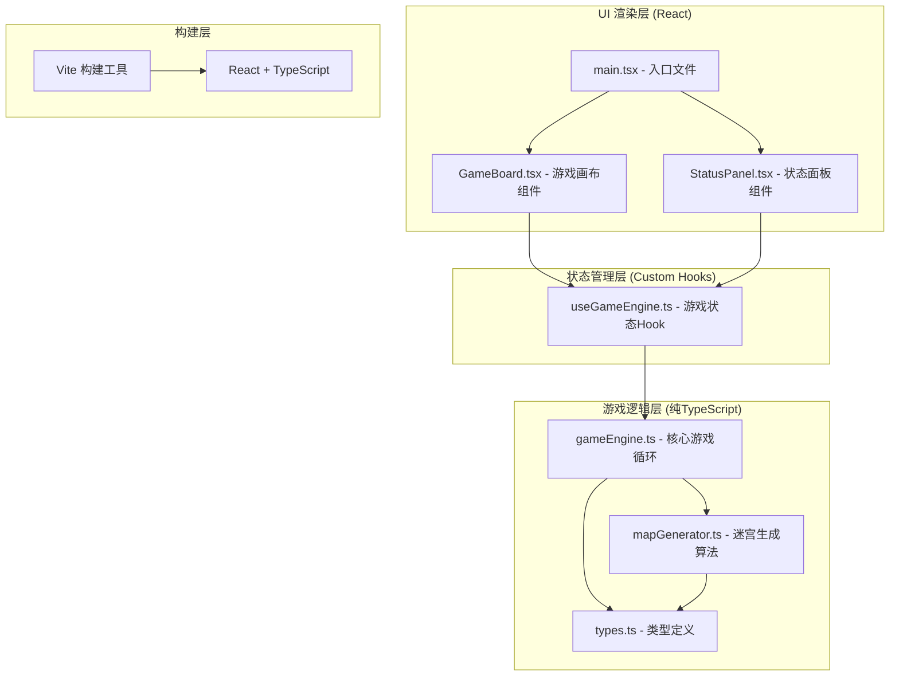

## 1. 架构设计



## 2. 技术说明

- **前端框架**：React@18 + TypeScript@5 + Vite@5
- **初始化方式**：手动创建项目结构（package.json配置）
- **样式方案**：内联CSS + CSS Modules混合，动画使用CSS Keyframes
- **状态管理**：自定义Hook (useGameEngine) + React useState/useReducer
- **渲染方式**：Canvas API渲染地图网格（高性能60FPS），HTML/CSS渲染UI面板
- **后端**：无后端，纯前端游戏
- **数据库**：无需数据库，游戏状态内存存储

## 3. 文件结构与路由

### 3.1 文件结构
```
auto35/
├── package.json                 # 项目依赖配置
├── index.html                   # 入口HTML
├── vite.config.js               # Vite配置
├── tsconfig.json                # TS配置（strict模式）
└── src/
    ├── main.tsx                 # React入口
    ├── game/
    │   ├── types.ts             # 类型定义
    │   ├── mapGenerator.ts      # 迷宫生成器
    │   └── gameEngine.ts        # 核心引擎
    ├── components/
    │   ├── GameBoard.tsx        # 游戏画布
    │   └── StatusPanel.tsx      # 状态面板
    └── hooks/
        └── useGameEngine.ts     # 状态管理Hook
```

### 3.2 单页应用，无路由跳转
本游戏为单页面应用（SPA），无需路由系统。通过游戏状态（楼层状态、战斗状态、胜利状态）切换不同的渲染内容。

## 4. 核心数据类型定义

### 4.1 类型定义 (types.ts)

```typescript
// 格子类型
export enum TileType {
  WALL = 'wall',       // 墙壁
  CORRIDOR = 'corridor', // 走廊
  ROOM = 'room',       // 房间
  ENTRANCE = 'entrance', // 入口
  EXIT = 'exit',       // 出口
}

// 坐标
export interface Position {
  x: number;
  y: number;
}

// 房间
export interface Room {
  x: number;
  y: number;
  width: number;
  height: number;
}

// 玩家
export interface Player {
  position: Position;
  hp: number;
  maxHp: number;
  attack: number;
  defense: number;
}

// 怪物
export interface Monster {
  id: string;
  position: Position;
  hp: number;
  maxHp: number;
  attack: number;
  isBoss: boolean;
}

// 装备类型
export enum EquipmentType {
  ATTACK = 'attack',
  HEAL = 'heal',
  DEFENSE = 'defense',
}

// 装备
export interface Equipment {
  id: string;
  position: Position;
  type: EquipmentType;
  value: number;
  name: string;
}

// 浮字特效
export interface FloatingText {
  id: string;
  position: Position;
  text: string;
  color: string;
  createdAt: number;
}

// 地图格子
export type MapGrid = TileType[][];

// 游戏阶段
export enum GamePhase {
  EXPLORING = 'exploring',
  BATTLE = 'battle',
  BOSS = 'boss',
  VICTORY = 'victory',
  GAME_OVER = 'game_over',
}

// 整体游戏状态
export interface GameState {
  phase: GamePhase;
  floor: number;
  map: MapGrid;
  rooms: Room[];
  player: Player;
  monsters: Monster[];
  equipments: Equipment[];
  inventory: Equipment[];
  floatingTexts: FloatingText[];
  isShaking: boolean;
  isBossSpecialAttack: boolean;
  battleMonsters: string[]; // 当前战斗的怪物ID
}
```

## 5. 核心算法与逻辑

### 5.1 地图生成算法 (mapGenerator.ts)
- 采用随机游走 + 房间放置算法：
  1. 初始化40x40全墙壁数组
  2. 随机放置3个以上房间（矩形挖空）
  3. 使用随机游走（Drunkard's Walk）算法生成走廊连接各房间
  4. 左上角区域标记入口，右下角区域标记出口
  5. BFS验证连通性，若不连通重新生成

### 5.2 游戏引擎核心 (gameEngine.ts)
- `initGame()`：初始化新游戏（生成地图、放置实体）
- `movePlayer(dx, dy)`：玩家移动处理（碰撞检测、触发战斗/拾取）
- `processBattle(monsterId)`：回合制战斗逻辑（双方互扣HP）
- `pickupEquipment(equipmentId)`：装备拾取与增益应用
- `enterBossFloor()`：切换到Boss战层
- `processBossTurn()`：Boss回合（含特殊攻击判定）

### 5.3 Canvas渲染优化
- 使用requestAnimationFrame实现60FPS渲染循环
- 仅渲染20x20视野范围内的格子（离屏裁剪）
- 相机偏移量使用整数避免子像素渲染抖动
- 浮字特效按时间自动清理

## 6. 性能预算
| 资源类型 | 预算限制 |
|---------|---------|
| 首次加载JS体积 | < 200KB (gzip) |
| 渲染帧率 | 稳定60FPS |
| 键盘响应延迟 | ≤ 50ms |
| 单次地图生成耗时 | < 10ms |
| Canvas单次渲染耗时 | < 8ms |
