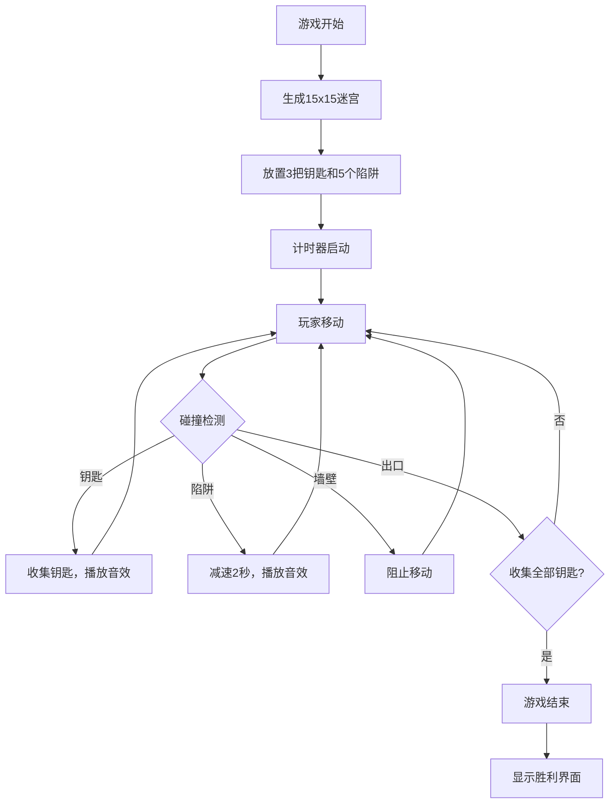

## 1. 产品概述

基于迷宫生成与解谜的实时多人竞速游戏，支持2-4名玩家在同一设备上进行本地对战，玩家需在随机生成的迷宫中收集钥匙、躲避陷阱，以最快速度找到出口。

- 主要目的：提供一款紧张刺激的本地多人休闲竞技游戏
- 目标用户：休闲游戏爱好者、家庭娱乐、朋友聚会
- 产品价值：通过随机迷宫生成实现高重玩价值，多人竞技增强互动乐趣

## 2. 核心功能

### 2.1 用户角色
| 角色 | 注册方式 | 核心权限 |
|------|----------|----------|
| 本地玩家 | 无需注册 | 参与游戏，控制角色移动 |

### 2.2 功能模块
1. **迷宫生成模块**：递归回溯算法生成15x15随机迷宫
2. **游戏主循环**：60fps帧率，管理多玩家状态、碰撞检测
3. **玩家系统**：角色移动、旋转、动画、交互
4. **渲染系统**：Canvas绘制迷宫、角色、特效
5. **物品系统**：钥匙收集、陷阱触发
6. **音效系统**：Web Audio API生成模拟音效
7. **UI系统**：排行榜、计时器、胜利界面
8. **响应式布局**：桌面端信息面板，移动端折叠面板

### 2.3 页面详情
| 页面名称 | 模块名称 | 功能描述 |
|-----------|-------------|---------------------|
| 游戏主界面 | 迷宫画布 | 15x15迷宫绘制，角色移动，物品渲染 |
| 游戏主界面 | 左侧玩家面板 | 显示玩家状态、头像、钥匙数、减速标记 |
| 游戏主界面 | 右侧排行榜 | 实时排名，第一名金色闪烁效果 |
| 游戏主界面 | 顶部计时器 | 倒计时显示，数字变化动画 |
| 胜利界面 | 全屏提示 | 半透明背景，胜利信息，粒子烟花特效 |

## 3. 核心流程

游戏开始 → 生成迷宫 → 放置钥匙和陷阱 → 玩家出发 → 收集钥匙 → 躲避陷阱 → 到达出口 → 显示排名 → 游戏结束

## 4. 用户界面设计

### 4.1 设计风格
- **设计主题**：深色科幻风格
- **主色调**：背景 #0a0a23，迷宫墙 #2a2a4a，地板 #0d1b2a
- **强调色**：金色 #ffd700（钥匙、出口、第一名），暗红 #8b0000（陷阱）
- **玩家颜色**：红、蓝、绿、橙（区分4名玩家）
- **发光效果**：迷宫墙内发光 #4a4a8a（半径2px），出口脉冲发光
- **按钮/交互元素**：圆角设计，悬浮发光效果

### 4.2 字体
- 数字字体：等宽字体，清晰锐利
- 文字字体：无衬线现代字体
- 标题大小：70px（胜利文字），24px（计时器），12px（玩家名称）

### 4.3 布局
- **桌面端（≥800px）**：三栏布局
  - 左侧：160px玩家信息区
  - 中间：迷宫画布（居中）
  - 右侧：200px排行榜
- **移动端（<800px）**：单栏布局
  - 顶部：汉堡菜单，点击展开信息面板
  - 中间：迷宫画布（自适应）
- **圆角**：信息面板 8px，角色 4px（圆角正方形）

### 4.4 动画与特效
- **角色收集钥匙**：头顶金色光环 0.5秒
- **第一名闪烁**：文字阴影 #ffd700，呼吸动画周期 1秒
- **计时器**：数字变化时 0.2秒缩放放大
- **出口门**：脉冲发光动画周期 1.5秒
- **胜利界面**：彩色粒子烟花效果持续 3秒
- **陷阱区域**：地板颜色渐变至暗红

### 4.5 页面设计概述
| 页面名称 | 模块名称 | UI 元素 |
|-----------|-------------|----------|
| 游戏主界面 | 迷宫画布 | 网格线、墙壁发光、地板纹理、陷阱渐变、钥匙光效、出口脉冲 |
| 游戏主界面 | 左侧玩家面板 | 圆形头像、颜色填充、名称、钥匙数（黄色）、减速灰化效果 |
| 游戏主界面 | 右侧排行榜 | 深灰背景 #1a1a2e，圆角 8px，金色闪烁第一名 |
| 游戏主界面 | 顶部计时器 | 白色 24px，数字缩放动画 |
| 胜利界面 | 全屏提示 | 半透明黑背景，70px文字，粒子烟花 |

### 4.6 响应式
- **设计原则**：桌面优先，移动端自适应
- **断点**：800px
- **移动端适配**：信息面板折叠为汉堡菜单，点击展开
- **触摸优化**：预留虚拟按键区域（可选扩展）
