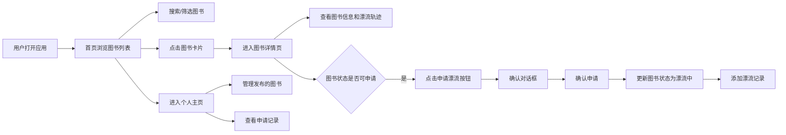

## 1. 产品概述

二手书漂流记录应用，让用户能够发布闲置图书、申请漂流传阅，并追踪每本书的漂流轨迹。通过图书漂流的形式，促进知识分享和文化传播。

- **主要目的**：建立一个图书共享平台，让闲置图书能够流动起来，实现知识共享
- **解决的问题**：闲置图书浪费、读书社交需求
- **目标用户**：热爱阅读、喜欢分享的读者群体
- **产品价值**：促进图书循环利用，建立读书社交圈

## 2. 核心功能

### 2.1 用户角色

| 角色 | 注册方式 | 核心权限 |
|------|-----------|----------|
| 普通用户 | 无需注册，使用本地存储模拟 | 浏览图书、发布图书、申请漂流、管理个人图书 |

### 2.2 功能模块

1. **首页**：图书列表展示、搜索筛选、排序功能
2. **图书详情页**：图书完整信息展示、漂流轨迹时间线、漂流申请功能
3. **个人主页**：发布的图书管理、申请记录查看、图书状态管理

### 2.3 页面详情

| 页面名称 | 模块名称 | 功能描述 |
|---------|---------|---------|
| 首页 | 图书列表 | 瀑布流布局展示所有可漂流图书，显示封面、书名、作者、状态标签、漂流次数 |
| 首页 | 搜索功能 | 按书名或作者搜索，输入停止后200ms发送请求 |
| 首页 | 排序功能 | 按发布时间或漂流次数排序 |
| 图书详情页 | 图书信息区 | 展示封面大图、简介、出版信息、发布者信息 |
| 图书详情页 | 漂流轨迹区 | 时间线展示漂流历史，支持缩放查看，节点悬浮显示详情 |
| 图书详情页 | 漂流申请 | 可申请状态图书支持发起申请，弹出确认对话框 |
| 个人主页 | 发布的图书 | 查看自己发布的所有图书，管理图书状态 |
| 个人主页 | 申请记录 | 查看所有申请记录，包括申请状态（已申请、漂流中、已完成） |

## 3. 核心流程

## 4. 用户界面设计

### 4.1 设计风格

- **主色调**：#f6e9d2（羊皮纸色）
- **辅助色**：#4a3728（深棕色）
- **卡片背景**：#fdf8f0
- **状态标签色**：可申请#5cb85c（绿色）、漂流中#f0ad4e（橙色）、已下架#999（灰色）
- **圆角**：16px
- **边框**：1px solid #e3d5bc
- **字体**：使用思源宋体等具有书香气息的字体，搭配清晰易读的正文字体
- **布局风格**：卡片式布局，瀑布流展示
- **动画效果**：卡片悬浮上移8px，阴影过渡0.3s，按钮点击scale 1.02反馈

### 4.2 页面设计概述

| 页面名称 | 模块名称 | UI 元素 |
|---------|---------|----------|
| 首页 | 顶部导航 | Logo、搜索框、排序选择器、个人中心入口 |
| 首页 | 图书列表 | 瀑布流布局，每列宽320px，间距24px |
| 首页 | 图书卡片 | 封面缩略图、书名、作者、状态标签、漂流次数 |
| 图书详情页 | 左侧信息区（40%） | 封面大图、书名、作者、简介、出版信息、状态标签 |
| 图书详情页 | 右侧轨迹区（60%） | 漂流时间线，圆形节点，虚线连接 |
| 图书详情页 | 时间线节点 | 直径24px圆形，状态色区分：起始绿、中间蓝、当前橙 |
| 图书详情页 | 悬浮提示 | 节点悬浮显示详细时间和地点 |
| 个人主页 | Tab切换 | 发布的图书/申请记录 |
| 个人主页 | 图书管理 | 状态切换按钮（已漂流/已下架） |

### 4.3 响应式设计

- **桌面端**：双列/多列瀑布流布局，详情页左右分栏
- **平板端（≤768px）**：单列布局，详情页上下结构
- **手机端（≤480px）**：单列布局，详情页隐藏左侧信息区改为上下结构，优化触摸交互

### 4.4 动画效果

- 页面切换淡入淡出过渡（0.3s ease）
- 卡片悬浮上移8px，阴影从0 2px 8px变为0 12px 28px（0.3s过渡）
- 按钮点击轻微上弹（0.1s scale 1.02）
- 时间线节点悬浮放大效果
- 漂流轨迹展开/折叠动画
