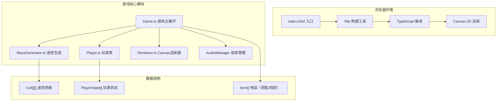

## 1. 架构设计



## 2. 技术描述

- **开发语言**：TypeScript（严格模式，target ES2020）
- **构建工具**：Vite 5.x
- **渲染引擎**：HTML5 Canvas 2D API
- **音效引擎**：Web Audio API
- **运行环境**：现代浏览器（Chrome/Firefox/Safari/Edge）
- **依赖包**：
  - typescript
  - vite
  - @types/node

## 3. 文件结构

```
auto4/
├── package.json              # 依赖配置，启动脚本
├── vite.config.js            # Vite 构建配置
├── tsconfig.json             # TypeScript 配置（严格模式）
├── index.html                # 入口页面
└── src/
    ├── MazeGenerator.ts      # 迷宫生成器（递归回溯算法）
    ├── Game.ts               # 游戏主控制器，主循环
    ├── Player.ts             # 玩家类（移动、碰撞、动画）
    └── Renderer.ts           # Canvas 渲染器
```

## 4. 核心数据结构

### 4.1 迷宫格子
```typescript
interface Cell {
  x: number;
  y: number;
  walls: {
    top: boolean;
    right: boolean;
    bottom: boolean;
    left: boolean;
  };
  visited: boolean;
  hasKey?: boolean;
  hasTrap?: boolean;
  isExit?: boolean;
  isStart?: boolean;
}
```

### 4.2 玩家状态
```typescript
interface PlayerState {
  id: number;
  name: string;
  color: string;
  x: number;
  y: number;
  angle: number;
  speed: number;
  baseSpeed: number;
  keysCollected: number;
  isSlowed: boolean;
  slowEndTime: number;
  keyAnimationTime: number;
  controls: {
    up: string;
    down: string;
    left: string;
    right: string;
  };
  finished: boolean;
  finishTime: number;
}
```

### 4.3 游戏配置
```typescript
const CONFIG = {
  MAZE_SIZE: 15,
  CELL_SIZE: 40,
  PLAYER_SIZE: 28,
  PLAYER_SPEED: 120,
  KEY_COUNT: 3,
  TRAP_COUNT: 5,
  SLOW_DURATION: 2000,
  KEY_ANIMATION_DURATION: 500,
  VOLUME: 0.3,
  LEFT_PANEL_WIDTH: 160,
  RIGHT_PANEL_WIDTH: 200,
  MOBILE_BREAKPOINT: 800,
} as const;
```

## 5. 性能优化

### 5.1 碰撞检测优化
- 每个玩家每帧最多检测 20 个格子
- 采用 AABB（轴对齐包围盒）碰撞检测
- 预计算玩家所在格子，减少检测范围

### 5.2 渲染优化
- 离屏 Canvas 预渲染迷宫静态层
- 仅重绘变化区域（脏矩形算法）
- requestAnimationFrame 驱动 60fps 渲染

### 5.3 迷宫生成优化
- 递归回溯算法时间复杂度 O(n²)，15x15 迷宫生成 < 50ms
- 使用迭代实现避免栈溢出

## 6. 键盘控制映射

| 玩家 | 上 | 下 | 左 | 右 |
|------|----|----|----|----|
| 玩家1（红） | W | S | A | D |
| 玩家2（蓝） | ↑ | ↓ | ← | → |
| 玩家3（绿） | I | K | J | L |
| 玩家4（橙） | 8 | 5 | 4 | 6 |

## 7. 音效频率表

| 音效 | 频率/序列 | 时长 |
|------|----------|------|
| 脚步声 | Click 音 | 40ms |
| 收集钥匙 | C4 → D4 → E4 | 每步 50ms |
| 触发陷阱 | 100Hz 低音 | 200ms |
| 到达出口 | 上升琶音 | 500ms |
