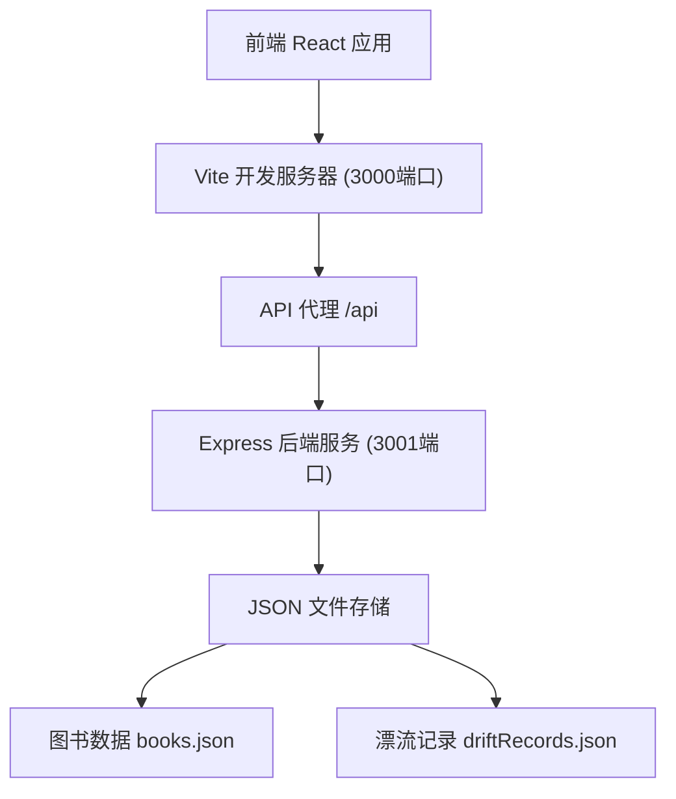
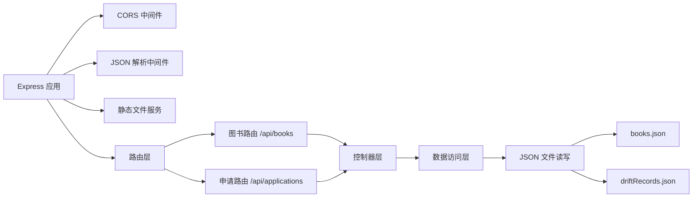
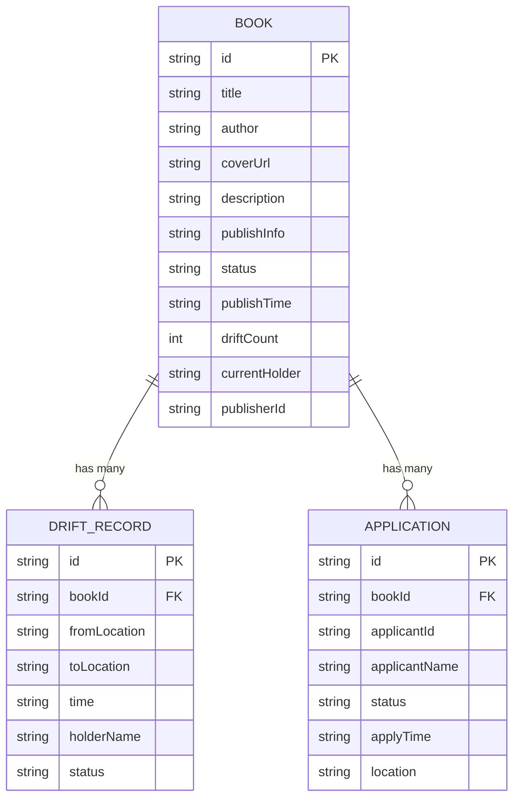

## 1. 架构设计



## 2. 技术栈说明

- **前端**：React 18 + TypeScript + Vite
- **路由**：react-router-dom v6
- **HTTP客户端**：Fetch API（自定义封装）
- **状态管理**：React Hooks + Context
- **日期处理**：dayjs
- **唯一ID**：uuid
- **后端**：Express 4 + TypeScript
- **跨域**：cors 中间件
- **数据存储**：JSON 文件（本地文件系统）
- **构建工具**：Vite

## 3. 路由定义

| 路由路径 | 页面组件 | 功能描述 |
|----------|---------|---------|
| `/` | HomePage | 首页，图书列表展示 |
| `/book/:id` | BookDetailPage | 图书详情页 |
| `/profile` | ProfilePage | 个人主页 |

## 4. API 定义

### 4.1 类型定义

```typescript
// 图书状态
type BookStatus = 'available' | 'drifting' | 'offline';

// 申请状态
type ApplicationStatus = 'pending' | 'drifting' | 'completed';

// 图书接口
interface Book {
  id: string;
  title: string;
  author: string;
  coverUrl: string;
  description: string;
  publishInfo: string;
  status: BookStatus;
  publishTime: string;
  driftCount: number;
  currentHolder: string;
  publisherId: string;
  applications: Application[];
}

// 漂流记录接口
interface DriftRecord {
  id: string;
  bookId: string;
  fromLocation: string;
  toLocation: string;
  time: string;
  holderName: string;
  status: 'start' | 'middle' | 'current';
}

// 申请记录接口
interface Application {
  id: string;
  bookId: string;
  applicantId: string;
  applicantName: string;
  status: ApplicationStatus;
  applyTime: string;
  location: string;
}
```

### 4.2 接口列表

| 方法 | 路径 | 描述 | 请求参数 | 响应 |
|------|------|------|---------|------|
| GET | `/api/books` | 获取图书列表 | search?, sortBy? | Book[] |
| GET | `/api/books/:id` | 获取图书详情 | - | Book |
| POST | `/api/books` | 创建图书 | Book（无id） | Book |
| PUT | `/api/books/:id` | 更新图书信息 | Partial<Book> | Book |
| DELETE | `/api/books/:id` | 删除图书 | - | { success: boolean } |
| GET | `/api/books/:id/drift-records` | 获取图书漂流记录 | - | DriftRecord[] |
| POST | `/api/books/:id/apply` | 申请漂流 | { applicantId, applicantName, location } | { success: boolean, message: string } |
| GET | `/api/books/publisher/:publisherId` | 获取用户发布的图书 | - | Book[] |
| GET | `/api/applications/:applicantId` | 获取用户申请记录 | - | Application[] |
| PUT | `/api/books/:id/status` | 更新图书状态 | { status: BookStatus } | Book |

## 5. 服务器架构图



## 6. 数据模型

### 6.1 数据模型定义



### 6.2 数据文件结构

**books.json**
```json
{
  "books": [
    {
      "id": "uuid",
      "title": "书名",
      "author": "作者",
      "coverUrl": "封面URL",
      "description": "简介",
      "publishInfo": "出版信息",
      "status": "available",
      "publishTime": "2024-01-01T00:00:00Z",
      "driftCount": 0,
      "currentHolder": "发布者昵称",
      "publisherId": "publisher-uuid",
      "applications": []
    }
  ]
}
```

**driftRecords.json**
```json
{
  "records": [
    {
      "id": "uuid",
      "bookId": "book-uuid",
      "fromLocation": "起始地点",
      "toLocation": "到达地点",
      "time": "2024-01-01T00:00:00Z",
      "holderName": "持有者昵称",
      "status": "start"
    }
  ]
}
```

## 7. 项目文件结构

```
.
├── package.json
├── vite.config.js
├── tsconfig.json
├── index.html
├── server/
│   ├── index.ts
│   ├── data/
│   │   ├── books.json
│   │   └── driftRecords.json
│   └── types.ts
├── src/
│   ├── api.ts
│   ├── App.tsx
│   ├── main.tsx
│   ├── types.ts
│   ├── hooks/
│   │   └── useBooks.ts
│   ├── pages/
│   │   ├── HomePage.tsx
│   │   ├── BookDetailPage.tsx
│   │   └── ProfilePage.tsx
│   ├── components/
│   │   ├── BookCard.tsx
│   │   ├── DriftTimeline.tsx
│   │   ├── SearchBar.tsx
│   │   └── ConfirmDialog.tsx
│   └── styles/
│       └── index.css
└── .trae/
    └── documents/
        ├── PRD.md
        └── technical-architecture.md
```

## 8. 性能优化策略

1. **首页加载优化**：
   - 使用 React.lazy 进行代码分割
   - 图片懒加载
   - 接口请求防抖处理（搜索200ms延迟）

2. **渲染优化**：
   - 使用 React.memo 优化组件渲染
   - 使用 useMemo/useCallback 缓存计算结果和回调函数
   - 虚拟滚动（如列表过长时）

3. **动画优化**：
   - 使用 CSS transform 和 opacity 实现动画
   - 避免布局抖动
   - 使用 will-change 优化动画性能
