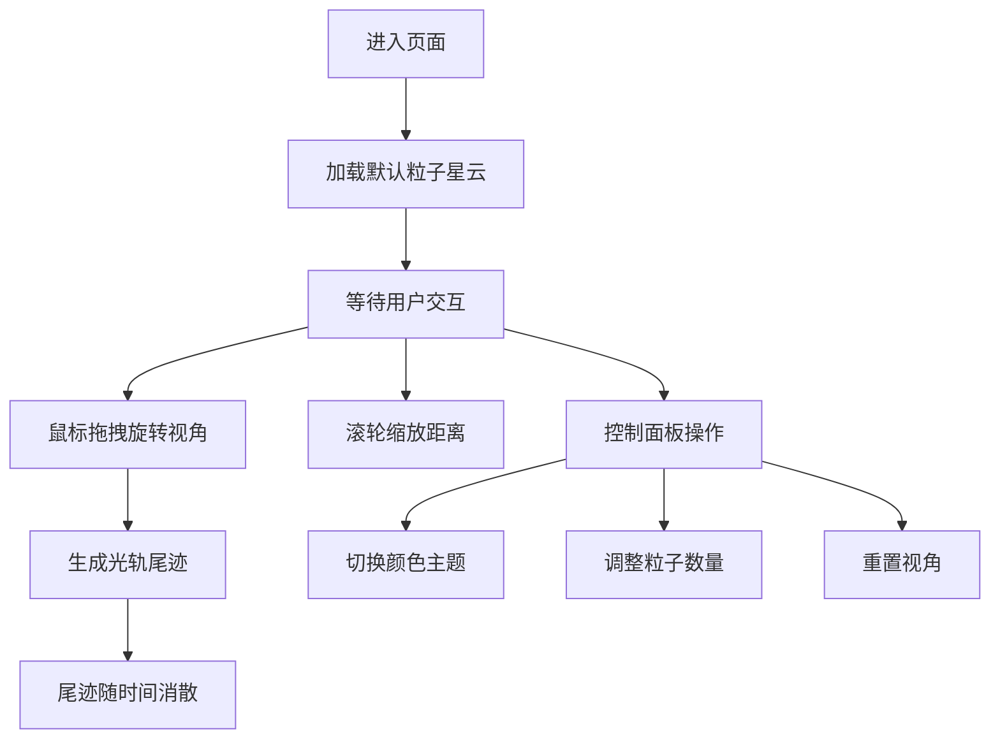

## 1. 产品概述

星流光轨 - 一个沉浸式3D粒子星云探索体验，用户可在动态生成的粒子星云中自由穿梭，移动轨迹留下发光的粒子尾迹，形成独特的流动视觉艺术。

- 核心价值：提供冥想式的视觉体验，通过交互创造个性化的流动艺术画面
- 目标用户：艺术爱好者、视觉设计师、寻求放松体验的普通用户
- 使用场景：休闲放松、创意灵感、桌面装饰、展示演示

## 2. 核心功能

### 2.1 功能模块

1. **粒子星云系统**：5万粒子球状星云，渐变色彩，缓慢旋转与浮动
2. **光轨尾迹系统**：鼠标拖拽生成发光粒子尾迹，随时间消散
3. **交互控制系统**：鼠标拖拽旋转视角，滚轮缩放距离
4. **控制面板**：主题切换、粒子数量调节、视角重置

### 2.2 功能详情

| 模块名称 | 功能描述 | 技术要点 |
|---------|---------|---------|
| 粒子星云 | 半径150单位球体内5万粒子，大小1-3px随机，颜色随距离渐变 | Three.js Points，BufferGeometry，ShaderMaterial |
| 光轨尾迹 | 拖拽时每帧生成6px白色发光粒子，最多800个，3秒内消散 | 独立Points系统，生命周期管理 |
| 视角控制 | 水平360°/垂直180°旋转，缩放30-300单位 | 球面坐标转换，OrbitControls或自定义 |
| 控制面板 | 4种主题、1-10万粒子滑块、重置按钮 | React组件，毛玻璃效果，平滑过渡 |

## 3. 核心流程

用户进入页面 → 看到默认蓝紫粉主题的粒子星云 → 鼠标拖拽旋转视角探索 → 拖拽过程中留下发光尾迹 → 滚轮缩放观察细节 → 通过控制面板切换主题/调整粒子数量 → 点击重置恢复初始视角

## 4. 用户界面设计

### 4.1 设计风格

- **整体风格**：深空宇宙风格，神秘、沉浸、流动感
- **主色调**：深空背景 #0a0a1a
- **辅助色**：蓝紫 #4a00e0、粉紫 #8e2de2、青色 #00f2fe
- **文字色**：低饱和度灰 #bbbbbb
- **边框色**：暗灰 #555555
- **交互过渡**：所有控件悬停 0.3s 平滑过渡

### 4.2 页面设计

| 区域 | 元素 | 设计描述 |
|-----|------|---------|
| 全屏背景 | 3D粒子星云 | 动态粒子系统，缓慢旋转浮动 |
| 左上角 | 控制面板 | 毛玻璃效果 backdrop-filter: blur(10px)，背景 rgba(0,0,0,0.3)，圆角 16px |
| 控制面板 | 主题下拉框 | 4种主题选项，低饱和度配色 |
| 控制面板 | 粒子数量滑块 | 1万-10万，步长1万，默认5万 |
| 控制面板 | 重置视角按钮 | 悬停高亮过渡，点击复位相机到 (0,0,150) |

### 4.3 颜色主题

| 主题名称 | 中心色 | 中间色 | 外围色 |
|---------|-------|-------|-------|
| 默认蓝紫粉 | #4a00e0 | #8e2de2 | #00f2fe |
| 极光绿紫 | #00ff88 | #7b2ff7 | #00d4ff |
| 火焰红橙 | #ff4d00 | #ff8c00 | #ffd700 |
| 冰蓝银白 | #0066ff | #66ccff | #ffffff |

### 4.4 性能要求

- 拖拽和缩放时帧率 ≥ 50fps
- 粒子数量切换卡顿 ≤ 300ms
- 视角切换流畅无明显延迟
