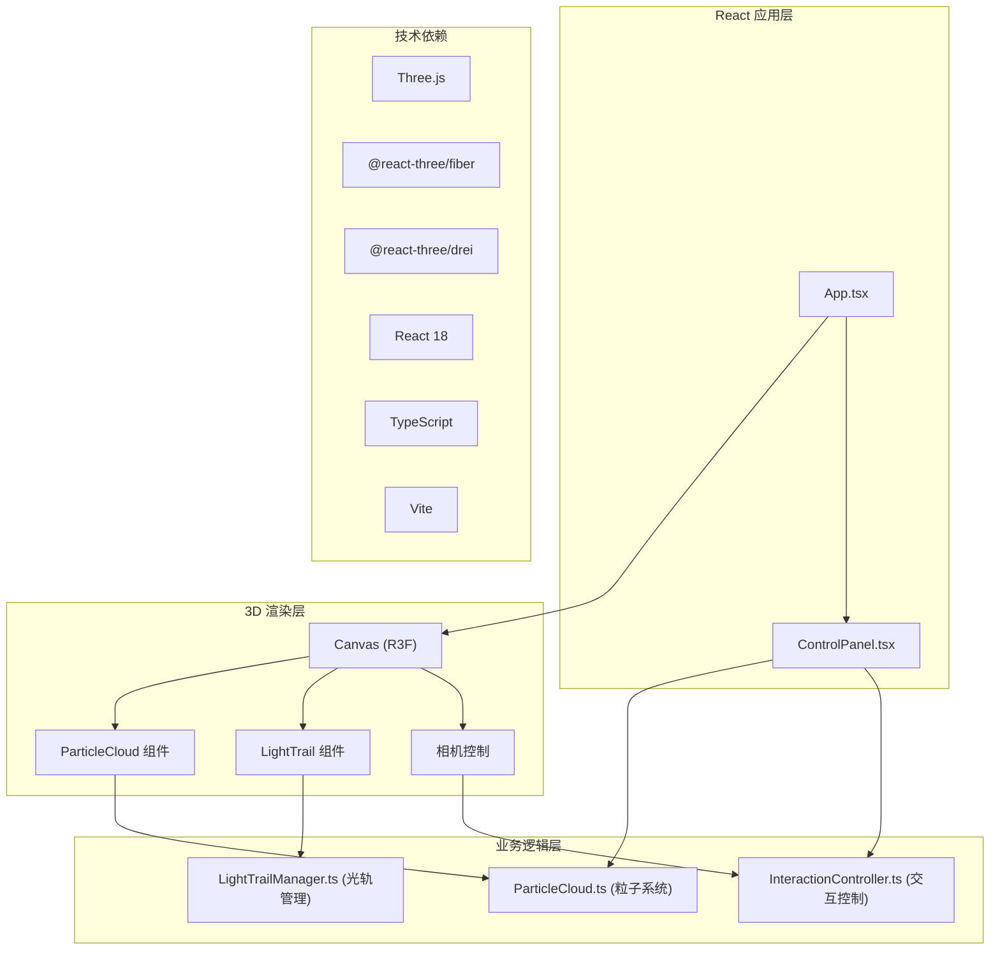

## 1. 架构设计



## 2. 技术栈描述

- **前端框架**：React 18 + TypeScript
- **构建工具**：Vite 5.x
- **3D 渲染**：Three.js r160+
- **React 3D 绑定**：@react-three/fiber 8.x + @react-three/drei 9.x
- **样式方案**：原生 CSS + CSS 变量

## 3. 模块划分

### 3.1 粒子系统模块 (src/modules/particleSystem/)

| 文件 | 职责 | 核心数据结构 |
|-----|------|-------------|
| ParticleCloud.ts | 管理粒子星云几何数据、颜色渐变、旋转动画 | positions: Float32Array, colors: Float32Array, sizes: Float32Array |
| LightTrailManager.ts | 管理光粒尾迹生命周期、添加/移除、大小衰减 | particles: LightParticle[], maxCount: 800, lifetime: 3s |

### 3.2 交互控制模块 (src/modules/interaction/)

| 文件 | 职责 | 核心方法 |
|-----|------|---------|
| InteractionController.ts | 鼠标拖拽旋转、滚轮缩放、视角重置 | onMouseDown(), onMouseMove(), onWheel(), resetCamera() |
| ControlPanel.tsx | 控制面板 UI 渲染与用户交互 | ThemeSelect, ParticleCountSlider, ResetButton |

### 3.3 应用入口

| 文件 | 职责 |
|-----|------|
| src/App.tsx | 组装场景，组合所有模块 |
| src/main.tsx | React 渲染入口 |

## 4. 核心技术方案

### 4.1 粒子星云实现

- 使用 Three.js `BufferGeometry` 存储粒子位置、颜色、大小
- 采用 `PointsMaterial` 或自定义 `ShaderMaterial` 实现发光效果
- 粒子在球体内均匀随机分布（使用球坐标系转换）
- 颜色根据与中心距离在三种主题色间插值
- 整体绕 Y 轴缓慢旋转（1度/秒）
- 每个粒子叠加正弦随机浮动

### 4.2 光轨尾迹实现

- 独立的 `Points` 系统，最多 800 个粒子
- 每帧检测鼠标拖拽状态，拖拽时添加新光粒
- 光粒初始大小 6px，3秒内线性衰减至 0
- 使用队列管理，超出数量移除最早粒子
- 通过 shader 实现外发光效果

### 4.3 交互控制实现

- 使用球面坐标系统 (theta, phi, radius) 表示相机位置
- 鼠标水平拖拽 → theta 变化（360° 范围）
- 鼠标垂直拖拽 → phi 变化（限制 0-180°）
- 滚轮 → radius 变化（限制 30-300 单位）
- 初始相机位置 (0, 0, 150)，看向原点

### 4.4 性能优化

- 使用 `BufferGeometry` 而非 `Geometry`
- 粒子更新直接操作 typed array，避免 GC
- 光粒使用对象池或环形缓冲区
- 避免每帧创建新对象
- 使用 `useFrame` 钩子进行动画更新

## 5. 文件结构

```
src/
├── modules/
│   ├── particleSystem/
│   │   ├── ParticleCloud.ts
│   │   └── LightTrailManager.ts
│   └── interaction/
│       ├── InteractionController.ts
│       └── ControlPanel.tsx
├── components/
│   ├── ParticleCloud.tsx      # R3F 粒子云组件
│   └── LightTrail.tsx         # R3F 光轨组件
├── hooks/
│   └── useInteraction.ts      # 交互控制 Hook
├── App.tsx
├── main.tsx
└── index.css
```

## 6. 主题色配置

```typescript
const themes = {
  default: { center: '#4a00e0', middle: '#8e2de2', outer: '#00f2fe' },
  aurora: { center: '#00ff88', middle: '#7b2ff7', outer: '#00d4ff' },
  fire: { center: '#ff4d00', middle: '#ff8c00', outer: '#ffd700' },
  ice: { center: '#0066ff', middle: '#66ccff', outer: '#ffffff' }
}
```
