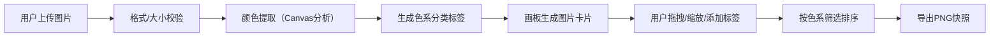

## 1. 产品概述
智能画板与素材管理应用，帮助数字画师高效管理大量草稿和素材，通过自动色系分类、自由布局画板和快速筛选功能，快速定位参考图并进行创意组织。
- 目标用户：数字画师、设计师、创意工作者
- 核心价值：按色系自动分类图片素材，支持自由布局拖拽，一键导出创意参考板

## 2. 核心功能

### 2.1 功能模块
1. **文件上传模块**：点击或拖拽上传图片，支持JPG/PNG格式，单文件≤5MB
2. **色系分析模块**：自动提取图片主色调（前3色），生成色系分类标签（暖/冷色系）
3. **画板模块**：自由拖拽定位、滚轮缩放、边界检测、文字标签叠加
4. **快速筛选模块**：按暖色系/冷色系/最近添加/默认排序筛选图片
5. **侧边栏缩略图模块**：展示已上传图片缩略图，支持快速定位和删除
6. **快照导出模块**：2倍清晰度PNG导出，画板背景透明

### 2.2 页面详情
| 页面名称 | 模块名称 | 功能描述 |
|-----------|-------------|---------------------|
| 主页面 | 顶部工具栏 | 应用名称、上传按钮、筛选下拉、导出按钮 |
| 主页面 | 渐变分隔线 | 3px渐变线（#e94560→#0f3460）分隔工具栏与画板 |
| 主页面 | 侧边栏缩略图列表 | 200px宽可隐藏侧边栏，100x100缩略图带删除按钮 |
| 主页面 | 自由画板区域 | 占满剩余高度，支持卡片拖拽、缩放、标签编辑 |
| 主页面 | 图片卡片 | 初始宽300px高自适应，圆角12px，色点+色系标签展示 |
| 主页面 | 文字标签 | 双击卡片添加，≤20字，半透明黑底白字，可拖拽 |

## 3. 核心流程

用户上传图片 → 系统自动提取主色调并分类 → 画板生成带色点和标签的图片卡片 → 用户拖拽/缩放/添加文字标签 → 用户筛选排序 → 一键导出画板快照

## 4. 用户界面设计

### 4.1 设计风格
- **主色调**：背景#1a1a2e（深蓝紫），强调色#e94560（粉红）、#0f3460（深蓝）
- **按钮风格**：圆角8px，hover状态颜色加深，白色文字
- **字体**：默认系统字体，应用名称24px/600，正文14px
- **布局风格**：顶部固定工具栏 + 左侧可隐藏侧边栏 + 中央自由画板
- **图标风格**：内联SVG图标，简洁线性风格

### 4.2 页面设计概览
| 页面名称 | 模块名称 | UI元素 |
|-----------|-------------|-------------|
| 主页面 | 顶部工具栏 | 固定40px高度，深色背景，左中右对齐布局 |
| 主页面 | 图片卡片 | 淡入动画（0.3s opacity 0→1，scale 0.8→1），拖拽时shadow→shadow-xl，缩放时2px虚线边框#e94560 |
| 主页面 | 色系标签 | 右上角标签，背景为主色调，文字白色半透明 |
| 主页面 | 色点指示 | 左下角3个小圆点，展示前3主色调 |
| 主页面 | 文字标签 | 半透明黑底#00000066，白色14px文字，可拖拽定位 |

### 4.3 响应式设计
- **桌面端（≥768px）**：侧边栏显示200px宽，工具栏按钮完整展示
- **移动端（<768px）**：侧边栏自动隐藏，工具按钮转为下拉菜单，图片卡片宽度50%自适应

### 4.4 性能指标
- 画板上50个卡片同时操作时，拖拽/缩放保持60fps（CSS transform实现）
- 首页加载时间≤2秒（Vite代码分割，lazy import组件）
