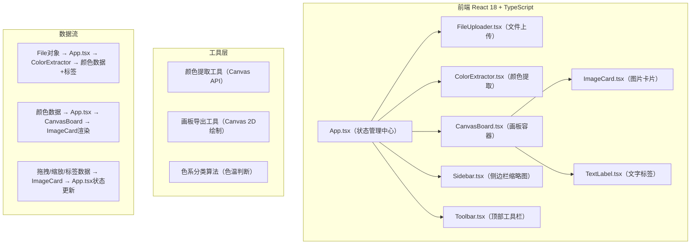

## 1. 架构设计



## 2. 技术描述

- **前端框架**：React 18 + TypeScript
- **构建工具**：Vite + @vitejs/plugin-react
- **颜色选择器**：react-colorful（预留扩展）
- **状态管理**：React useState/useCallback（轻量级场景，无需额外库）
- **样式方案**：原生CSS + CSS Modules（或内联样式，保证性能）
- **性能优化**：CSS transform实现动画（不触发回流），useMemo/useCallback减少重渲染

## 3. 文件结构与调用关系

```
项目根目录/
├── index.html                      # 入口HTML，全屏#1a1a2e背景
├── package.json                    # 依赖配置
├── vite.config.js                  # Vite构建配置
├── tsconfig.json                   # TS配置（严格模式，ES2020）
└── src/
    ├── main.tsx                    # React挂载入口 → 渲染App
    ├── App.tsx                     # 主组件（状态管理）
    │   ↑ 接收 FileUploader 的文件
    │   ↓ 传递 文件+颜色数据 给 CanvasBoard
    │   ↓ 调用 ColorExtractor 处理颜色
    ├── types/
    │   └── index.ts                # 全局类型定义
    ├── utils/
    │   ├── colorUtils.ts           # 颜色分析、色系分类算法
    │   └── exportUtils.ts          # 画板导出PNG工具函数
    ├── components/
    │   ├── Toolbar.tsx             # 顶部工具栏（上传/筛选/导出按钮）
    │   ├── FileUploader.tsx        # 文件上传组件 → onUpload回调传File给App
    │   ├── ColorExtractor.tsx      # 颜色提取组件（工具性质组件）
    │   ├── CanvasBoard.tsx         # 画板容器 → 管理ImageCard列表
    │   ├── ImageCard.tsx           # 图片卡片 → 拖拽/缩放/标签
    │   ├── TextLabel.tsx           # 文字标签组件
    │   └── Sidebar.tsx             # 侧边栏缩略图列表
    └── styles/
        ├── globals.css             # 全局样式
        └── animations.css          # 动画定义
```

## 4. 数据模型定义

### 4.1 TypeScript 类型定义

```typescript
// src/types/index.ts

// RGB颜色类型
export interface RGB {
  r: number;
  g: number;
  b: number;
}

// 色系分类
export type ColorCategory = 
  | '暖红' | '暖橙' | '暖黄' 
  | '冷蓝' | '冷紫' | '冷绿' 
  | '中性灰' | '中性棕';

// 冷暖色系分组
export type ColorTemperature = 'warm' | 'cool' | 'neutral';

// 文字标签
export interface TextLabelItem {
  id: string;
  text: string;
  x: number;  // 相对于卡片的偏移
  y: number;
}

// 画板上的图片卡片
export interface BoardImage {
  id: string;
  file: File;
  url: string;           // ObjectURL
  width: number;         // 原始宽度
  height: number;        // 原始高度
  displayWidth: number;  // 显示宽度（默认300）
  displayHeight: number; // 显示高度（自适应）
  x: number;             // 画板位置X
  y: number;             // 画板位置Y
  scale: number;         // 缩放比例 0.2-3.0
  zIndex: number;        // 层级
  colors: RGB[];         // 前3主色调
  category: ColorCategory;
  temperature: ColorTemperature;
  labels: TextLabelItem[];
  createdAt: number;     // 时间戳（用于排序）
}

// 筛选类型
export type FilterType = 'default' | 'warm' | 'cool' | 'recent';
```

## 5. 核心算法说明

### 5.1 颜色提取算法
1. 创建临时Canvas，将图片绘制上去（缩至100x100提高性能）
2. 遍历所有像素，统计颜色出现频率（量化到32级减少噪声）
3. 取频率最高的前3个颜色作为主色调

### 5.2 色系分类算法
- **色温判断**：计算 (r - b) 差值，正值偏暖，负值偏冷
- **色相判断**：转换为HSV，根据H值判断具体色系
  - 红：345°~15°，橙：15°~45°，黄：45°~75°
  - 绿：75°~165°，蓝：195°~255°，紫：255°~315°

### 5.3 画板导出算法
1. 创建2倍分辨率的Canvas
2. 遍历所有卡片按x/y/scale绘制图像
3. 在对应位置绘制文字标签
4. 导出为透明背景PNG

## 6. 性能优化策略

| 优化点 | 方案 |
|--------|------|
| 拖拽流畅度 | 使用CSS transform: translate(x,y)，避免触发reflow |
| 缩放性能 | 使用CSS transform: scale()，配合transform-origin:center |
| 大量卡片渲染 | React.memo包裹ImageCard，useMemo缓存计算结果 |
| 颜色提取效率 | 缩小图片至100x100像素后再分析，Web Worker可选 |
| 首次加载 | Vite代码分割，lazy()动态加载CanvasBoard等重型组件 |
