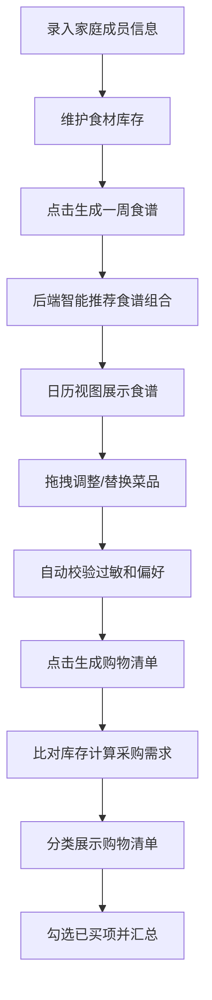

## 1. 产品概述

智能家庭膳食规划应用，根据家庭成员饮食偏好、过敏信息和现有食材库存，自动生成一周均衡食谱并输出购物清单。解决家庭主厨每天为"吃什么"纠结、采购时漏买或浪费食材的问题。

- 目标用户：家庭主厨、负责家庭饮食规划的家庭成员
- 核心价值：智能化膳食规划、减少食材浪费、确保饮食健康均衡

## 2. 核心特性

### 2.1 功能模块
1. **家庭成员管理**：录入成员信息（姓名、年龄、偏好标签、过敏原），卡片式展示
2. **食材库存管理**：维护食材名称、数量、保质期，自动排序和过期提醒
3. **一周食谱生成**：根据偏好、过敏及库存智能推荐，日历视图展示
4. **食谱调整**：拖拽调整餐次、替换备选菜品、自动校验过敏冲突
5. **购物清单生成**：比对食谱与库存，分类展示采购项，实时汇总金额

### 2.2 页面详情

| 页面名称 | 模块名称 | 功能描述 |
|---------|---------|---------|
| 主应用 | 家庭成员管理区 | 添加/编辑/删除成员，展示成员卡片（头像、标签气泡） |
| 主应用 | 食材库存列表 | 添加/编辑/删除库存项，按保质期排序，过期脉冲动画提醒 |
| 主应用 | 一周食谱日历 | 展示每日三餐+零食，拖拽调整，替换备选，冲突警告 |
| 主应用 | 购物清单面板 | 分类分组展示采购项，勾选已买，汇总金额和节省金额 |
| 主应用 | 操作按钮区 | 生成食谱按钮、生成购物清单按钮 |

## 3. 核心流程

## 4. 用户界面设计

### 4.1 设计风格
- **主色调**：深色系主题，主背景#0f0f1a，卡片背景#1a1a2e，文字#e0e0e0
- **强调色**：线性渐变#667eea到#764ba2（按钮），类别色（蔬菜绿#66bb6a、肉蛋红#ef5350、主食黄#ffa726、乳品蓝#42a5f5）
- **按钮风格**：圆角24px，渐变背景，悬停放大效果
- **卡片风格**：圆角12px，悬停放大1.05倍，阴影box-shadow: 0 8px 30px rgba(102,126,234,0.3)
- **动画效果**：淡入动画（opacity 0→1，300ms ease-out），脉冲动画（过期提醒）
- **字体**：现代无衬线字体，层次分明的字号系统

### 4.2 页面设计概述

| 页面名称 | 模块名称 | UI元素 |
|---------|---------|---------|
| 主应用 | 成员卡片 | 200×140px圆角卡片，50px圆形头像，8px圆角标签气泡 |
| 主应用 | 库存列表 | 保质期排序，8px红色脉冲圆点（7天内过期） |
| 主应用 | 餐次卡片 | 220×280px卡片，食材类别色标，用时/热量信息，点击展开步骤 |
| 主应用 | 备选菜单 | 240px弹出式菜单，圆角12px |
| 主应用 | 购物清单 | 分类折叠箭头，已买项灰色删除线，底部固定60px汇总栏 |

### 4.3 响应式设计
- **桌面端**：左面板380px（库存+成员），右面板自适应（食谱）
- **平板及以下**：两面板纵向堆叠，左面板折叠为汉堡菜单
- **触摸优化**：拖拽交互适配触摸设备，按钮最小48px触控区域

### 4.4 性能指标
- 食谱生成API响应时间 < 3秒
- 页面首次加载时间 < 2秒
