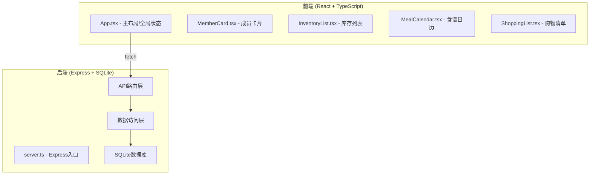
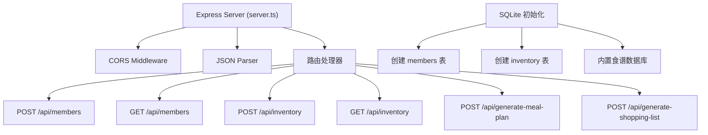
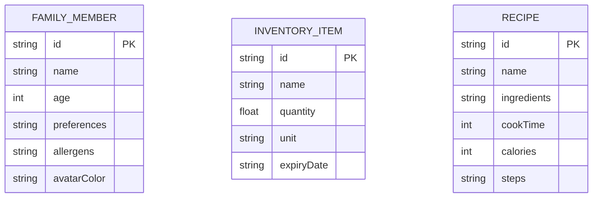

## 1. 架构设计



## 2. 技术描述

- **前端**：React@18 + TypeScript + Vite
- **构建工具**：Vite 5.x
- **后端**：Express@4
- **数据库**：SQLite3
- **HTTP通信**：fetch API + CORS
- **唯一标识**：uuid
- **样式方案**：CSS Modules / 内联样式（根据组件复杂度）

## 3. 项目文件结构

```
auto43/
├── package.json
├── index.html
├── vite.config.js
├── tsconfig.json
└── src/
    ├── frontend/
    │   ├── App.tsx
    │   └── components/
    │       ├── MemberCard.tsx
    │       ├── InventoryList.tsx
    │       ├── MealCalendar.tsx
    │       └── ShoppingList.tsx
    └── backend/
        └── server.ts
```

## 4. API 定义

### 4.1 TypeScript 类型定义

```typescript
interface FamilyMember {
  id: string;
  name: string;
  age: number;
  preferences: string[]; // 最多5个
  allergens: string[];
  avatarColor: string;
}

interface InventoryItem {
  id: string;
  name: string;
  quantity: number;
  unit: string; // 克/个/升
  expiryDate: string; // ISO日期
}

interface Ingredient {
  name: string;
  quantity: number;
  unit: string;
  category: 'vegetable' | 'meat' | 'grain' | 'dairy' | 'seasoning' | 'other';
}

interface Recipe {
  id: string;
  name: string;
  ingredients: Ingredient[];
  cookTime: number; // 分钟
  calories: number;
  steps: string[];
}

interface MealSlot {
  id: string;
  day: number; // 0-6 周一到周日
  mealType: 'breakfast' | 'lunch' | 'dinner' | 'snack';
  recipe: Recipe | null;
  alternatives: Recipe[];
  warnings: string[]; // 过敏/偏好冲突警告
}

interface ShoppingItem {
  id: string;
  name: string;
  quantity: number;
  unit: string;
  category: string;
  estimatedPrice: number;
  purchased: boolean;
}

interface ShoppingCategory {
  name: string;
  items: ShoppingItem[];
  collapsed: boolean;
}
```

### 4.2 API 端点

| 方法 | 路径 | 描述 | 请求体 | 响应 |
|------|------|------|--------|------|
| POST | /api/members | 添加家庭成员 | `{name, age, preferences, allergens}` | `FamilyMember` |
| GET | /api/members | 获取所有成员 | - | `FamilyMember[]` |
| DELETE | /api/members/:id | 删除成员 | - | `{success: boolean}` |
| POST | /api/inventory | 添加库存项 | `{name, quantity, unit, expiryDate}` | `InventoryItem` |
| GET | /api/inventory | 获取所有库存 | - | `InventoryItem[]` |
| DELETE | /api/inventory/:id | 删除库存项 | - | `{success: boolean}` |
| POST | /api/generate-meal-plan | 生成一周食谱 | `{members, inventory}` | `MealSlot[]` |
| POST | /api/generate-shopping-list | 生成购物清单 | `{mealPlan, inventory}` | `{categories: ShoppingCategory[], total: number, saved: number}` |

## 5. 服务器架构



## 6. 数据模型

### 6.1 ER 图



### 6.2 DDL 语句

```sql
CREATE TABLE IF NOT EXISTS members (
  id TEXT PRIMARY KEY,
  name TEXT NOT NULL,
  age INTEGER NOT NULL,
  preferences TEXT NOT NULL, -- JSON数组
  allergens TEXT NOT NULL, -- JSON数组
  avatarColor TEXT NOT NULL
);

CREATE TABLE IF NOT EXISTS inventory (
  id TEXT PRIMARY KEY,
  name TEXT NOT NULL,
  quantity REAL NOT NULL,
  unit TEXT NOT NULL,
  expiryDate TEXT NOT NULL
);

-- 内置食谱数据（应用启动时初始化）
CREATE TABLE IF NOT EXISTS recipes (
  id TEXT PRIMARY KEY,
  name TEXT NOT NULL,
  ingredients TEXT NOT NULL, -- JSON数组
  cookTime INTEGER NOT NULL,
  calories INTEGER NOT NULL,
  steps TEXT NOT NULL, -- JSON数组
  category TEXT NOT NULL -- breakfast/lunch/dinner/snack
);
```

## 7. 构建与启动

- **依赖安装**：`npm install`
- **开发启动**：`npm run dev`（使用 concurrently 同时启动 Vite 和 Express）
- **前端端口**：5173（Vite 默认）
- **后端端口**：3001
- **代理配置**：Vite 代理 `/api` 到 `http://localhost:3001`
