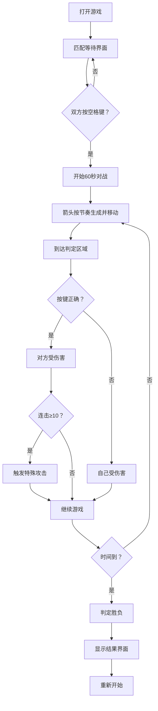

## 1. 产品概述

幻音战场是一款实时音乐节奏对战游戏，两名玩家在同一设备上通过键盘按键，根据音乐节奏点击对应方向箭头来击败对方的虚拟角色。游戏融合了音乐节奏玩法与对战元素，为玩家带来紧张刺激的双人对战体验。

## 2. 核心功能

### 2.1 用户角色

| 角色 | 注册方式 | 核心权限 |
|------|----------|----------|
| 玩家1 | 本地游戏，使用WASD键 | 控制左侧角色，进行节奏对战 |
| 玩家2 | 本地游戏，使用方向键 | 控制右侧角色，进行节奏对战 |

### 2.2 功能模块

1. **匹配等待界面**：显示连接状态，等待双方按空格键开始
2. **游戏对战界面**：节奏轨道、角色显示、血条、判定区域、特效动画
3. **结果展示界面**：胜负判定、庆祝动画、鼓励文字

### 2.3 页面详情

| 页面名称 | 模块名称 | 功能描述 |
|---------|----------|----------|
| 匹配等待页 | 状态指示器 | 显示"等待对手..."和实时连接状态 |
| 匹配等待页 | 开始触发 | 检测双方空格键按下，进入游戏 |
| 游戏对战页 | 节奏轨道 | 左右各四条箭头轨道，箭头从底部向上移动 |
| 游戏对战页 | 判定系统 | 箭头到达顶部判定区域时检测按键输入 |
| 游戏对战页 | 角色系统 | 低多边形风格角色，受击动画、特殊攻击 |
| 游戏对战页 | 血条系统 | 显示双方血量，减血时颜色渐变和屏幕闪烁 |
| 游戏对战页 | 连击系统 | 10连击以上触发特殊攻击动画 |
| 结果展示页 | 胜负判定 | 60秒后根据剩余血量判定胜负 |
| 结果展示页 | 动画效果 | 胜利方庆祝动画，失败方鼓励文字 |

## 3. 核心流程

玩家打开游戏 → 进入匹配等待界面 → 两名玩家同时按下空格键 → 开始60秒对战 → 箭头按节奏出现并向上移动 → 玩家在判定区域按下对应按键 → 成功击中对方受伤害，错过自己受伤害 → 连击10次触发特殊攻击 → 时间结束判定胜负 → 显示结果界面 → 可重新开始

## 4. 用户界面设计

### 4.1 设计风格

- **设计主题**：赛博朋克霓虹风格
- **主背景**：深紫蓝色渐变 `#0f0f23` 到 `#1a1a2e`
- **玩家1主色**：蓝色调 `#3a86ff`
- **玩家2主色**：红色调 `#ff006e`
- **箭头颜色**：青色 `#00f5d4` 渐变到粉色 `#f72585`
- **判定区域**：亮色光带 `#fca311`
- **字体**：使用Orbitron（科技感字体）作为标题，Roboto作为正文字体
- **动效**：所有交互带有平滑过渡 `transition: all 0.15s ease`
- **按钮**：悬停缩放1.05倍并增加阴影

### 4.2 页面设计概述

| 页面名称 | 模块名称 | UI元素 |
|---------|----------|--------|
| 匹配等待页 | 主容器 | 深色渐变背景，居中布局，霓虹发光文字 |
| 匹配等待页 | 状态显示 | "等待对手..."文字，脉动连接指示器 |
| 匹配等待页 | 按键提示 | 双方玩家按键说明，空格键提示 |
| 游戏对战页 | 轨道区域 | 左右分栏，各四条半透明发光轨道 |
| 游戏对战页 | 判定线 | 横贯屏幕的橙色光带，上下脉动光晕 |
| 游戏对战页 | 角色显示 | 低多边形角色，位于轨道侧上方 |
| 游戏对战页 | 血条显示 | 角色下方，圆角设计，颜色渐变 |
| 游戏对战页 | 箭头元素 | 渐变色箭头，向上移动动画 |
| 游戏对战页 | 特效层 | 打击特效、受击闪烁、屏幕震动、全屏闪光 |
| 游戏对战页 | 连击显示 | 连击数显示，达到10时特殊发光 |
| 游戏对战页 | 计时器 | 60秒倒计时显示 |
| 结果展示页 | 结果文字 | 大号霓虹文字，胜利/失败状态 |
| 结果展示页 | 动画效果 | 胜利方庆祝粒子动画，失败方柔和过渡 |
| 结果展示页 | 重新开始 | 霓虹按钮，悬停动效 |

### 4.3 响应式

- 桌面端优先设计，全屏游戏体验
- 支持不同分辨率自适应
- 键盘操作优化，确保按键响应准确

### 4.4 动效设计指导

- **箭头移动**：使用requestAnimationFrame驱动，60FPS流畅动画
- **打击特效**：CSS keyframes动画，粒子扩散效果
- **受击效果**：角色抖动 + 颜色闪白200ms
- **特殊攻击**：屏幕震动 + 全屏闪光 + 颜色滤镜
- **判定线脉动**：CSS动画实现光晕呼吸效果
- **血条变化**：平滑过渡动画，减血时红色闪烁
- **按钮交互**：悬停缩放1.05倍，阴影增加
