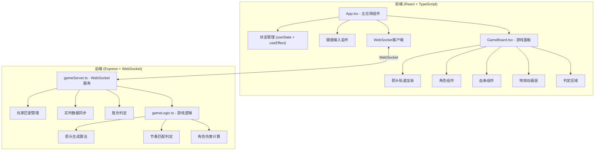
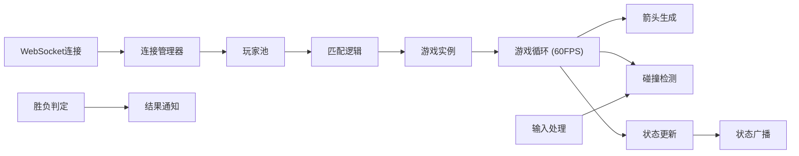

## 1. 架构设计



## 2. 技术描述

- **前端框架**：React@18 + TypeScript@5
- **构建工具**：Vite@5 + @vitejs/plugin-react@4
- **后端服务**：Express@4 + ws@8 (WebSocket)
- **状态管理**：React Hooks (useState, useEffect, useRef, useCallback)
- **唯一标识**：uuid@9
- **类型定义**：@types/react, @types/react-dom, @types/express, @types/ws, @types/uuid, @types/node

## 3. 项目结构

```
auto44/
├── package.json              # 项目依赖和脚本
├── index.html                # 入口HTML
├── vite.config.js            # Vite构建配置
├── tsconfig.json             # TypeScript配置
└── src/
    ├── client/
    │   ├── App.tsx           # 主应用组件
    │   └── GameBoard.tsx     # 游戏面板组件
    └── server/
        ├── gameServer.ts     # WebSocket服务端
        └── gameLogic.ts      # 核心游戏逻辑
```

## 4. 核心类型定义

```typescript
// 箭头方向类型
type ArrowDirection = 'up' | 'down' | 'left' | 'right';

// 玩家类型
type Player = 'player1' | 'player2';

// 箭头对象
interface Arrow {
  id: string;
  direction: ArrowDirection;
  player: Player;
  y: number;
  speed: number;
  hit: boolean;
  missed: boolean;
}

// 玩家状态
interface PlayerState {
  id: string;
  player: Player;
  health: number;
  maxHealth: number;
  combo: number;
  maxCombo: number;
  isHit: boolean;
  isSpecialAttacking: boolean;
  connected: boolean;
}

// 游戏状态
type GamePhase = 'waiting' | 'playing' | 'finished';

interface GameState {
  phase: GamePhase;
  player1: PlayerState;
  player2: PlayerState;
  arrows: Arrow[];
  timeRemaining: number;
  currentDifficulty: number;
  winner: Player | null;
}

// WebSocket消息类型
interface WSMessage {
  type: 'player_ready' | 'input' | 'game_state' | 'match_found' | 'game_over';
  payload: any;
}

// 按键映射
const PLAYER1_KEYS: Record<string, ArrowDirection> = {
  w: 'up',
  s: 'down',
  a: 'left',
  d: 'right',
};

const PLAYER2_KEYS: Record<string, ArrowDirection> = {
  ArrowUp: 'up',
  ArrowDown: 'down',
  ArrowLeft: 'left',
  ArrowRight: 'right',
};

// 游戏常量
const GAME_CONFIG = {
  GAME_DURATION: 60,
  TRACK_HEIGHT: 600,
  JUDGE_LINE_Y: 100,
  BASE_SPEED: 200,
  BASE_BPM: 120,
  MAX_HEALTH: 100,
  HIT_DAMAGE: 5,
  MISS_DAMAGE: 8,
  SPECIAL_COMBO_THRESHOLD: 10,
  DIFFICULTY_INTERVALS: [800, 500, 300],
  PERFECT_WINDOW: 50,
  GOOD_WINDOW: 100,
  MISS_WINDOW: 150,
};
```

## 5. API 定义

### 5.1 WebSocket 消息协议

| 消息类型 | 发送方 | 数据结构 | 说明 |
|---------|--------|----------|------|
| `player_ready` | 客户端 | `{ player: 'player1' \| 'player2' }` | 玩家准备就绪 |
| `input` | 客户端 | `{ player: Player, direction: ArrowDirection, timestamp: number }` | 玩家按键输入 |
| `game_state` | 服务端 | `GameState` | 游戏状态同步 |
| `match_found` | 服务端 | `{ player1Ready: boolean, player2Ready: boolean }` | 匹配成功通知 |
| `game_over` | 服务端 | `{ winner: Player, player1Health: number, player2Health: number }` | 游戏结束通知 |

### 5.2 核心函数定义

```typescript
// gameLogic.ts
export function generateArrow(
  player: Player,
  difficulty: number,
  bpm: number
): Arrow;

export function judgeHit(
  arrow: Arrow,
  judgeY: number,
  timestamp: number
): 'perfect' | 'good' | 'miss' | null;

export function calculateDamage(
  judgeResult: 'perfect' | 'good' | 'miss',
  isSpecial: boolean
): number;

export function shouldGenerateArrow(
  lastArrowTime: number,
  difficulty: number
): boolean;

export function determineWinner(
  player1Health: number,
  player2Health: number
): Player;

// gameServer.ts
export class GameServer {
  constructor(server: http.Server);
  handleConnection(ws: WebSocket): void;
  broadcastState(): void;
  startGameLoop(): void;
  endGame(): void;
}
```

## 6. 服务器架构



## 7. 性能优化方案

### 7.1 渲染性能
- 使用 `requestAnimationFrame` 驱动箭头移动动画
- 使用 CSS `transform` 和 `will-change` 优化动画性能
- 箭头组件使用 `React.memo` 避免不必要重渲染
- 使用 CSS 动画而非 JavaScript 计算特效

### 7.2 状态更新
- 游戏状态批量更新，避免频繁 setState
- 使用 `useRef` 存储频繁变化的数值（箭头位置）
- WebSocket 消息节流，避免网络拥堵

### 7.3 内存管理
- 及时清理已消失的箭头对象
- 移除事件监听器和动画帧
- WebSocket 连接正常关闭

## 8. 动画实现方案

| 动画效果 | 实现方式 | 说明 |
|---------|----------|------|
| 箭头移动 | requestAnimationFrame + transform: translateY | 60FPS流畅动画 |
| 打击特效 | CSS @keyframes + scale + opacity | 粒子扩散效果 |
| 受击闪烁 | CSS animation + filter: brightness | 闪白200ms |
| 角色抖动 | CSS transform: translate 随机偏移 | 抖动动画 |
| 判定线脉动 | CSS @keyframes + box-shadow | 光晕呼吸效果 |
| 屏幕震动 | CSS transform: translate 整体偏移 | 特殊攻击效果 |
| 全屏闪光 | CSS animation + background-color | 特殊攻击效果 |
| 血条变化 | CSS transition + width/background-color | 平滑过渡 |
| 按钮悬停 | CSS transition + transform: scale | 缩放1.05倍 |
