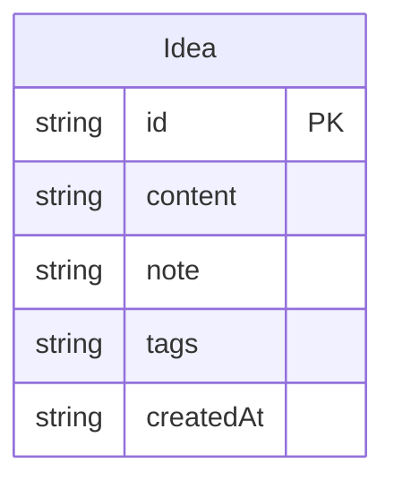

## 1. 架构设计

```mermaid
graph TB
    "Frontend[前端 React+TypeScript]" --> "Backend[后端 Express+SQLite]"
    "Frontend" --> "Vite[开发服务器 :3000]"
    "Backend" --> "SQLite[(SQLite数据库)]"
    "Frontend" --> "API[RESTful API :3001]"
    "API" --> "POST /api/ideas[提交灵感]"
    "API" --> "GET /api/ideas[获取灵感列表]"
    "API" --> "POST /api/cluster[聚类分析]"
```

## 2. 技术说明

- 前端：React@18 + TypeScript + Vite
- 初始化工具：vite-init (react-express-ts模板)
- 后端：Express@4 + TypeScript + SQLite3
- 数据库：SQLite（本地文件存储）
- 状态管理：Zustand
- 图谱渲染：D3.js 力导向图
- 样式方案：CSS-in-JS（内联样式 + CSS模块）

## 3. 路由定义

| 路由 | 用途 |
|------|------|
| / | 主页面，包含灵感输入、瀑布流、聚类图谱 |

## 4. API定义

### 类型定义

```typescript
interface Idea {
  id: string;
  content: string;
  note: string;
  tags: string[];
  createdAt: string;
}

interface ClusterResult {
  clusters: {
    id: string;
    label: string;
    ideaIds: string[];
  }[];
  links: {
    source: string;
    target: string;
    strength: number;
  }[];
}
```

### 请求/响应模式

| 接口 | 方法 | 请求体 | 响应 |
|------|------|--------|------|
| /api/ideas | POST | { content: string } | { idea: Idea } |
| /api/ideas | GET | - | { ideas: Idea[] } |
| /api/cluster | POST | - | { clusters: Cluster[], links: Link[] } |

## 5. 服务端架构图

```mermaid
graph LR
    "Controller[路由控制器]" --> "Service[业务逻辑层]"
    "Service" --> "Repository[数据访问层]"
    "Repository" --> "DB[(SQLite)]"
```

## 6. 数据模型

### 6.1 数据模型定义



### 6.2 数据定义语言

```sql
CREATE TABLE IF NOT EXISTS ideas (
  id TEXT PRIMARY KEY,
  content TEXT NOT NULL,
  note TEXT DEFAULT '',
  tags TEXT DEFAULT '[]',
  createdAt TEXT NOT NULL
);
```
