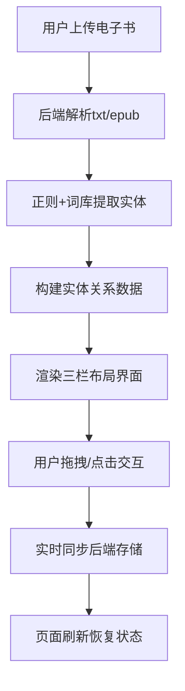

## 1. 产品概述
电子书故事地图可视化应用，帮助读者在阅读复杂叙事作品时，清晰把握人物关系和时空脉络。通过自动提取书籍中的角色、地点和事件，构建交互式可视化图谱。

- 核心价值：解决多角色、多线剧情阅读时的信息过载问题，提供直观的实体关系视图
- 目标用户：文学爱好者、学生、研究者、书评人
- 市场价值：填补阅读辅助工具在复杂叙事可视化领域的空白

## 2. 核心功能

### 2.1 用户角色
| 角色 | 注册方式 | 核心权限 |
|------|---------|---------|
| 普通用户 | 无需注册 | 上传电子书、查看故事地图、编辑实体、保存修改 |

### 2.2 功能模块
1. **主界面**：三栏布局（实体列表、力导向图、时间线）
2. **文件上传**：支持txt/epub格式电子书上传与解析
3. **实体提取**：自动提取角色、地点、事件，记录出现次数和首次位置
4. **交互编辑**：拖拽创建关联、双击编辑/删除实体
5. **数据持久化**：修改即时同步后端，刷新后恢复

### 2.3 页面详情
| 页面名称 | 模块名称 | 功能描述 |
|---------|---------|----------|
| 主界面 | 顶部操作栏 | 文件上传按钮、书籍信息显示 |
| 主界面 | 实体列表 | 角色/地点/事件分类展示，支持拖拽 |
| 主界面 | 力导向图 | 节点按共现关系布局，支持交互 |
| 主界面 | 时间线 | 按章节顺序展示事件，联动高亮 |

## 3. 核心流程

用户上传电子书 → 后端解析文本 → 提取关键实体 → 构建实体关系图谱 → 前端渲染三栏界面 → 用户交互编辑 → 数据同步存储

## 4. 用户界面设计

### 4.1 设计风格
- **主色调**：蓝紫 #6c63ff
- **辅助色**：青色 #00bcd4（地点）、粉色 #ff4081（事件）
- **背景色**：深色 #121212，卡片 #1e1e2e/#2a2a3e
- **毛玻璃效果**：backdrop-filter: blur(10px)
- **圆角**：12px（容器）、8px（卡片）
- **字体**：现代无衬线字体，清晰的层次结构

### 4.2 页面设计概述
| 页面名称 | 模块名称 | UI元素 |
|---------|---------|--------|
| 主界面 | 实体列表 | 280px宽，颜色条标识类别，卡片圆角8px |
| 主界面 | 力导向图 | 节点半径12-32px按次数，连线1-4px按共现 |
| 主界面 | 时间线 | 300px宽，垂直滚动，章节事件摘要 |

### 4.3 响应式
- **桌面端**（>768px）：三栏并排布局
- **平板端**（≤768px）：上下布局，实体列表可折叠

### 4.4 交互动效
- 拖拽实体：半透明副本跟随（opacity: 0.6），目标区域虚线圆圈提示
- 节点悬浮：放大1.15倍，显示详情弹出框
- 所有过渡：0.3秒 ease-out

## 5. 性能要求
- 实体提取：5秒内返回结果
- 初始加载：2秒内完成提取和渲染
- 地图渲染：>50节点时FPS ≥ 30
