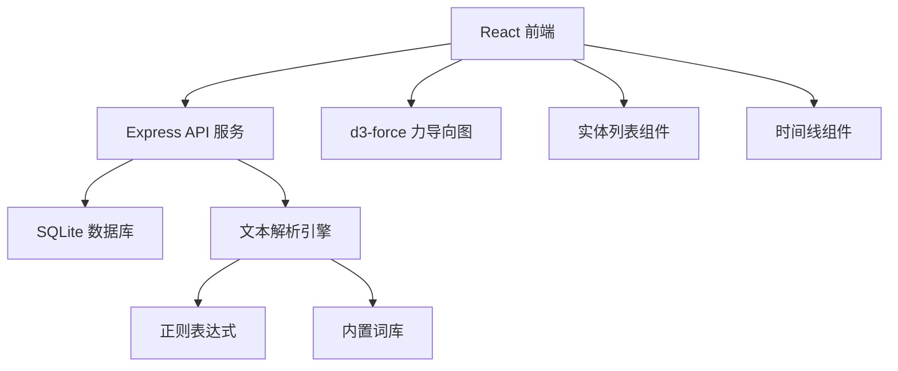
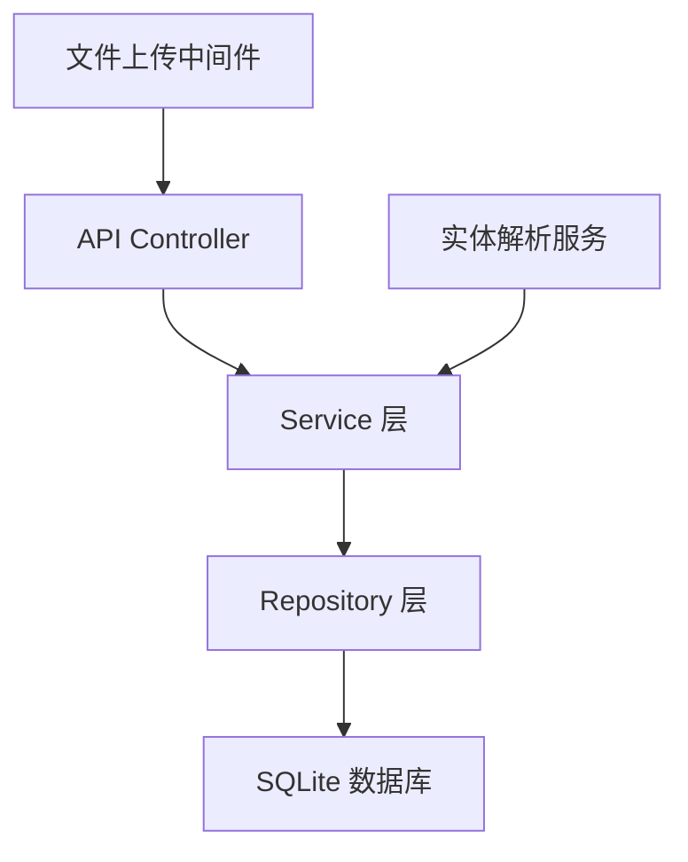
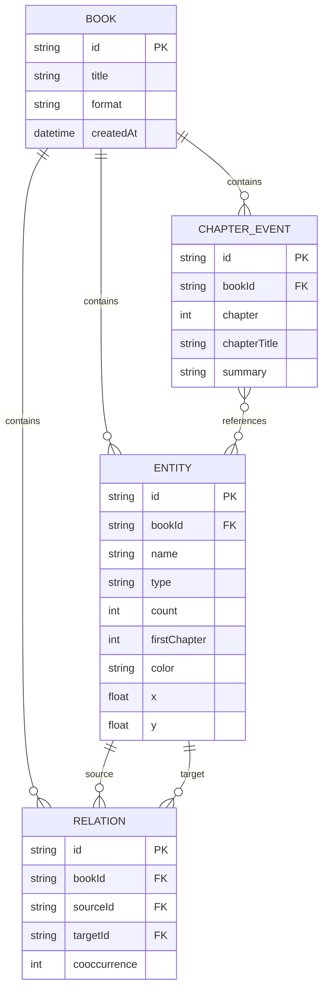

## 1. 架构设计



## 2. 技术描述

- **前端**：React 18 + TypeScript + Vite
- **后端**：Express 4 + TypeScript
- **数据库**：SQLite3
- **可视化**：d3-force 力导向图布局
- **样式**：原生CSS + CSS变量，毛玻璃效果
- **状态管理**：React useState/useEffect

## 3. 项目结构

```
auto46/
├── package.json
├── index.html
├── vite.config.js
├── tsconfig.json
├── src/
│   ├── App.tsx
│   ├── components/
│   │   ├── EntityList.tsx
│   │   ├── StoryMap.tsx
│   │   └── Timeline.tsx
│   └── types/
│       └── index.ts
└── server/
    └── index.ts
```

## 4. API 定义

### 类型定义

```typescript
interface Entity {
  id: string;
  name: string;
  type: 'character' | 'location' | 'event';
  count: number;
  firstChapter: number;
  color?: string;
  x?: number;
  y?: number;
}

interface Relation {
  id: string;
  sourceId: string;
  targetId: string;
  cooccurrence: number;
}

interface ChapterEvent {
  id: string;
  chapter: number;
  chapterTitle: string;
  summary: string;
  relatedEntities: string[];
}
```

### API 端点

| 方法 | 路径 | 描述 |
|------|------|------|
| POST | /api/upload | 上传电子书文件 |
| GET | /api/entities | 获取所有实体 |
| PUT | /api/entities/:id | 更新实体 |
| DELETE | /api/entities/:id | 删除实体 |
| GET | /api/relations | 获取所有关系 |
| POST | /api/relations | 创建新关系 |
| GET | /api/timeline | 获取时间线事件 |
| GET | /api/book/:id | 获取书籍信息 |

### 请求/响应示例

```typescript
// POST /api/upload
Request: FormData { file: File }
Response: { 
  entities: Entity[], 
  relations: Relation[], 
  timeline: ChapterEvent[] 
}

// PUT /api/entities/:id
Request: { name: string }
Response: { success: boolean, entity: Entity }
```

## 5. 服务器架构



## 6. 数据模型

### 6.1 ER 图



### 6.2 DDL

```sql
CREATE TABLE books (
    id TEXT PRIMARY KEY,
    title TEXT NOT NULL,
    format TEXT NOT NULL,
    created_at DATETIME DEFAULT CURRENT_TIMESTAMP
);

CREATE TABLE entities (
    id TEXT PRIMARY KEY,
    book_id TEXT NOT NULL,
    name TEXT NOT NULL,
    type TEXT NOT NULL CHECK(type IN ('character', 'location', 'event')),
    count INTEGER NOT NULL DEFAULT 1,
    first_chapter INTEGER NOT NULL,
    color TEXT,
    x REAL,
    y REAL,
    FOREIGN KEY (book_id) REFERENCES books(id) ON DELETE CASCADE
);

CREATE TABLE relations (
    id TEXT PRIMARY KEY,
    book_id TEXT NOT NULL,
    source_id TEXT NOT NULL,
    target_id TEXT NOT NULL,
    cooccurrence INTEGER NOT NULL DEFAULT 1,
    FOREIGN KEY (book_id) REFERENCES books(id) ON DELETE CASCADE,
    FOREIGN KEY (source_id) REFERENCES entities(id) ON DELETE CASCADE,
    FOREIGN KEY (target_id) REFERENCES entities(id) ON DELETE CASCADE,
    UNIQUE(source_id, target_id)
);

CREATE TABLE chapter_events (
    id TEXT PRIMARY KEY,
    book_id TEXT NOT NULL,
    chapter INTEGER NOT NULL,
    chapter_title TEXT NOT NULL,
    summary TEXT NOT NULL,
    FOREIGN KEY (book_id) REFERENCES books(id) ON DELETE CASCADE
);
```
