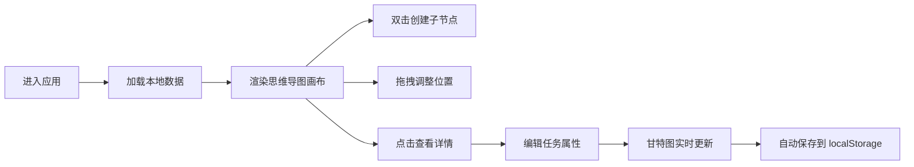

## 1. 产品概述

思维导图驱动的个人日程规划应用，用户通过拖拽节点的方式创建和管理每日任务与长期目标，自动生成甘特图可视化展示时间分配与进度。

- 核心价值：将思维导图的发散性思维与甘特图的时间规划相结合，提供直观、灵活的任务管理体验
- 目标用户：需要可视化管理任务和时间的个人用户、学生、职场人士

## 2. 核心功能

### 2.1 用户角色
| 角色 | 注册方式 | 核心权限 |
|------|----------|----------|
| 普通用户 | 无需注册，本地存储 | 创建、编辑、删除任务节点，查看甘特图，切换主题 |

### 2.2 功能模块
1. **思维导图画布**：节点创建、拖拽、缩放、平移、连线渲染
2. **甘特图面板**：时间条渲染、层级展示、折叠/展开、日期轴
3. **节点详情面板**：标题编辑、优先级设置、截止日期、备注、里程碑切换
4. **主题系统**：浅色/深色主题切换
5. **数据持久化**：localStorage 存储

### 2.3 页面详情
| 页面名称 | 模块名称 | 功能描述 |
|----------|----------|----------|
| 主页面 | 思维导图画布 | SVG 渲染节点与连线，支持拖拽、缩放、平移，双击新建子节点，右键删除 |
| 主页面 | 甘特图面板 | 水平时间条展示任务，层级缩进，折叠展开，日期轴，tooltip |
| 主页面 | 详情面板 | 节点属性编辑，标题、优先级、日期、备注、里程碑切换 |
| 主页面 | 主题切换 | 右上角按钮切换浅色/深色主题 |

## 3. 核心流程

### 主操作流程
用户进入应用 → 查看默认思维导图 → 双击节点创建子任务 → 拖拽调整节点位置 → 点击节点查看详情 → 编辑任务属性 → 右侧甘特图实时更新 → 数据自动保存到本地

## 4. 用户界面设计

### 4.1 设计风格
- **主色调**：蓝色 #3b82f6（品牌色、选中态、按钮）
- **优先级色**：红 #ef4444（高）、黄 #eab308（中）、绿 #22c55e（低）
- **浅色主题**：背景 #f0f4f8、卡片 #ffffff、文字 #1e293b、边框 #e2e8f0
- **深色主题**：背景 #0f172a、卡片 #1e293b、文字 #f1f5f9、边框 #334155
- **按钮交互**：hover 放大 1.05 倍，active 缩小至 0.95 倍，transition 150ms ease
- **卡片交互**：hover 阴影加深，transition 平滑过渡

### 4.2 页面设计概述
| 页面名称 | 模块名称 | UI 元素 |
|----------|----------|---------|
| 主页面 | 布局 | 左 70% 思维导图 + 右 30% 甘特图，响应式 900px 以下上下布局 |
| 主页面 | 思维导图节点 | 圆角矩形卡片，渐变背景，阴影，优先级圆点，截止日期 |
| 主页面 | 甘特图 | 水平时间条，层级缩进，折叠箭头，日期轴，悬停 tooltip |
| 主页面 | 详情面板 | 右侧滑入，表单编辑，iOS 风格开关 |
| 主页面 | 主题按钮 | 右上角圆形按钮，月亮/太阳图标 |

### 4.3 响应式
- 桌面端（≥900px）：左右两栏布局，左 70% 右 30%
- 移动端（<900px）：上下布局，上 60% 思维导图，下 40% 甘特图
- 甘特图可折叠，折叠时显示 40px 切换按钮悬浮边缘

### 4.4 动效设计
- 详情面板滑入：宽度 0→320px + 淡入，300ms ease-out
- 缩放过渡：200ms ease-out
- 节点吸附：150ms ease
- 主题切换：背景色过渡 300ms ease
- Tooltip 出现：向上移动 8px + 淡入，150ms ease
- 按钮 hover/active：缩放变换 150ms ease
