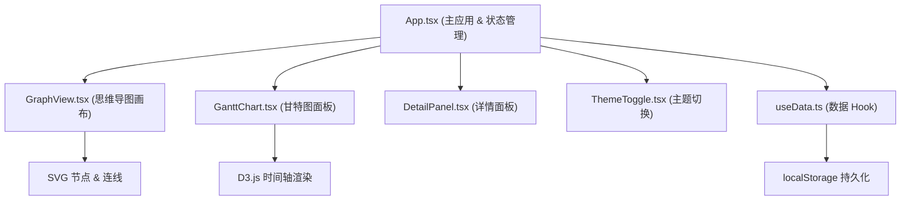

## 1. 架构设计



## 2. 技术描述

- **前端框架**：React@18 + TypeScript
- **构建工具**：Vite@5 + @vitejs/plugin-react
- **数据可视化**：D3.js@7 (甘特图时间轴)
- **状态管理**：React Hooks + Context API
- **样式方案**：原生 CSS + CSS Variables (主题切换)
- **数据持久化**：localStorage
- **图标库**：lucide-react

## 3. 目录结构

```
src/
├── types.d.ts          # TypeScript 类型定义
├── App.tsx             # 主组件，布局与状态管理
├── components/
│   ├── GraphView.tsx   # 思维导图组件 (SVG)
│   ├── GanttChart.tsx  # 甘特图组件 (D3.js)
│   ├── DetailPanel.tsx # 节点详情面板
│   └── ThemeToggle.tsx # 主题切换按钮
├── hooks/
│   └── useData.ts      # 数据管理自定义 Hook
└── utils/
    └── helpers.ts      # 工具函数
```

## 4. 数据模型

### 4.1 类型定义

```typescript
interface MindMapNode {
  id: string;
  title: string;
  priority: 'high' | 'medium' | 'low';
  dueDate: string; // ISO date string
  notes: string;
  isMilestone: boolean;
  x: number;
  y: number;
  parentId: string | null;
  children: string[];
  collapsed?: boolean;
  progress?: number; // 0-100
}

interface AppState {
  nodes: Record<string, MindMapNode>;
  rootId: string;
  selectedNodeId: string | null;
  theme: 'light' | 'dark';
  ganttCollapsed: boolean;
  detailPanelOpen: boolean;
}
```

### 4.2 数据结构说明
- 使用扁平结构 + 父子引用，便于快速查找和遍历
- 节点位置坐标独立存储，支持自由拖拽布局
- 甘特图数据由节点数据动态计算生成

## 5. 核心技术点

### 5.1 思维导图渲染
- 使用 SVG 渲染节点和贝塞尔曲线连线
- 实现画布缩放 (0.5-2.0) 和平移
- 节点拖拽约束在画布内，松手吸附网格 (40px)
- 双击创建子节点，右键删除节点

### 5.2 甘特图渲染
- 使用 D3.js 计算时间比例尺
- 横轴根据任务日期范围自动计算
- 任务层级通过缩进展示，支持折叠展开
- 悬停显示 tooltip，含任务名、日期范围、进度

### 5.3 性能优化
- 使用 React.memo 避免不必要的重渲染
- SVG 节点使用 transform 优化拖拽性能
- 数据变更使用不可变更新模式
- 200 节点保持 60fps 拖拽体验

### 5.4 主题系统
- 使用 CSS Variables 定义主题色
- 主题切换时平滑过渡动画
- 深浅两套主题完整适配

### 5.5 响应式布局
- 桌面端：左右两栏 (70% / 30%)
- 移动端 (<900px)：上下布局 (60% / 40%)
- 甘特图面板可折叠，折叠后仅显示切换按钮
