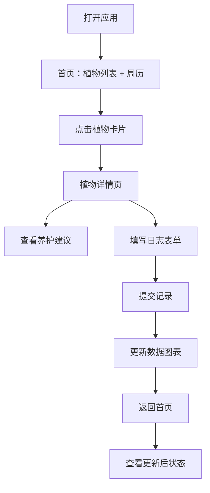

## 1. 产品概述

植物生长日志与养护提醒系统是为社区园艺爱好者开发的线上工具，帮助用户记录和分享家庭植物的生长数据，并自动生成植物养护日历。通过系统化的数据记录和智能提醒，提升植物养护的科学性和便捷性。

- **主要目的**：帮助园艺爱好者科学管理家庭植物，记录生长数据，获取个性化养护建议
- **解决问题**：植物养护缺乏系统化记录，浇水施肥时间容易遗忘，缺乏针对性养护指导
- **目标用户**：社区园艺爱好者、家庭植物养护者
- **产品价值**：提升植物存活率，培养科学养护习惯，构建园艺爱好者社区

## 2. 核心功能

### 2.1 用户角色

| 角色 | 注册方式 | 核心权限 |
|------|---------|---------|
| 普通用户 | 无需注册，本地存储 | 添加/编辑/删除植物、记录日志、查看养护建议和周历 |

### 2.2 功能模块

1. **首页**：植物列表网格、未来7天养护周历
2. **植物详情页**：植物信息展示、养护建议、日志记录表单、30天数据统计图表
3. **日志记录表单**：浇水、施肥、光照、备注记录

### 2.3 页面详情

| 页面名称 | 模块名称 | 功能描述 |
|---------|---------|---------|
| 首页 | 植物列表网格 | 展示所有植物卡片，支持添加、编辑、删除操作，显示养护状态指示条 |
| 首页 | 周历视图 | 展示未来7天养护提醒，高亮显示未完成任务，图标闪烁提醒 |
| 植物详情页 | 植物信息卡片 | 展示植物名称、种类、种植日期、位置、养护建议 |
| 植物详情页 | 日志记录表单 | 记录每日浇水、施肥、光照时长、备注信息 |
| 植物详情页 | 数据统计图表 | 30天浇水频率折线图、光照时长柱状图 |

## 3. 核心流程

### 主要用户流程

用户打开应用 → 查看首页植物列表和周历提醒 → 点击植物卡片进入详情页 → 查看养护建议 → 填写日志记录表单 → 提交记录 → 查看更新后的数据图表 → 返回首页查看更新后的状态

## 4. 用户界面设计

### 4.1 设计风格

- **主色调**：深绿 #2e7d32，用于标题和强调元素
- **背景色**：柔白 #f5f0eb，营造自然舒适氛围
- **卡片背景**：纯白 #ffffff，圆角 12px，阴影 2px rgba(0,0,0,0.08)
- **状态指示**：绿色<1天，黄色2-3天，红色>3天（根据上次浇水时间）
- **周末单元格**：背景 #e8f5e9
- **图表坐标轴**：#7cb342
- **字体**：采用自然园艺风格，标题字体清晰醒目，正文字体易读
- **图标**：水滴图标表示浇水，肥料袋图标表示施肥
- **交互反馈**：卡片点击缩放0.95倍，提交成功toast提示，图表悬停放大显示数值

### 4.2 页面设计概述

| 页面名称 | 模块名称 | UI元素 |
|---------|---------|--------|
| 首页 | 植物列表网格 | 3列响应式网格，植物卡片（缩略名、状态指示条），添加按钮 |
| 首页 | 周历视图 | 7天日历网格，每天显示对应植物的养护图标，未完成图标闪烁 |
| 植物详情页 | 植物信息卡片 | 植物名称、种类、种植日期、位置，底部养护建议文本 |
| 植物详情页 | 日志表单 | 浇水状态（已浇/未浇）、施肥标记（是/否）、光照滑块（0-12h）、备注文本框 |
| 植物详情页 | 数据图表 | Canvas绘制的折线图和柱状图，数据点圆形标记半径4px |

### 4.3 响应式设计

- **桌面端**：植物列表3列布局
- **平板端**：植物列表2列布局
- **移动端**：植物列表1列布局
- **触摸优化**：按钮和交互元素最小尺寸44x44px，确保触摸友好

## 5. 性能约束

- 页面初始加载时间 ≤ 1.5秒
- 图表渲染响应时间 ≤ 200ms
- LAN环境下API请求延迟 < 100ms
