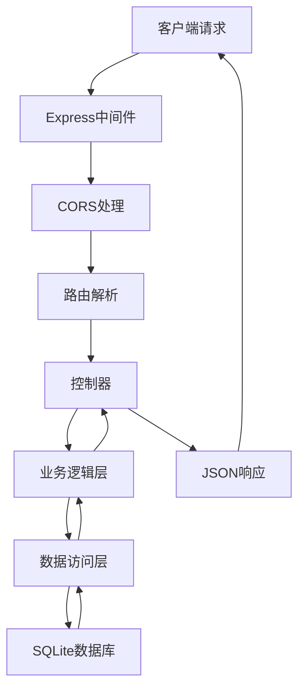
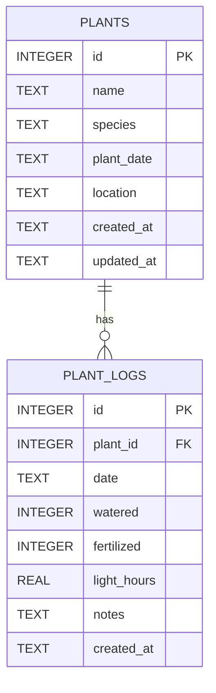

## 1. 架构设计


## 2. 技术描述

- **前端**：React@18 + TypeScript + Vite
- **后端**：Express@4 + SQLite3
- **初始化工具**：npm init + 手动配置
- **数据库**：SQLite（嵌入式，无需额外服务）
- **构建工具**：Vite@5
- **样式方案**：原生CSS + CSS变量

### 技术栈说明

| 技术 | 版本 | 用途 |
|------|------|------|
| React | ^18.2.0 | 前端UI框架 |
| React DOM | ^18.2.0 | DOM渲染 |
| TypeScript | ^5.0.0 | 类型安全 |
| Vite | ^5.0.0 | 构建工具和开发服务器 |
| Express | ^4.18.0 | 后端Web框架 |
| SQLite3 | ^5.1.0 | 嵌入式数据库 |
| CORS | ^2.8.5 | 跨域资源共享 |
| @vitejs/plugin-react | ^4.2.0 | Vite React插件 |

## 3. 路由定义

### 前端路由

| 路由 | 用途 |
|------|------|
| / | 首页：植物列表 + 周历视图 |
| /plant/:id | 植物详情页 |

### 后端API路由

| 方法 | 路由 | 用途 |
|------|------|------|
| GET | /api/plants | 获取所有植物列表 |
| GET | /api/plants/:id | 获取单个植物详情 |
| POST | /api/plants | 创建新植物 |
| PUT | /api/plants/:id | 更新植物信息 |
| DELETE | /api/plants/:id | 删除植物 |
| GET | /api/plants/:id/logs | 获取植物日志列表 |
| POST | /api/plants/:id/logs | 记录植物日志 |
| GET | /api/plants/:id/schedule | 获取植物养护日程 |
| GET | /api/plants/:id/advice | 获取植物养护建议 |

## 4. API定义

### 数据类型定义

```typescript
interface Plant {
  id: number;
  name: string;
  species: '绿萝' | '仙人掌' | '虎皮兰' | '多肉' | '龟背竹';
  plantDate: string;
  location: string;
  createdAt: string;
  updatedAt: string;
}

interface PlantLog {
  id: number;
  plantId: number;
  date: string;
  watered: boolean;
  fertilized: boolean;
  lightHours: number;
  notes: string;
  createdAt: string;
}

interface ScheduleItem {
  date: string;
  plantId: number;
  plantName: string;
  tasks: {
    type: 'water' | 'fertilize';
    completed: boolean;
  }[];
}

interface CareAdvice {
  plantId: number;
  advice: string;
  lastUpdated: string;
}
```

### 请求/响应示例

**GET /api/plants**
```
Response:
{
  "success": true,
  "data": Plant[]
}
```

**POST /api/plants**
```
Request:
{
  "name": string,
  "species": string,
  "plantDate": string,
  "location": string
}

Response:
{
  "success": true,
  "data": Plant
}
```

**POST /api/plants/:id/logs**
```
Request:
{
  "date": string,
  "watered": boolean,
  "fertilized": boolean,
  "lightHours": number,
  "notes": string
}

Response:
{
  "success": true,
  "data": PlantLog
}
```

## 5. 服务器架构图



## 6. 数据模型

### 6.1 数据模型定义



### 6.2 数据定义语言

```sql
-- 植物表
CREATE TABLE IF NOT EXISTS plants (
  id INTEGER PRIMARY KEY AUTOINCREMENT,
  name TEXT NOT NULL,
  species TEXT NOT NULL CHECK(species IN ('绿萝', '仙人掌', '虎皮兰', '多肉', '龟背竹')),
  plant_date TEXT NOT NULL,
  location TEXT NOT NULL,
  created_at TEXT DEFAULT CURRENT_TIMESTAMP,
  updated_at TEXT DEFAULT CURRENT_TIMESTAMP
);

-- 植物日志表
CREATE TABLE IF NOT EXISTS plant_logs (
  id INTEGER PRIMARY KEY AUTOINCREMENT,
  plant_id INTEGER NOT NULL,
  date TEXT NOT NULL,
  watered INTEGER NOT NULL DEFAULT 0,
  fertilized INTEGER NOT NULL DEFAULT 0,
  light_hours REAL NOT NULL DEFAULT 0,
  notes TEXT DEFAULT '',
  created_at TEXT DEFAULT CURRENT_TIMESTAMP,
  FOREIGN KEY (plant_id) REFERENCES plants(id) ON DELETE CASCADE
);

-- 索引
CREATE INDEX IF NOT EXISTS idx_plant_logs_plant_id ON plant_logs(plant_id);
CREATE INDEX IF NOT EXISTS idx_plant_logs_date ON plant_logs(date);
CREATE INDEX IF NOT EXISTS idx_plant_logs_plant_date ON plant_logs(plant_id, date);
```

## 7. 文件结构与调用关系

```
项目根目录/
├── package.json          # 项目依赖和脚本
├── vite.config.js        # Vite配置（代理/api到Express）
├── tsconfig.json         # TypeScript配置
├── index.html            # 入口HTML
├── src/
│   ├── main.tsx          # React入口
│   ├── App.tsx           # 主应用组件（路由）
│   ├── PlantManager.ts   # 数据管理类，调用后端API
│   ├── types.ts          # 类型定义
│   ├── components/
│   │   ├── PlantList.tsx     # 植物列表组件
│   │   ├── PlantCard.tsx     # 植物卡片组件
│   │   ├── CalendarView.tsx  # 周历视图组件
│   │   ├── LogForm.tsx       # 日志表单组件
│   │   ├── PlantDetail.tsx   # 植物详情页
│   │   ├── WaterChart.tsx    # 浇水频率图表
│   │   └── LightChart.tsx    # 光照时长图表
│   └── styles/
│       └── global.css    # 全局样式
└── server/
    └── index.js          # Express服务器（API路由、数据库操作）
```

### 数据流向

1. **用户操作** → `React组件` → `PlantManager.ts` → `Express API` → `SQLite`
2. **数据获取** → `SQLite` → `Express API` → `PlantManager.ts` → `React组件` → `UI渲染`
3. **日志记录** → `LogForm.tsx` → `PlantManager.recordLog()` → `POST /api/plants/:id/logs` → `SQLite`
4. **日程生成** → `CalendarView.tsx` → `PlantManager.getSchedule()` → `GET /api/plants/:id/schedule` → 业务逻辑计算 → `JSON响应`
5. **养护建议** → `PlantDetail.tsx` → `PlantManager.getAdvice()` → `GET /api/plants/:id/advice` → 业务逻辑分析 → `JSON响应`

### 模块职责

| 文件 | 职责 |
|------|------|
| `PlantManager.ts` | 封装所有后端API调用，管理植物数据、日志、日程、建议 |
| `CalendarView.tsx` | 渲染周历网格，显示养护提醒，从PlantManager获取数据 |
| `LogForm.tsx` | 收集用户输入，调用PlantManager记录日志 |
| `server/index.js` | Express服务器，处理API请求，数据库操作，业务逻辑计算 |
